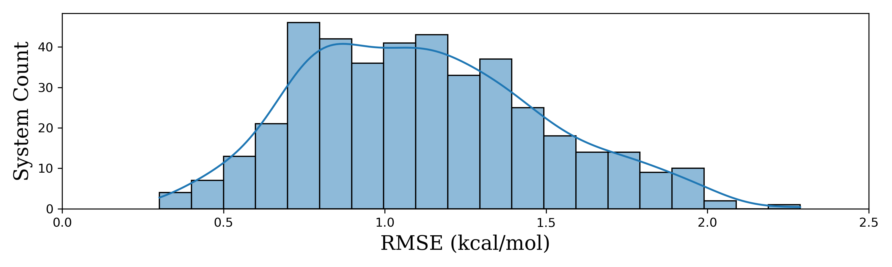

# Uni-FEP-Benchmarks

## Overview

**Uni-FEP-Benchmarks** is a benchmark dataset designed to systematically evaluate **Uni-FEP**, a free energy perturbation (FEP) method for accurate and efficient binding free energy calculations. This repository provides computational results across diverse protein-ligand systems and complex chemical transformations, facilitating validation and optimization of the Uni-FEP methodology.

## Objectives

By compiling well-structured benchmark cases, this repository aims to:

1. **Improve the stability of Uni-FEP**  
   - Through extensive testing across various systems, we aim to identify potential weaknesses in Uni-FEP and refine its robustness.

2. **Establish standardized test data for tracking performance changes**  
   - By maintaining a structured benchmark dataset, we can systematically analyze the impact of each Uni-FEP update on computational accuracy.

3. **Reduce the cost of FEP adoption for users**  
   - This repository is designed as a long-term project. Over time, as more benchmark cases are added, users may directly request pre-constructed systems from this dataset, allowing them to focus solely on predicting new compounds without having to reconstruct the entire system.

## FEP Open Challenge
We are excited to announce the **FEP Open Challenge** – an initiative aimed at validating the accuracy and stability of Uni-FEP through community participation. Researchers are invited to submit their own test cases using publicly available or published datasets. Our team will perform the FEP calculations on the submitted data and return the results, helping to dispel any doubts about Uni-FEP's performance.

Key points of the challenge include:

- **Data-Driven Validation**: Submit your test case (including a protein structure, reference ligand, and dataset file), and our team will evaluate it to verify Uni-FEP’s precision.
- **Public Benchmarking**: All validated test cases and their results will be shared openly in the Uni-FEP-Benchmarks repository under the Apache 2.0 license, contributing to a transparent and high-quality benchmark dataset.
- **Reward Policy**: Publicly compare Uni-FEP with another commercial FEP tool under identical conditions using supporting evidence (e.g., via a preprint, blog, or journal article) to earn<sup>*</sup> **a $50 Amazon Gift Card**—with **an additional $50** awarded upon verification if the other tool is shown to significantly outperform Uni-FEP. <br>
   <sub>**Subject to validation*</sub> <br>
- **Participation Guidelines**: To ensure fairness, each individual may only have one active submission at a time. Also, cases sourced from ChEMBL or BindingDB may be avoided during our review process.

For more details, please refer to our [FEP Open Challenge introduction](https://github.com/dptech-corp/Uni-FEP-Benchmarks/blob/main/docs/FEP_Open_Challenge.md).


## Summary of Benchmark Results
**Total Systems**: 311  
**Total Ligands**: 4826


| Series | Target | N_Ligands | RMSE (kcal/mol) | R² | Kendall's tau | Description |
|---|---|---|---|---|---|---|
| ChEMBL | ADK | 12 | 1.59 | 0.28 | 0.36 | CHEMBL642224 |
| ChEMBL | AKR1C3 | 11 | 0.90 | 0.59 | 0.67 | CHEMBL4428988 |
| ChEMBL | ALDH2 | 9 | 1.01 | 0.30 | 0.65 | CHEMBL3130565 |
| ChEMBL | ALDH2 | 12 | 1.23 | 0.26 | 0.43 | CHEMBL641008 |
| ChEMBL | AMPD2 | 14 | 1.36 | 0.54 | 0.46 | CHEMBL5240593 |
| ChEMBL | AR | 9 | 1.37 | 0.31 | 0.28 | CHEMBL896869 |
| ChEMBL | AURKA | 7 | 1.12 | 0.79 | 0.59 | CHEMBL2382841 |
| ChEMBL | AURKA | 10 | 1.49 | 0.54 | 0.63 | CHEMBL912713 |
| ChEMBL | BACE1 | 9 | 0.79 | 0.57 | 0.83 | CHEMBL2015090 |
| ChEMBL | BACE1 | 13 | 1.71 | 0.25 | 0.38 | CHEMBL2155063 |
| ChEMBL | BACE1 | 10 | 0.96 | 0.66 | 0.73 | CHEMBL2182237 |
| ChEMBL | BACE1 | 23 | 0.85 | 0.33 | 0.39 | CHEMBL2185271 |
| ChEMBL | BACE1 | 10 | 0.96 | 0.89 | 0.91 | CHEMBL2352381 |
| ChEMBL | BACE1 | 17 | 1.38 | 0.25 | 0.29 | CHEMBL2384472 |
| ChEMBL | BACE1 | 15 | 1.29 | 0.58 | 0.73 | CHEMBL3635177 |
| ChEMBL | BACE1 | 19 | 0.94 | 0.51 | 0.40 | CHEMBL3801550 |
| ChEMBL | BACE1 | 12 | 1.35 | 0.33 | 0.43 | CHEMBL3868309 |
| ChEMBL | BACE1 | 13 | 0.61 | 0.60 | 0.52 | CHEMBL5054671 |
| ChEMBL | BACE1 | 16 | 0.65 | 0.51 | 0.72 | CHEMBL5055929 |
| ChEMBL | BCL2L1 | 16 | 0.69 | 0.61 | 0.70 | CHEMBL859053 |
| ChEMBL | BRD4 | 12 | 0.48 | 0.77 | 0.34 | CHEMBL2183681 |
| ChEMBL | BRD4 | 18 | 1.20 | 0.47 | 0.37 | CHEMBL2433086 |
| ChEMBL | BRD4 | 13 | 0.55 | 0.89 | 0.53 | CHEMBL2433591 |
| ChEMBL | BRD4 | 26 | 0.68 | 0.50 | 0.60 | CHEMBL3414207 |
| ChEMBL | BRD4 | 109 | 0.71 | 0.47 | 0.52 | CHEMBL3706176 |
| ChEMBL | BRD4 | 29 | 1.08 | 0.63 | 0.57 | CHEMBL4020217 |
| ChEMBL | BRD4 | 18 | 1.26 | 0.49 | 0.32 | CHEMBL4038392 |
| ChEMBL | BRD4 | 21 | 1.16 | 0.29 | 0.31 | CHEMBL4200424 |
| ChEMBL | BRD4 | 28 | 1.18 | 0.26 | 0.22 | CHEMBL4308744 |
| ChEMBL | BRD4 | 25 | 0.73 | 0.36 | 0.45 | CHEMBL4310223 |
| ChEMBL | BRD4 | 10 | 0.30 | 0.86 | 0.82 | CHEMBL4716982 |
| ChEMBL | BRD4 | 24 | 0.66 | 0.40 | 0.53 | CHEMBL5037307 |
| ChEMBL | BRD4 | 26 | 0.89 | 0.47 | 0.50 | CHEMBL5044553 |
| ChEMBL | BRD4 | 36 | 0.76 | 0.49 | 0.50 | CHEMBL5137805 |
| ChEMBL | BRPF1 | 17 | 0.65 | 0.60 | 0.62 | CHEMBL3385101 |
| ChEMBL | BTK | 14 | 1.50 | 0.80 | 0.69 | CHEMBL3375466 |
| ChEMBL | BTK | 18 | 1.66 | 0.65 | 0.59 | CHEMBL4057948 |
| ChEMBL | BTK | 15 | 0.43 | 0.96 | 0.89 | CHEMBL5031679 |
| ChEMBL | CAMKK1 | 16 | 1.87 | 0.18 | 0.23 | CHEMBL4827617 |
| ChEMBL | CDK2 | 18 | 1.05 | 0.39 | 0.47 | CHEMBL1002021 |
| ChEMBL | CDK2 | 16 | 1.36 | 0.36 | 0.33 | CHEMBL1119481 |
| ChEMBL | CDK2 | 12 | 1.21 | 0.37 | 0.21 | CHEMBL2013356 |
| ChEMBL | CDK2 | 20 | 1.79 | 0.89 | 0.66 | CHEMBL2166172 |
| ChEMBL | CDK2 | 18 | 1.26 | 0.54 | 0.56 | CHEMBL3101312 |
| ChEMBL | CDK2 | 14 | 1.57 | 0.62 | 0.63 | CHEMBL3101313 |
| ChEMBL | CDK2 | 13 | 1.83 | 0.30 | 0.30 | CHEMBL661124 |
| ChEMBL | CDK2 | 9 | 1.40 | 0.62 | 0.83 | CHEMBL661127 |
| ChEMBL | CDK2 | 20 | 0.79 | 0.74 | 0.64 | CHEMBL908827 |
| ChEMBL | CDK2 | 17 | 1.98 | 0.42 | 0.35 | CHEMBL971698 |
| ChEMBL | CHEK1 | 8 | 1.67 | 0.30 | 0.40 | CHEMBL3381275 |
| ChEMBL | CHKA | 16 | 1.84 | 0.24 | 0.49 | CHEMBL3769127 |
| ChEMBL | CHKA | 17 | 1.54 | 0.33 | 0.48 | CHEMBL3769133 |
| ChEMBL | CMA1 | 9 | 0.90 | 0.67 | 0.50 | CHEMBL4182330 |
| ChEMBL | CNR2 | 22 | 1.60 | 0.59 | 0.55 | CHEMBL921109 |
| ChEMBL | CREBBP | 12 | 0.56 | 0.91 | 0.82 | CHEMBL3817157 |
| ChEMBL | CREBBP | 18 | 0.70 | 0.59 | 0.50 | CHEMBL4058600 |
| ChEMBL | CSNK1D | 13 | 1.48 | 0.47 | 0.50 | CHEMBL2211470 |
| ChEMBL | CTSS | 9 | 1.31 | 0.25 | 0.44 | CHEMBL1212307 |
| ChEMBL | CYP1A1 | 9 | 0.75 | 0.18 | 0.44 | CHEMBL4311586 |
| ChEMBL | DDR1 | 18 | 1.06 | 0.78 | 0.56 | CHEMBL4151608 |
| ChEMBL | DHFR | 22 | 1.06 | 0.58 | 0.50 | CHEMBL2384165 |
| ChEMBL | DHFR | 9 | 0.89 | 0.87 | 0.72 | CHEMBL4734506 |
| ChEMBL | DHODH | 10 | 1.10 | 0.70 | 0.73 | CHEMBL2388704 |
| ChEMBL | DHODH | 14 | 1.42 | 0.41 | 0.38 | CHEMBL4703073 |
| ChEMBL | DHODH | 9 | 0.77 | 0.90 | 0.78 | CHEMBL863437 |
| ChEMBL | DHODH | 15 | 1.39 | 0.85 | 0.78 | CHEMBL879486 |
| ChEMBL | DOT1L | 8 | 2.29 | 0.90 | 0.79 | CHEMBL4480297 |
| ChEMBL | DPP4 | 23 | 0.78 | 0.33 | 0.43 | CHEMBL1058857 |
| ChEMBL | DPP4 | 20 | 1.10 | 0.32 | 0.42 | CHEMBL2162559 |
| ChEMBL | DPP4 | 18 | 0.72 | 0.27 | 0.44 | CHEMBL2444439 |
| ChEMBL | DPP4 | 15 | 1.60 | 0.39 | 0.48 | CHEMBL3620564 |
| ChEMBL | DPP4 | 23 | 0.74 | 0.61 | 0.50 | CHEMBL951312 |
| ChEMBL | DUT | 18 | 0.83 | 0.51 | 0.45 | CHEMBL2049243 |
| ChEMBL | DUT | 13 | 1.10 | 0.40 | 0.49 | CHEMBL2060493 |
| ChEMBL | DYRK1A | 18 | 1.77 | 0.69 | 0.63 | CHEMBL5034566 |
| ChEMBL | DYRK1B | 12 | 0.92 | 0.37 | 0.49 | CHEMBL3424978 |
| ChEMBL | DYRK2 | 19 | 0.81 | 0.22 | 0.30 | CHEMBL5042808 |
| ChEMBL | EED | 13 | 1.20 | 0.26 | 0.36 | CHEMBL4020039 |
| ChEMBL | EED | 14 | 1.65 | 0.21 | 0.38 | CHEMBL4020042 |
| ChEMBL | EGFR | 14 | 0.80 | 0.29 | 0.41 | CHEMBL1935838 |
| ChEMBL | EGFR | 15 | 0.98 | 0.26 | 0.39 | CHEMBL3372999 |
| ChEMBL | EGFR | 11 | 1.03 | 0.36 | 0.53 | CHEMBL5260455 |
| ChEMBL | EHMT2 | 18 | 1.12 | 0.19 | 0.28 | CHEMBL4728050 |
| ChEMBL | EIF2AK3 | 12 | 1.17 | 0.65 | 0.60 | CHEMBL2444392 |
| ChEMBL | ERN1 | 20 | 1.57 | 0.50 | 0.61 | CHEMBL4673066 |
| ChEMBL | ESR1 | 19 | 0.82 | 0.31 | 0.55 | CHEMBL831077 |
| ChEMBL | ESR1 | 18 | 1.08 | 0.19 | 0.28 | CHEMBL832786 |
| ChEMBL | ESR1 | 9 | 0.99 | 0.41 | 0.50 | CHEMBL867062 |
| ChEMBL | ESR1 | 16 | 1.17 | 0.44 | 0.62 | CHEMBL886514 |
| ChEMBL | ESRRG | 20 | 1.12 | 0.19 | 0.32 | CHEMBL3857086 |
| ChEMBL | ESRRG | 9 | 0.95 | 0.41 | 0.48 | CHEMBL867061 |
| ChEMBL | F10 | 17 | 1.16 | 0.38 | 0.43 | CHEMBL3371468 |
| ChEMBL | F10 | 15 | 1.17 | 0.25 | 0.36 | CHEMBL657275 |
| ChEMBL | F10 | 14 | 1.13 | 0.63 | 0.67 | CHEMBL661585 |
| ChEMBL | F10 | 13 | 0.85 | 0.41 | 0.51 | CHEMBL661586 |
| ChEMBL | F10 | 15 | 0.79 | 0.34 | 0.28 | CHEMBL662878 |
| ChEMBL | F10 | 18 | 0.80 | 0.22 | 0.41 | CHEMBL827928 |
| ChEMBL | F10 | 9 | 0.75 | 0.72 | 0.56 | CHEMBL906423 |
| ChEMBL | F2 | 16 | 0.84 | 0.65 | 0.58 | CHEMBL1067528 |
| ChEMBL | F2 | 14 | 0.78 | 0.82 | 0.71 | CHEMBL4479424 |
| ChEMBL | F2 | 9 | 0.44 | 0.96 | 0.89 | CHEMBL924350 |
| ChEMBL | F2 | 17 | 0.82 | 0.24 | 0.41 | CHEMBL934691 |
| ChEMBL | F7 | 16 | 1.35 | 0.62 | 0.64 | CHEMBL1005612 |
| ChEMBL | F7 | 22 | 1.51 | 0.38 | 0.39 | CHEMBL3129741 |
| ChEMBL | FKBP1A | 10 | 0.70 | 0.66 | 0.42 | CHEMBL678145 |
| ChEMBL | GAK | 21 | 1.11 | 0.63 | 0.56 | CHEMBL4736826 |
| ChEMBL | GAK | 9 | 0.96 | 0.33 | 0.44 | CHEMBL5217398 |
| ChEMBL | GCKR | 11 | 0.69 | 0.87 | 0.67 | CHEMBL3751185 |
| ChEMBL | GCKR | 11 | 0.74 | 0.87 | 0.67 | CHEMBL3751192 |
| ChEMBL | GRK2 | 14 | 1.14 | 0.46 | 0.47 | CHEMBL4703614 |
| ChEMBL | GSK3B | 22 | 1.31 | 0.58 | 0.53 | CHEMBL1102983 |
| ChEMBL | GSK3B | 20 | 1.10 | 0.43 | 0.56 | CHEMBL1960393 |
| ChEMBL | HSP90AA1 | 18 | 0.98 | 0.29 | 0.11 | CHEMBL3107812 |
| ChEMBL | HSP90AA1 | 9 | 0.99 | 0.62 | 0.67 | CHEMBL3427922 |
| ChEMBL | HSP90AA1 | 23 | 1.60 | 0.38 | 0.44 | CHEMBL3885742 |
| ChEMBL | HSP90AA1 | 11 | 0.67 | 0.76 | 0.56 | CHEMBL832973 |
| ChEMBL | IDH2 | 14 | 1.16 | 0.32 | 0.45 | CHEMBL4628662 |
| ChEMBL | IGF1R | 9 | 1.08 | 0.38 | 0.54 | CHEMBL1045057 |
| ChEMBL | IGF1R | 11 | 1.03 | 0.49 | 0.53 | CHEMBL3424980 |
| ChEMBL | IRAK4 | 19 | 0.84 | 0.50 | 0.58 | CHEMBL4015947 |
| ChEMBL | IRAK4 | 14 | 1.26 | 0.48 | 0.53 | CHEMBL4323523 |
| ChEMBL | JAK1 | 21 | 0.91 | 0.31 | 0.36 | CHEMBL2160360 |
| ChEMBL | JAK1 | 23 | 0.95 | 0.63 | 0.57 | CHEMBL3706193 |
| ChEMBL | JAK1 | 23 | 0.91 | 0.52 | 0.54 | CHEMBL3784138 |
| ChEMBL | JAK1 | 14 | 1.37 | 0.32 | 0.23 | CHEMBL4411594 |
| ChEMBL | JAK1 | 10 | 0.51 | 0.65 | 0.72 | CHEMBL4620434 |
| ChEMBL | JAK2 | 16 | 1.41 | 0.64 | 0.62 | CHEMBL3404501 |
| ChEMBL | JAK2 | 15 | 0.84 | 0.42 | 0.45 | CHEMBL3625473 |
| ChEMBL | JAK2 | 10 | 1.39 | 0.42 | 0.54 | CHEMBL3625512 |
| ChEMBL | JAK2 | 12 | 0.69 | 0.60 | 0.42 | CHEMBL3627422 |
| ChEMBL | JAK2 | 9 | 1.30 | 0.77 | 0.56 | CHEMBL4031305 |
| ChEMBL | JAK2 | 15 | 0.83 | 0.55 | 0.44 | CHEMBL4150584 |
| ChEMBL | KIF11 | 16 | 0.81 | 0.40 | 0.38 | CHEMBL1023928 |
| ChEMBL | KIF11 | 14 | 0.70 | 0.61 | 0.59 | CHEMBL1037992 |
| ChEMBL | KIF11 | 22 | 1.10 | 0.58 | 0.62 | CHEMBL1694081 |
| ChEMBL | KIF11 | 17 | 1.30 | 0.33 | 0.23 | CHEMBL3636399 |
| ChEMBL | KIF11 | 22 | 1.30 | 0.37 | 0.43 | CHEMBL831535 |
| ChEMBL | KIF11 | 10 | 1.49 | 0.33 | 0.42 | CHEMBL942113 |
| ChEMBL | KLK3 | 26 | 1.01 | 0.61 | 0.64 | CHEMBL4844448 |
| ChEMBL | LCK | 19 | 0.93 | 0.36 | 0.34 | CHEMBL902547 |
| ChEMBL | LCK | 11 | 0.59 | 0.74 | 0.64 | CHEMBL903614 |
| ChEMBL | LCK | 12 | 1.49 | 0.49 | 0.39 | CHEMBL948988 |
| ChEMBL | LDHA | 12 | 1.79 | 0.27 | 0.42 | CHEMBL3369987 |
| ChEMBL | LDHA | 13 | 0.84 | 0.65 | 0.49 | CHEMBL5138278 |
| ChEMBL | MAOB | 7 | 1.67 | 0.61 | 0.43 | CHEMBL3588480 |
| ChEMBL | MAP2K1 | 18 | 1.32 | 0.57 | 0.08 | CHEMBL1686836 |
| ChEMBL | MAP2K1 | 10 | 0.86 | 0.28 | 0.18 | CHEMBL2092007 |
| ChEMBL | MAP2K1 | 22 | 1.00 | 0.47 | 0.45 | CHEMBL3096357 |
| ChEMBL | MAP2K1 | 22 | 1.17 | 0.24 | 0.40 | CHEMBL3266112 |
| ChEMBL | MAP3K5 | 17 | 1.00 | 0.56 | 0.26 | CHEMBL4605628 |
| ChEMBL | MAP4K4 | 19 | 0.85 | 0.39 | 0.49 | CHEMBL3265752 |
| ChEMBL | MAP4K4 | 12 | 0.77 | 0.41 | 0.26 | CHEMBL3624922 |
| ChEMBL | MAP4K4 | 15 | 0.53 | 0.75 | 0.62 | CHEMBL3755426 |
| ChEMBL | MAPK10 | 17 | 1.49 | 0.40 | 0.43 | CHEMBL3375438 |
| ChEMBL | MAPK14 | 11 | 0.66 | 0.52 | 0.50 | CHEMBL1024853 |
| ChEMBL | MAPK14 | 8 | 0.65 | 0.66 | 0.50 | CHEMBL1101788 |
| ChEMBL | MAPK14 | 19 | 1.18 | 0.31 | 0.31 | CHEMBL1110043 |
| ChEMBL | MAPK14 | 21 | 0.83 | 0.52 | 0.49 | CHEMBL1251166 |
| ChEMBL | MAPK14 | 18 | 1.30 | 0.70 | 0.37 | CHEMBL1787752 |
| ChEMBL | MAPK14 | 17 | 1.36 | 0.26 | 0.40 | CHEMBL1804666 |
| ChEMBL | MAPK14 | 8 | 0.73 | 0.40 | 0.50 | CHEMBL1805307 |
| ChEMBL | MAPK14 | 17 | 1.05 | 0.67 | 0.70 | CHEMBL1825474 |
| ChEMBL | MAPK14 | 19 | 1.07 | 0.48 | 0.57 | CHEMBL1825475 |
| ChEMBL | MAPK14 | 21 | 1.80 | 0.29 | 0.31 | CHEMBL1913342 |
| ChEMBL | MAPK14 | 11 | 1.47 | 0.45 | 0.70 | CHEMBL2061259 |
| ChEMBL | MAPK14 | 17 | 1.79 | 0.39 | 0.53 | CHEMBL732094 |
| ChEMBL | MAPK14 | 9 | 1.42 | 0.68 | 0.56 | CHEMBL734085 |
| ChEMBL | MAPK14 | 9 | 1.65 | 0.54 | 0.56 | CHEMBL734088 |
| ChEMBL | MAPK14 | 17 | 1.03 | 0.58 | 0.66 | CHEMBL929947 |
| ChEMBL | MAPK14 | 5 | 0.96 | 0.57 | 0.40 | CHEMBL983811 |
| ChEMBL | MAPK14 | 13 | 1.93 | 0.33 | 0.41 | CHEMBL997720 |
| ChEMBL | MAPKAPK2 | 17 | 1.33 | 0.19 | 0.40 | CHEMBL1072653 |
| ChEMBL | MCL1 | 20 | 1.45 | 0.80 | 0.61 | CHEMBL3429294 |
| ChEMBL | MDM2 | 12 | 0.46 | 0.31 | 0.30 | CHEMBL3705138 |
| ChEMBL | MELK | 13 | 0.91 | 0.57 | 0.35 | CHEMBL3824963 |
| ChEMBL | MELK | 8 | 0.79 | 0.72 | 0.62 | CHEMBL4006633 |
| ChEMBL | MET | 10 | 0.78 | 0.34 | 0.40 | CHEMBL1038130 |
| ChEMBL | MET | 8 | 1.05 | 0.90 | 0.79 | CHEMBL2032485 |
| ChEMBL | MET | 22 | 2.00 | 0.71 | 0.51 | CHEMBL3226601 |
| ChEMBL | MET | 21 | 0.94 | 0.61 | 0.59 | CHEMBL3404455 |
| ChEMBL | MET | 9 | 1.08 | 0.51 | 0.11 | CHEMBL3816036 |
| ChEMBL | MET | 16 | 0.60 | 0.61 | 0.66 | CHEMBL4426787 |
| ChEMBL | MMP13 | 13 | 1.22 | 0.83 | 0.58 | CHEMBL1798873 |
| ChEMBL | MTAP | 17 | 0.98 | 0.40 | 0.38 | CHEMBL2073357 |
| ChEMBL | NEK2 | 11 | 1.12 | 0.35 | 0.45 | CHEMBL1693342 |
| ChEMBL | NEK2 | 19 | 1.42 | 0.42 | 0.46 | CHEMBL2044151 |
| ChEMBL | NR1H2 | 8 | 1.61 | 0.63 | 0.64 | CHEMBL907758 |
| ChEMBL | NR3C1 | 21 | 1.19 | 0.67 | 0.62 | CHEMBL4031186 |
| ChEMBL | NTRK1 | 10 | 1.13 | 0.39 | 0.38 | CHEMBL5146064 |
| ChEMBL | NUDT1 | 9 | 1.75 | 0.31 | 0.48 | CHEMBL4673830 |
| ChEMBL | OGA | 10 | 0.96 | 0.52 | 0.42 | CHEMBL3887929 |
| ChEMBL | PARP2 | 16 | 1.45 | 0.35 | 0.55 | CHEMBL3607347 |
| ChEMBL | PDE10A | 17 | 1.46 | 0.37 | 0.50 | CHEMBL3297609 |
| ChEMBL | PDE1B | 13 | 1.16 | 0.51 | 0.53 | CHEMBL4011522 |
| ChEMBL | PDE2A | 21 | 1.30 | 0.50 | 0.56 | CHEMBL4008514 |
| ChEMBL | PDE4B | 13 | 0.62 | 0.79 | 0.68 | CHEMBL3374901 |
| ChEMBL | PDE4D | 12 | 1.05 | 0.55 | 0.61 | CHEMBL3374902 |
| ChEMBL | PDE4D | 21 | 1.18 | 0.39 | 0.43 | CHEMBL3375590 |
| ChEMBL | PDE5A | 12 | 1.58 | 0.24 | 0.38 | CHEMBL1107382 |
| ChEMBL | PDE5A | 22 | 1.74 | 0.50 | 0.43 | CHEMBL2184512 |
| ChEMBL | PDE5A | 14 | 0.80 | 0.48 | 0.54 | CHEMBL968866 |
| ChEMBL | PDK2 | 20 | 0.45 | 0.88 | 0.82 | CHEMBL5057865 |
| ChEMBL | PDPK1 | 11 | 1.01 | 0.53 | 0.20 | CHEMBL1942054 |
| ChEMBL | PDPK1 | 22 | 1.36 | 0.37 | 0.55 | CHEMBL3815750 |
| ChEMBL | PGR | 15 | 1.67 | 0.35 | 0.39 | CHEMBL1054361 |
| ChEMBL | PHGDH | 16 | 0.86 | 0.67 | 0.57 | CHEMBL4375168 |
| ChEMBL | PIK3C3 | 17 | 0.84 | 0.23 | 0.32 | CHEMBL3784185 |
| ChEMBL | PIK3CA | 21 | 1.72 | 0.41 | 0.50 | CHEMBL4360966 |
| ChEMBL | PIK3CA | 15 | 1.61 | 0.22 | 0.26 | CHEMBL887586 |
| ChEMBL | PIK3CG | 22 | 0.97 | 0.24 | 0.42 | CHEMBL1065056 |
| ChEMBL | PIK3CG | 9 | 0.63 | 0.79 | 0.67 | CHEMBL1108628 |
| ChEMBL | PIK3CG | 10 | 1.04 | 0.50 | 0.47 | CHEMBL2174949 |
| ChEMBL | PIM1 | 16 | 0.95 | 0.47 | 0.48 | CHEMBL1022925 |
| ChEMBL | PIM1 | 12 | 0.77 | 0.55 | 0.50 | CHEMBL2038828 |
| ChEMBL | PIM1 | 14 | 1.72 | 0.36 | 0.42 | CHEMBL2149642 |
| ChEMBL | PIM1 | 13 | 1.28 | 0.69 | 0.71 | CHEMBL3376646 |
| ChEMBL | PIM1 | 17 | 1.37 | 0.48 | 0.41 | CHEMBL3887608 |
| ChEMBL | PIM1 | 15 | 1.31 | 0.21 | 0.45 | CHEMBL4222672 |
| ChEMBL | PIM2 | 12 | 0.93 | 0.74 | 0.61 | CHEMBL3376647 |
| ChEMBL | PLA2G7 | 19 | 0.95 | 0.47 | 0.49 | CHEMBL3861790 |
| ChEMBL | PLA2G7 | 23 | 1.09 | 0.40 | 0.53 | CHEMBL707410 |
| ChEMBL | PLAU | 21 | 1.19 | 0.61 | 0.64 | CHEMBL1026932 |
| ChEMBL | PLG | 10 | 1.44 | 0.70 | 0.47 | CHEMBL3295545 |
| ChEMBL | PNMT | 9 | 0.52 | 0.89 | 0.94 | CHEMBL890212 |
| ChEMBL | PPARD | 11 | 1.25 | 0.67 | 0.60 | CHEMBL759401 |
| ChEMBL | PPARG | 9 | 1.15 | 0.23 | 0.42 | CHEMBL830853 |
| ChEMBL | PTGES | 11 | 1.09 | 0.69 | 0.61 | CHEMBL3999537 |
| ChEMBL | PTK2 | 23 | 1.03 | 0.41 | 0.44 | CHEMBL4832051 |
| ChEMBL | PTK2 | 23 | 1.26 | 0.86 | 0.73 | CHEMBL962347 |
| ChEMBL | RAF1 | 11 | 1.47 | 0.53 | 0.44 | CHEMBL3267830 |
| ChEMBL | REN | 16 | 1.60 | 0.42 | 0.41 | CHEMBL1054383 |
| ChEMBL | REN | 12 | 1.22 | 0.28 | 0.42 | CHEMBL828516 |
| ChEMBL | REN | 15 | 0.78 | 0.59 | 0.58 | CHEMBL898576 |
| ChEMBL | RET | 10 | 1.21 | 0.60 | 0.56 | CHEMBL4836452 |
| ChEMBL | RIPK2 | 12 | 1.20 | 0.46 | 0.52 | CHEMBL4269599 |
| ChEMBL | ROCK2 | 12 | 1.14 | 0.38 | 0.39 | CHEMBL4669834 |
| ChEMBL | RORC | 22 | 1.38 | 0.21 | 0.31 | CHEMBL3270932 |
| ChEMBL | RORC | 22 | 1.23 | 0.33 | 0.32 | CHEMBL4197717 |
| ChEMBL | RPS6KA3 | 12 | 0.89 | 0.83 | 0.72 | CHEMBL4266990 |
| ChEMBL | RPS6KA3 | 9 | 1.13 | 0.59 | 0.56 | CHEMBL4266991 |
| ChEMBL | RXRA | 10 | 0.99 | 0.64 | 0.64 | CHEMBL797916 |
| ChEMBL | SLC5A2 | 10 | 1.07 | 0.56 | 0.69 | CHEMBL1217373 |
| ChEMBL | SLC6A1 | 15 | 0.97 | 0.40 | 0.37 | CHEMBL862288 |
| ChEMBL | SLC6A2 | 18 | 0.74 | 0.42 | 0.42 | CHEMBL2211273 |
| ChEMBL | SMYD2 | 9 | 1.29 | 0.59 | 0.50 | CHEMBL3592282 |
| ChEMBL | SPR | 12 | 0.88 | 0.47 | 0.53 | CHEMBL3887419 |
| ChEMBL | SPR | 11 | 0.88 | 0.43 | 0.38 | CHEMBL3887420 |
| ChEMBL | SRC | 10 | 1.36 | 0.90 | 0.73 | CHEMBL2039537 |
| ChEMBL | SRC | 17 | 0.88 | 0.50 | 0.46 | CHEMBL823232 |
| ChEMBL | STK3 | 8 | 0.71 | 0.42 | 0.64 | CHEMBL3395732 |
| ChEMBL | SYK | 21 | 1.56 | 0.29 | 0.31 | CHEMBL1838853 |
| ChEMBL | SYK | 21 | 0.76 | 0.28 | 0.11 | CHEMBL945309 |
| ChEMBL | TNKS | 9 | 0.72 | 0.84 | 0.87 | CHEMBL2384487 |
| ChEMBL | TRAP1 | 8 | 1.33 | 0.57 | 0.21 | CHEMBL3427925 |
| ChEMBL | TTBK1 | 20 | 1.71 | 0.26 | 0.25 | CHEMBL5236876 |
| ChEMBL | TTK | 13 | 1.24 | 0.31 | 0.46 | CHEMBL2383388 |
| ChEMBL | TTK | 25 | 0.86 | 0.74 | 0.73 | CHEMBL3411333 |
| ChEMBL | USP7 | 12 | 1.22 | 0.28 | 0.00 | CHEMBL5234060 |
| ChEMBL | WEE1 | 10 | 1.44 | 0.48 | 0.58 | CHEMBL5230681 |
| CyclicPeptide | Menin | 16 | 0.90 | 0.46 | 0.50 |  |
| CyclicPeptide | PCSK9 | 18 | 0.77 | 0.51 | 0.47 |  |
| GPCR | A2A | 10 | 0.76 | 0.83 | 0.69 | Deflorian |
| GPCR | A2A | 7 | 0.54 | 0.84 | 0.62 | Lenselink |
| GPCR | A2A | 9 | 0.91 | 0.50 | 0.39 | Minetti |
| GPCR | A2A | 7 | 0.38 | 0.33 | 0.62 | Piersanti |
| GPCR | CXCR4 | 9 | 1.11 | 0.44 | 0.25 |  |
| GPCR | D3 | 6 | 1.09 | 0.67 | 0.87 |  |
| GPCR | DOR | 11 | 0.83 | 0.59 | 0.60 |  |
| GPCR | OX2-set1 | 27 | 0.88 | 0.57 | 0.57 |  |
| GPCR | OX2-set2 | 24 | 1.07 | 0.25 | 0.35 |  |
| GPCR | TA1 | 8 | 1.07 | 0.58 | 0.43 |  |
| GPCR | beta1 | 9 | 0.91 | 0.14 | 0.22 |  |
| GPCR | mGluR5 | 12 | 1.16 | 0.73 | 0.79 |  |
| Hermite | 3CLPro | 5 | 0.83 | 0.69 | 0.80 |  |
| Hermite | ACK1 | 6 | 1.10 | 0.71 | 0.60 |  |
| Hermite | BCL6 | 6 | 1.01 | 0.84 | 0.60 |  |
| Hermite | CDK4 | 6 | 0.38 | 0.84 | 0.87 |  |
| Hermite | Eg5 | 7 | 0.40 | 0.58 | 0.52 |  |
| Hermite | FKBP12 | 6 | 0.53 | 0.84 | 0.87 |  |
| Hermite | FXR | 6 | 0.69 | 0.69 | 0.60 |  |
| Hermite | Galectin-3 | 8 | 0.90 | 0.89 | 0.93 |  |
| Hermite | HNE | 6 | 1.28 | 0.96 | 0.73 |  |
| Hermite | HSP90 | 11 | 1.29 | 0.71 | 0.73 |  |
| Hermite | KRAS-G12D | 10 | 0.76 | 0.91 | 0.87 |  |
| Hermite | PAK4 | 10 | 0.58 | 0.66 | 0.64 |  |
| Hermite | Pka | 8 | 0.51 | 0.87 | 0.79 |  |
| Hermite | mGluR5 | 12 | 1.16 | 0.73 | 0.78 |  |
| JACS8 | BACE | 36 | 0.80 | 0.47 | 0.49 |  |
| JACS8 | CDK2 | 16 | 0.81 | 0.54 | 0.53 |  |
| JACS8 | JNK1 | 21 | 0.65 | 0.59 | 0.63 |  |
| JACS8 | MCL1 | 42 | 1.19 | 0.57 | 0.57 |  |
| JACS8 | P38 | 34 | 0.92 | 0.42 | 0.54 |  |
| JACS8 | PTP1B | 23 | 0.91 | 0.57 | 0.67 |  |
| JACS8 | TYK2 | 16 | 0.81 | 0.63 | 0.55 |  |
| JACS8 | Thrombin | 11 | 0.78 | 0.66 | 0.64 |  |
| Merck8 | CDK8 | 32 | 0.87 | 0.84 | 0.70 |  |
| Merck8 | EG5 | 28 | 0.84 | 0.54 | 0.46 |  |
| Merck8 | HIF-2α | 41 | 1.54 | 0.22 | 0.28 |  |
| Merck8 | PFKFB3 | 40 | 1.06 | 0.39 | 0.44 |  |
| Merck8 | SHP2 | 26 | 1.79 | 0.04 | 0.12 |  |
| Merck8 | SYK | 48 | 1.56 | 0.26 | 0.42 |  |
| Merck8 | TNKS2 | 33 | 1.03 | 0.24 | 0.28 |  |
| Merck8 | c-Met | 24 | 1.01 | 0.79 | 0.73 |  |
| WaterSet | Brd4(1)-ASH106 | 8 | 0.66 | 0.62 | 0.79 |  |
| WaterSet | Chk1 | 13 | 1.02 | 0.53 | 0.61 |  |
| WaterSet | HSP90 | 11 | 1.20 | 0.65 | 0.56 | Kung |
| WaterSet | HSP90 | 4 | 0.43 | 0.95 | 1.00 | Woodhead |
| WaterSet | Scytalone-Dehydratase | 7 | 1.35 | 0.71 | 0.62 |  |
| WaterSet | Taf1(2) | 8 | 0.46 | 0.67 | 0.36 |  |
| WaterSet | Thrombin | 21 | 0.79 | 0.56 | 0.58 |  |
| WaterSet | Urokinase | 4 | 0.55 | 0.60 | 1.00 |  |
## Repository Structure

Each system is organized into a separate folder, containing:

```
scripts/
└── gen_figure.py       # Script for generating dG comparison plots based on result_dG.csv

uni_fep_benchmarks/
│── system_1/  
│   ├── README.md        # Brief description of the system  
│   ├── protein.pdb      # Protein structure file in PDB format  
│   ├── ref_ligand.sdf   # Reference ligand file in SDF format  
│   ├── result_dG.png    # Visualization of FEP-calculated dG  
│   ├── result_dG.csv    # Numerical results of dG comparisons  
│  
│── system_2/  
│   ├── README.md  
│   ├── protein.pdb     
│   ├── ref_ligand.sdf  
│   ├── result_dG.png  
│   ├── result_dG.csv  
│  
└── ...
```

## File Descriptions

- **`README.md`**: Contains a brief summary of the system, including error statistics (e.g., RMSE of dG and ddG).
- **`protein.pdb`**: The protein structure file in PDB format required for FEP calculations.
- **`ref_ligand.sdf`**: The reference ligand file in SDF format used to define the ligand in the system.
- **`result_dG.png`**: Graphical representation of **FEP-derived binding free energies (dG)** compared to experimental values.
- **`result_dG.csv`**: A table containing RBFE-predicted binding free energies (`fep_dG`) and experimental measurements (`exp_dG`).

#### `result_dG.csv` Example (RBFE-calculated dG values)
| ligand_smiles | ligand_name | exp_dG (kcal/mol) | fep_dG (kcal/mol) | fep_dG_std (kcal/mol) |
|----------------|--------------|-----------------|-----------------|-----------------|
| 'Ligand_SMILES' | 'Ligand_Name' | -7.5 | -7.2 | 0.15 |
| 'Ligand_SMILES' | 'Ligand_Name' | -8.1 | -7.9 | 0.08 |

## Data Update Guidelines

When submitting new benchmark data via a **Merge Request**, please provide the following:

1. Name all new folders using the format `Series|Target|Description`.
2. Include the required files in each system folder: `protein.pdb` and `ref_ligand.sdf` along with the existing files.
3. Update the benchmark summary table by running:
   ```cmd
   python scripts/update_summary_table.py
   ```

