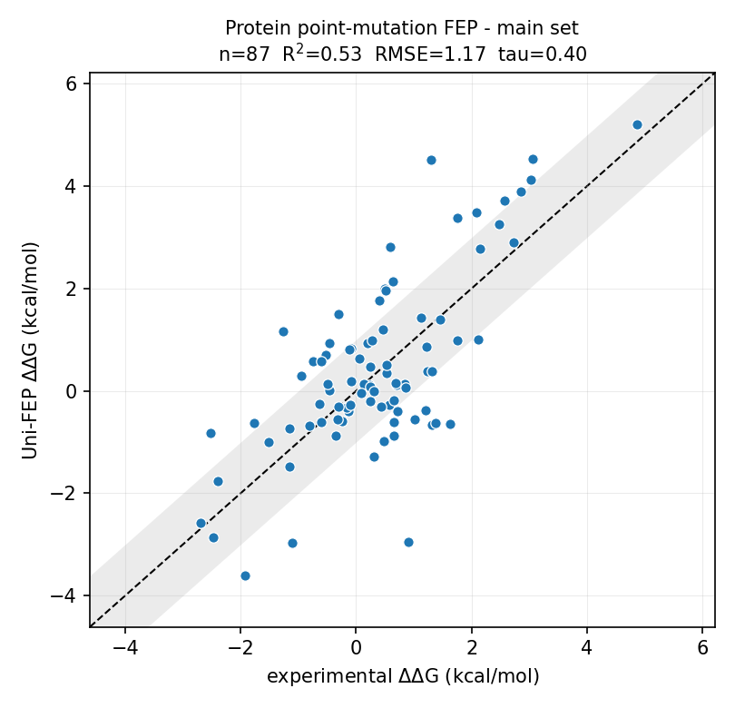
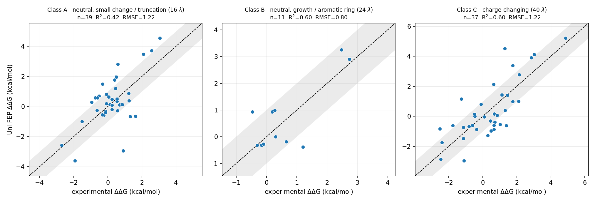

# Protein Point-Mutation FEP Benchmark

Relative binding free-energy changes (ddG) upon **protein point mutation**, computed with Uni-FEP and
compared against the experimental set compiled by Aldeghi *et al.*

In contrast to the ligand-perturbation benchmarks, the ligand is held fixed within each entry and the
**protein** is alchemically mutated.

## pH

Each entry lists a pH because the experimental ddG values were measured under different conditions,
and PROPKA assigns the protonation states at that experimental pH with the ligand present. The pH is
therefore an input taken from the source measurement, not a variable we scanned: no entry was run at
a pH other than the one its experiment used. The receptors genuinely differ in charge state as a
result - at pH 4.5 histidines are doubly protonated (HIP) and Glu/Asp are neutral (GLH/ASH), while at
pH 7.7 they are HID/HIE and GLU/ASP.

1YON is the only complex with experimental values at two pH values (4.5 and 7.7). It is a single
entry with two rows, and the second receptor is kept as `protein_pH4.5.pdb`.

## Different mutations, different difficulty, different protocols

A protein mutation is not a single kind of perturbation. Truncating a leucine to valine, growing an
alanine into a tryptophan, and turning an aspartate into a leucine are three very different
alchemical transformations, and they do not converge at the same rate.

We therefore do not apply one protocol to all 101 mutations. Each mutation is assigned to one of
three classes, and each class gets its own lambda ladder:

| Class                              | Definition                          | lambda |  N | RMSE (kcal/mol) |
| ---------------------------------- | ----------------------------------- | -----: | -: | --------------: |
| A | neutral, small change or truncation |     16 | 39 |            1.22 |
| B | neutral, growth or aromatic ring    |     24 | 11 |            0.80 |
| C | charge-changing                     |     40 | 37 |            1.22 |

[`protocol.md`](protocol.md) gives the class definitions and the known blind spot of
this classifier.

Twelve structurally harder systems - large cavity creation, bulky residues grown into a packed
pocket, loss of a buried hydrogen-bonding network - additionally use a more aggressive enhanced
sampling setting, recorded per mutation in the `protocol` column.

Per-class results, data and figures live in the three `Protein|class_*` entries under
`uni_fep_benchmarks/`.

## Results

| Set                                                      |  N |   R2 | RMSE (kcal/mol) |  MUE | Kendall tau |  Bias |
| -------------------------------------------------------- | -: | ---: | --------------: | ---: | ----------: | ----: |
| **Main set**                                             | 87 | 0.53 |            1.17 | 0.92 |        0.40 | +0.07 |
| Class A - neutral, small change / truncation (16 lambda) | 39 | 0.42 |            1.22 | 0.93 |        0.27 | +0.15 |
| Class B - neutral, growth / aromatic ring (24 lambda)    | 11 | 0.60 |            0.80 | 0.62 |        0.26 | +0.07 |
| Class C - charge-changing (40 lambda)                    | 37 | 0.60 |            1.22 | 1.00 |        0.55 | -0.01 |

<p align="center"></p>

Every mutation in the main set was run as three independent replicas; tabulated values are replica
means and the median replica standard deviation is 0.27 kcal/mol.

### By mutation class

<p align="center"></p>

Class C shows the strongest rank correlation because its experimental values span the widest range.
Class A has the lowest per-point error but a weak tau: almost all of its experimental values lie
within +/-2 kcal/mol, leaving little signal to rank.

The complete Aldeghi set contains 101 mutations. Fourteen are excluded from the main set because they
lie outside the applicability domain of a fixed-charge force field, or remain unexplained after
systematic diagnosis - see [excluded.md](excluded.md). Over all 101 systems the statistics
are R2 = 0.35, RMSE = 2.28, tau = 0.36.

## Enhanced sampling for the harder systems

Twelve of the 87 systems are structurally harder than the mutation class alone predicts: they create
a large buried cavity, grow a bulky residue into a packed pocket, or delete a buried
hydrogen-bonding network. For these the baseline REST2 region - which heats only the disappearing
side chain - is too small, so a **more aggressive design** is applied.

| Parameter                       | Baseline | Enhanced                                                     |
| ------------------------------- | -------- | ------------------------------------------------------------ |
| `rest2_neighbor_cutoff`         | off      | 3.0 A around the mutation site                               |
| `rest2_pocket_ligand_cutoff`    | off      | 5.0 A around the ligand                                      |
| `rest2_pocket_full_hamiltonian` | off      | on (neutral pocket residues also enter the non-bonded boost) |
| `auto_rotamer_select`           | off      | off (see protocol.md)                                   |

The heated region widens from 3-18 atoms to 116-234 in the wild-type state, and from 0-24 atoms to
114-245 in the *mutant* state; in the baseline the mutant end state is left essentially unheated.
Ten of the twelve improved over the baseline and none regressed.

For two class-A systems the wider heated region also needed more lambda windows to keep adjacent
windows overlapping (16 -> 24). These are labelled `pocket-heating+lambda`.

| PDB  | Mutation                     | Class | lambda | Protocol              | Error (kcal/mol) |
| ---- | ---------------------------- | ----- | -----: | --------------------- | ---------------: |
| 1AMW | L89V/L93I                    | A     |     16 | pocket-heating        |            -1.99 |
| 1AMW | L89V/L93I/V136M              | A     |     16 | pocket-heating        |            -2.28 |
| 2QEH | Y94L                         | A     |     24 | pocket-heating+lambda |            +2.23 |
| 3ZY2 | F357A                        | A     |     16 | pocket-heating        |            +1.14 |
| 3ZY2 | W245A                        | A     |     24 | pocket-heating+lambda |            -3.85 |
| 2PZN | S302R/C303D                  | B     |     24 | pocket-heating        |            +0.78 |
| 2PDP | R302S                        | C     |     40 | pocket-heating        |            +1.69 |
| 2PDQ | D303C                        | C     |     40 | pocket-heating        |            +0.64 |
| 2QEH | E7L/H35L                     | C     |     40 | pocket-heating        |            +1.10 |
| 2YGE | E88G/N92L                    | C     |     40 | pocket-heating        |            +2.42 |
| 3RDQ | S90T/V108W/T110L/L29F/G52... | C     |     40 | pocket-heating        |            -1.58 |
| 3ZY2 | R40A                         | C     |     40 | pocket-heating        |            +3.22 |

### Protocol usage across the main set

| Protocol              |  A |  B |  C | Total |
| --------------------- | -: | -: | -: | ----: |
| baseline              | 33 | 10 | 31 |    74 |
| baseline+lambda       |  1 |  0 |  0 |     1 |
| pocket-heating        |  3 |  1 |  6 |    10 |
| pocket-heating+lambda |  2 |  0 |  0 |     2 |

The protocol applied to each mutation is recorded in the `protocol` and `num_lambda` columns of every
`result_ddG.csv`.

## Repository layout

**There is one dataset, presented under several groupings.** The benchmark contains 40 complexes and
101 mutations (87 of those mutations, across 34 complexes, form the main set). Every entry directory
under `uni_fep_benchmarks/` is a *view* of that same dataset - not an independent set of systems. Two
different grouping rules are applied:

- **by lambda ladder** - `Protein|class_A_*`, `Protein|class_B_*`, `Protein|class_C_*`. Together these
  three cover all 101 mutations exactly once, because every mutation has exactly one class.
- **by known failure mechanism** - `Protein|sigma-hole` and `Protein|bulky_into_packed_pocket`. These
  re-collect the mutations that are excluded from the main set, so their rows also appear in whichever
  class entry they belong to.

| Entry | Grouping | Complexes | Mutations |
|---|---|--:|--:|
| `Protein\|class_A_neutral_small_change` | 16 lambda windows | 21 | 41 |
| `Protein\|class_B_neutral_growth_ring` | 24 lambda windows | 12 | 21 |
| `Protein\|class_C_charge_changing` | 40 lambda windows | 18 | 39 |
| `Protein\|sigma-hole` | excluded: aryl-bromide halogen bond | 8 | 8 |
| `Protein\|bulky_into_packed_pocket` | excluded: bulky growth into a packed pocket | 1 | 4 |

**Do not add these numbers up.** The three class entries sum to 101 mutations, which is the whole set;
the two mechanism entries are 12 of those 101 seen again. Likewise a complex appears once per entry it
contributes to, so the complex counts overlap: 3H2K appears in class A, class B and
`bulky_into_packed_pocket`; 1A4H and 1AMW appear in all three classes; nine of the 40 complexes span
more than one class.

Each entry is self-contained - the structures are duplicated rather than cross-referenced, so any one
directory can be used on its own:

```
Protein|<grouping>/
    result_ddG.csv     every mutation in this grouping, with an `entry` column
    result_ddG.png     plot for this grouping
    <PDB>/             one subdirectory per complex contributing to it
        protein.pdb        prepared wild-type receptor (repairs applied; see preparation.md)
        ref_ligand.sdf     bound ligand
        result_ddG.csv     this complex's mutations within this grouping
```

`Protein|class_A_neutral_small_change/1YON/` additionally carries `protein_pH4.5.pdb`, the second
protonation state (see the pH section above).

The `status` column is what ties the views together: `included` for the 87 main-set mutations, and
`excluded:aryl-bromide-sigma-hole`, `excluded:bulky-residue-growth` or `excluded:unexplained` for the
14 that are not. Filtering the three class entries on `status == included` reproduces the main set
exactly. The two remaining `excluded:unexplained` mutations (2QEH D111L, 1DF8 A45S/D128A) have no
mechanism entry of their own precisely because no mechanism was established; see
[`excluded.md`](excluded.md).

Documentation, the summary table and per-complex provenance are under `docs/protein-fep-benchmark/`.

### Columns of `result_ddG.csv`

| Column                              | Meaning                                                   |
| ----------------------------------- | --------------------------------------------------------- |
| `mutation`                          | e.g. `L89V`, or `L89V/L93I` for a multi-site mutation     |
| `chain`, `resid`, `wt_aa`, `mut_aa` | mutation site(s), semicolon-separated for multi-site      |
| `n_sites`                           | number of simultaneously mutated residues                 |
| `mutation_class`                    | `A` / `B` / `C`, see [protocol.md](protocol.md) |
| `exp_ddG (kcal/mol)`                | experimental value                                        |
| `fep_ddG (kcal/mol)`                | Uni-FEP result (replica mean where replicas were run)     |
| `fep_ddG_std (kcal/mol)`            | standard deviation over independent replicas              |
| `n_replicas`                        | number of independent repeats                             |
| `num_lambda`                        | number of lambda windows                                  |
| `protocol`                          | `baseline`, `pocket-heating`, or `pocket-heating+lambda`  |
| `status`                            | `included`, or the reason for exclusion                   |

## Entries

Per-entry correlation coefficients are not reported. Only 10 of the 34 complexes contain three or more
included mutations, and within a single protein the experimental ddG values span a median range of
only 1.58 kcal/mol, so R2 and Kendall tau for an individual complex would reflect that target's
dynamic range rather than the accuracy of the method. Per-complex RMSE is reported instead (median 0.94
kcal/mol, consistent with the global 1.17); the aggregate over all 87 systems is the figure to quote.

| PDB  |  pH | Mutations | Included | RMSE (kcal/mol) | Exp. range |
| ---- | --: | --------: | -------: | --------------: | ---------: |
| 1AMW | 7.4 |        11 |       11 |            1.11 |       1.55 |
| 1A4H | 7.4 |         9 |        9 |            1.12 |       1.61 |
| 3ZY2 | 7.5 |         7 |        7 |            2.06 |       3.87 |
| 2QEH | 7.4 |         7 |        6 |            1.33 |       6.79 |
| 2PQL | 7.4 |         4 |        4 |            1.23 |       4.79 |
| 2Q64 | 4.7 |         4 |        4 |            0.68 |       1.30 |
| 2II4 | 7.5 |         3 |        3 |            1.00 |       0.47 |
| 2PDG | 8.0 |         4 |        3 |            0.94 |       2.97 |
| 3AQT | 7.0 |         3 |        3 |            1.13 |       0.66 |
| 3EEB | 7.4 |         3 |        3 |            1.39 |       0.54 |
| 1GZF | 7.4 |         2 |        2 |            0.02 |       0.40 |
| 1PWM | 8.0 |         2 |        2 |            0.67 |       0.24 |
| 2FGU | 5.0 |         2 |        2 |            0.24 |       0.46 |
| 2JBZ | 8.0 |         2 |        2 |            1.16 |       0.04 |
| 2VWC | 7.4 |         2 |        2 |            1.41 |       0.11 |
| 3AFK | 7.4 |         2 |        2 |            0.22 |       1.73 |
| 3H2K | 7.5 |         6 |        2 |            0.65 |       0.22 |
| 3M3C | 7.4 |         2 |        2 |            1.16 |       1.12 |
| 3UJB | 7.5 |         2 |        2 |            0.20 |       0.01 |
| 1US0 | 8.0 |         1 |        1 |            0.52 |       0.00 |
| 1YON | 4.5 / 7.7 |     2 |        2 |            1.53 |       0.29 |
| 2IKI | 8.0 |         2 |        1 |            0.00 |       0.00 |
| 2PD9 | 8.0 |         1 |        1 |            0.18 |       0.00 |
| 2PDJ | 8.0 |         1 |        1 |            1.39 |       0.00 |
| 2PDP | 8.0 |         1 |        1 |            1.69 |       0.00 |
| 2PDQ | 8.0 |         1 |        1 |            0.64 |       0.00 |
| 2PDU | 8.0 |         1 |        1 |            0.39 |       0.00 |
| 2PZN | 8.0 |         2 |        1 |            0.78 |       0.00 |
| 2WDS | 8.0 |         1 |        1 |            0.17 |       0.00 |
| 2YGE | 7.4 |         1 |        1 |            2.42 |       0.00 |
| 2YGF | 7.4 |         1 |        1 |            0.24 |       0.00 |
| 3LEP | 8.0 |         1 |        1 |            0.26 |       0.00 |
| 3RDQ | 7.4 |         1 |        1 |            1.58 |       0.00 |
| 3UJ9 | 7.5 |         1 |        1 |            0.28 |       0.00 |
| 1DF8 | 7.0 |         1 |        0 |               - |          - |
| 3LD5 | 8.0 |         1 |        0 |               - |          - |
| 3LQG | 8.0 |         1 |        0 |               - |          - |
| 3LQL | 8.0 |         1 |        0 |               - |          - |
| 3LZ5 | 8.0 |         1 |        0 |               - |          - |
| 3M4H | 8.0 |         1 |        0 |               - |          - |

## Further reading

- [protocol.md](protocol.md) - protocol and the rationale for the three mutation classes
- [preparation.md](preparation.md) - structure preparation and manual repairs
- [excluded.md](excluded.md) - the excluded systems and the evidence behind each
