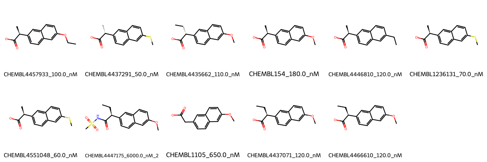

# AKR1C3 System FEP Calculation Results Analysis

> This README is generated by AI model using verified experimental data and Uni-FEP calculation results. Content may contain inaccuracies and is provided for reference only. No liability is assumed for outcomes related to its use.

## Introduction

AKR1C3 (Aldo-keto reductase family 1 member C3), also known as 17β-HSD5, is an NADPH-dependent oxidoreductase that plays crucial roles in steroid hormone and prostaglandin metabolism. It is involved in the conversion of androgens, estrogens, and prostaglandins, and has been implicated in hormone-dependent cancers. AKR1C3 has emerged as an important therapeutic target for hormone-dependent cancers, particularly prostate cancer, due to its role in androgen biosynthesis.

## Molecules

The AKR1C3 system dataset in this study consists of 11 compounds, featuring a core structure with a naphthalene scaffold. The compounds share a common carboxylic acid group and demonstrate structural diversity through various substituents at the 6-position of the naphthalene ring, including methoxy, methylthio, and ethyl groups. These molecules also show stereochemical variation at the α-carbon of the carboxylic acid group.

The experimentally determined binding affinities range from 50 nM to 6000 nM, spanning approximately two orders of magnitude, with binding free energies from -7.12 to -9.96 kcal/mol.

## Conclusions

The FEP calculation results for the AKR1C3 system show moderate correlation with experimental data, achieving an R² of 0.59 and an RMSE of 0.90 kcal/mol. Several compounds demonstrated excellent prediction accuracy, such as CHEMBL1105 (experimental: -8.44 kcal/mol, predicted: -8.40 kcal/mol) and CHEMBL4437071 (experimental: -9.44 kcal/mol, predicted: -9.42 kcal/mol). The predicted binding free energies ranged from -6.78 to -11.68 kcal/mol, generally capturing the relative binding trends of the series.

## References

For more information about the AKR1C3 target and associated bioactivity data, please visit:
https://www.ebi.ac.uk/chembl/explore/assay/CHEMBL4428988 