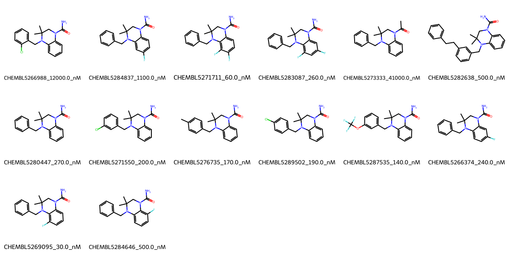

# AMPD2 System FEP Calculation Results Analysis

> This README is generated by AI model using verified experimental data and Uni-FEP calculation results. Content may contain inaccuracies and is provided for reference only. No liability is assumed for outcomes related to its use.

## Introduction

AMPD2 (Adenosine Monophosphate Deaminase 2) is a key enzyme in purine nucleotide metabolism that catalyzes the deamination of AMP to IMP. It plays a crucial role in maintaining cellular energy homeostasis and nucleotide balance, particularly in tissues with high energy demands. AMPD2 deficiency has been associated with rare neurodevelopmental disorders and metabolic conditions. The enzyme's importance in cellular metabolism and its potential as a therapeutic target for various disorders has led to increased interest in developing selective AMPD2 inhibitors.

## Molecules

The AMPD2 system dataset in this study comprises 14 compounds, primarily featuring a dihydroquinazoline scaffold with various substituents. The compounds have molecular weights ranging from 300 to 450 Da. These molecules share a common core structure with a urea moiety and demonstrate structural diversity through different substitution patterns, including fluorine, chlorine, and methyl groups at various positions. The compounds are designed to interact with key binding site residues through hydrogen bonding and hydrophobic interactions.

The experimentally determined binding affinities range from 30 nM to 41 μM, spanning approximately three orders of magnitude, with binding free energies from -5.98 to -10.26 kcal/mol.

## Conclusions

The FEP calculation results for the AMPD2 system show that the predicted values (-2.93 to -11.41 kcal/mol) generally align with the experimental range, though with some notable deviations. The overall prediction accuracy achieved an R² of 0.54 and an RMSE of 1.36 kcal/mol. Several compounds demonstrated good prediction results, such as CHEMBL5269095 (experimental: -10.26 kcal/mol, predicted: -10.02 kcal/mol) and CHEMBL5284646 (experimental: -8.59 kcal/mol, predicted: -8.46 kcal/mol).

## References

For more information about the AMPD2 target and associated bioactivity data, please visit:
https://www.ebi.ac.uk/chembl/explore/assay/CHEMBL5240593