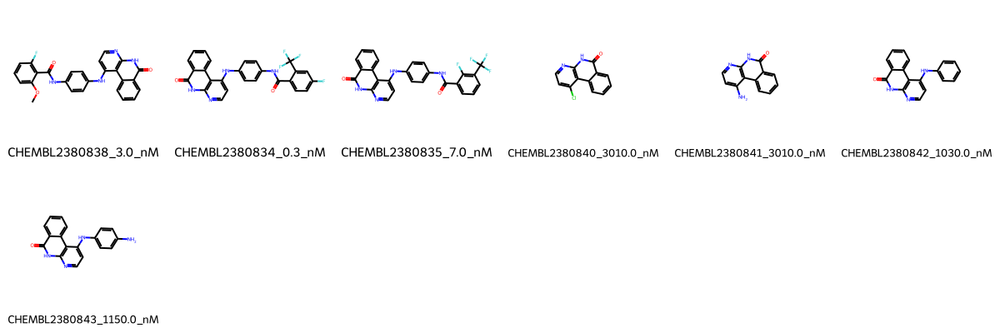

# AURKA System FEP Calculation Results Analysis

> This README is generated by AI model using verified experimental data and Uni-FEP calculation results. Content may contain inaccuracies and is provided for reference only. No liability is assumed for outcomes related to its use.

## Introduction

AURKA (Aurora Kinase A) is a serine/threonine protein kinase that plays essential roles in cell cycle regulation, particularly during mitosis. It is crucial for centrosome maturation, spindle assembly, and chromosome segregation. Overexpression of AURKA has been observed in various types of cancer, including breast, colorectal, and ovarian cancers, where it contributes to genomic instability and tumor progression. Due to its critical role in cell cycle regulation and its frequent dysregulation in cancer, AURKA has emerged as an important target for anti-cancer drug development.

## Molecules

The AURKA system dataset in this study comprises 7 compounds, featuring a pyrimidine-based scaffold with various substituents. The compounds have molecular weights ranging from 250 to 500 Da. These molecules share a common core structure with a quinazoline-like system and demonstrate structural diversity through different substitution patterns, including fluorine-containing groups and various aromatic substituents. The compounds are designed to form key interactions within the ATP-binding pocket of AURKA through hydrogen bonding and hydrophobic contacts.

The experimentally determined binding affinities range from 0.3 nM to 3.01 μM, spanning approximately four orders of magnitude, with binding free energies from -7.53 to -12.99 kcal/mol.

## Conclusions

The FEP calculation results for the AURKA system show that the predicted values (-6.90 to -13.53 kcal/mol) align well with the experimental range. The overall prediction accuracy achieved an R² of 0.79 and an RMSE of 1.12 kcal/mol, indicating good predictive performance. Several compounds demonstrated excellent prediction results, such as CHEMBL2380835 (experimental: -11.12 kcal/mol, predicted: -11.97 kcal/mol) and CHEMBL2380842 (experimental: -8.16 kcal/mol, predicted: -7.64 kcal/mol).

## References

For more information about the AURKA target and associated bioactivity data, please visit:
https://www.ebi.ac.uk/chembl/explore/assay/CHEMBL2382841 