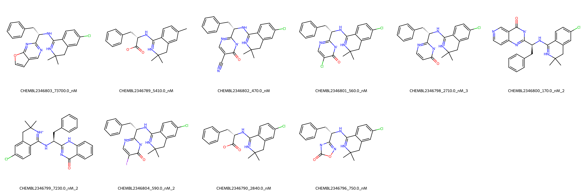

# BACE1 System FEP Calculation Results Analysis

> This README is generated by AI model using verified experimental data and Uni-FEP calculation results. Content may contain inaccuracies and is provided for reference only. No liability is assumed for outcomes related to its use.

## Introduction

BACE1 (Beta-site APP Cleaving Enzyme 1), also known as β-secretase, is a transmembrane aspartic protease that plays a crucial role in the production of β-amyloid peptides. It is a key therapeutic target for Alzheimer's disease due to its involvement in the amyloidogenic processing of amyloid precursor protein (APP). BACE1 inhibition has been extensively studied as a potential treatment strategy for reducing β-amyloid accumulation in the brain, although achieving selective and brain-penetrant inhibition has proven challenging.

## Molecules

The BACE1 system dataset comprises 10 compounds featuring a common structural framework with a dimethyl-substituted tetrahydroquinoline core. These compounds exhibit structural diversity through various heterocyclic substituents, including pyrimidine, isoxazole, and benzimidazole moieties. A notable feature is the presence of a chloro substituent on the tetrahydroquinoline ring and different terminal groups including cyano, halo, and carboxylate functionalities.

The experimentally determined binding affinities span a wide range from 170.0 nM to 73700.0 nM, corresponding to binding free energies from -5.64 to -9.23 kcal/mol. This approximately 430-fold range in binding affinity provides an excellent distribution for evaluating the FEP calculations.

## Conclusions

The FEP calculations for the BACE1 system demonstrate excellent predictive performance with an R² of 0.89 and an RMSE of 0.96 kcal/mol. Several compounds showed remarkable prediction accuracy, such as CHEMBL2346796 (experimental: -8.35 kcal/mol, predicted: -8.32 kcal/mol) and CHEMBL2346790 (experimental: -7.56 kcal/mol, predicted: -7.44 kcal/mol). The predictions successfully captured both the general trend and specific variations in binding affinity across the series, particularly for the more potent compounds.

## References

For more information about the BACE1 target and associated bioactivity data, please visit:
https://www.ebi.ac.uk/chembl/explore/assay/CHEMBL2352381 