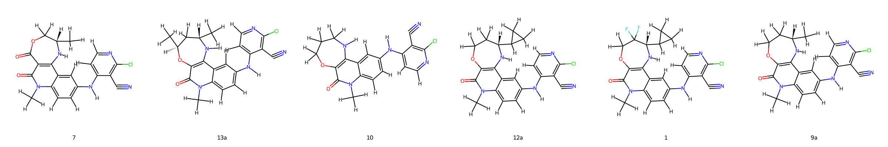

# BCL6 System FEP Calculation Results Analysis

> This README is generated by AI model using verified experimental data and Uni-FEP calculation results. Content may contain inaccuracies and is provided for reference only. No liability is assumed for outcomes related to its use.

## Introduction

B-cell lymphoma 6 (BCL6) is a transcriptional repressor that plays a crucial role in the regulation of B-cell development and differentiation. It is particularly important in the germinal center reaction and has been implicated in various lymphomas, where its dysregulation contributes to cancer development and progression. BCL6 has emerged as an important therapeutic target in the treatment of diffuse large B-cell lymphoma (DLBCL) and other B-cell malignancies, with inhibitors showing promise in disrupting its protein-protein interactions.

## Molecules

The BCL6 system dataset in this study consists of 6 compounds, featuring a tricyclic core structure with various substituents. The compounds share a common chlorocyanoaniline moiety and demonstrate structural diversity through different modifications of the tricyclic system, including variations in the ring size and substitution patterns. Notable structural features include the presence of N-methylated lactams and different cycloalkyl substituents that influence binding affinity.

The experimentally determined binding free energies span a range from -6.44 to -11.47 kcal/mol, representing a significant range of binding affinities that covers nearly 5 orders of magnitude in terms of binding constants.

## Conclusions

The FEP calculation results for the BCL6 system show excellent correlation with experimental data, achieving an R² of 0.84 and an RMSE of 1.01 kcal/mol. Several compounds demonstrated good prediction accuracy, such as compound 9a (experimental: -9.39 kcal/mol, predicted: -9.24 kcal/mol) and compound 12a (experimental: -10.11 kcal/mol, predicted: -10.38 kcal/mol). The predicted binding free energies ranged from -5.09 to -12.29 kcal/mol, effectively capturing the relative binding trends of the series.

## References

> Davis OA, Cheung KM, Brennan A, Lloyd MG, Rodrigues MJ, Pierrat OA, Collie GW, Le Bihan YV, Huckvale R, Harnden AC, Varela A. Optimizing shape complementarity enables the discovery of potent tricyclic BCL6 inhibitors. Journal of Medicinal Chemistry. 2022 Jun 3;65(12):8169-90. 