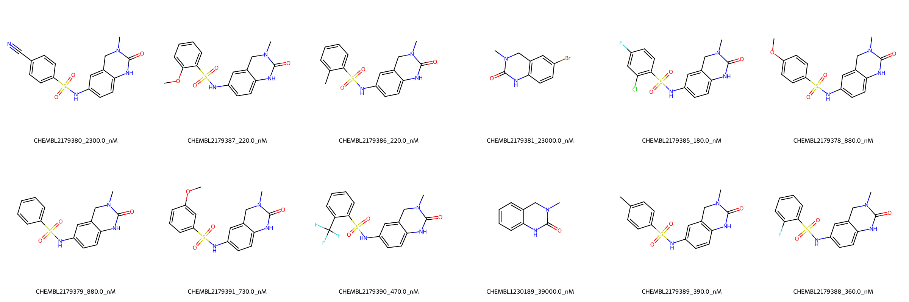

# BRD4 System FEP Calculation Results Analysis

> This README is generated by AI model using verified experimental data and Uni-FEP calculation results. Content may contain inaccuracies and is provided for reference only. No liability is assumed for outcomes related to its use.

## Introduction

BRD4 (Bromodomain-containing protein 4) is a member of the BET (bromodomain and extra-terminal) family of proteins. It plays a crucial role in transcriptional regulation by reading acetylated lysine marks on histones and facilitating the recruitment of transcriptional machinery. BRD4 has emerged as an important therapeutic target in cancer and inflammatory diseases, as its inhibition can suppress the expression of oncogenes and inflammatory genes. The development of BRD4 inhibitors has shown promise in various therapeutic applications.

## Molecules

The BRD4 system dataset in this study comprises 12 compounds, featuring a benzene sulfonamide scaffold linked to a methylated dihydroquinolinone core structure. These compounds demonstrate structural diversity through various substituents on the benzene ring, including methoxy, methyl, halogen, and trifluoromethyl groups. The compounds are designed to interact with the acetyl-lysine binding pocket of the BRD4 bromodomain.

The experimentally determined binding affinities range from 180 nM to 39000 nM, spanning approximately two orders of magnitude, with binding free energies from -6.01 to -9.20 kcal/mol.

## Conclusions

The FEP calculation results for the BRD4 system demonstrate excellent predictive performance with an R² of 0.77 and an RMSE of 0.48 kcal/mol. The predicted binding free energies (-5.81 to -8.85 kcal/mol) align well with the experimental values. Several compounds showed particularly good prediction accuracy, such as CHEMBL2179388 (experimental: -8.79 kcal/mol, predicted: -8.71 kcal/mol) and CHEMBL2179389 (experimental: -8.74 kcal/mol, predicted: -8.65 kcal/mol). The most potent compound, CHEMBL2179385, with an experimental binding free energy of -9.20 kcal/mol, was well predicted at -8.80 kcal/mol.

## References

For more information about the BRD4 target and associated bioactivity data, please visit:
https://www.ebi.ac.uk/chembl/explore/assay/CHEMBL2183681 