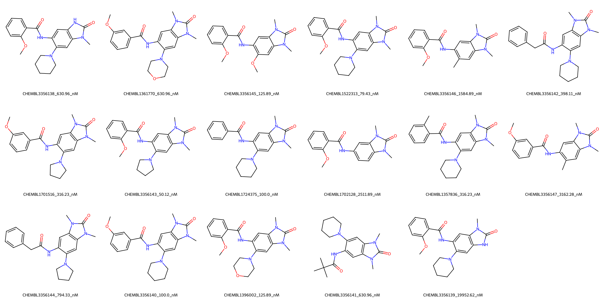

# BRPF1 System FEP Calculation Results Analysis

## Introduction

BRPF1 (Bromodomain and PHD Finger-containing protein 1) is a multidomain protein that functions as a scaffolding subunit of the MOZ/MORF histone acetyltransferase complex. It plays crucial roles in chromatin regulation and gene expression through its ability to recognize specific histone modifications. BRPF1 has emerged as a potential therapeutic target for various diseases, including cancer and inflammatory conditions, due to its involvement in epigenetic regulation.

## Molecules

The BRPF1 system dataset in this study consists of 17 compounds, featuring a core structure with a quinazolinone scaffold. The compounds share a common N-methylquinazolinone core and demonstrate structural diversity through various substituents, including methoxy groups, piperidine rings, and morpholine moieties. These molecules exhibit different patterns of substitution at both the benzamide portion and the quinazolinone core.

The experimentally determined binding affinities range from 50.12 nM to 19.95 μM, spanning approximately three orders of magnitude, with binding free energies from -6.41 to -9.95 kcal/mol.

## Conclusions

The FEP calculation results for the BRPF1 system show moderate correlation with experimental data, achieving an R² of 0.60 and an RMSE of 0.65 kcal/mol. Several compounds demonstrated good prediction accuracy, such as CHEMBL3356139 (experimental: -6.41 kcal/mol, predicted: -6.44 kcal/mol) and CHEMBL1396002 (experimental: -9.41 kcal/mol, predicted: -9.33 kcal/mol). The predicted binding free energies ranged from -6.44 to -10.46 kcal/mol, generally capturing the relative binding trends of the series.

## References

For more information about the BRPF1 target and associated bioactivity data, please visit:
https://www.ebi.ac.uk/chembl/explore/assay/CHEMBL3385101 