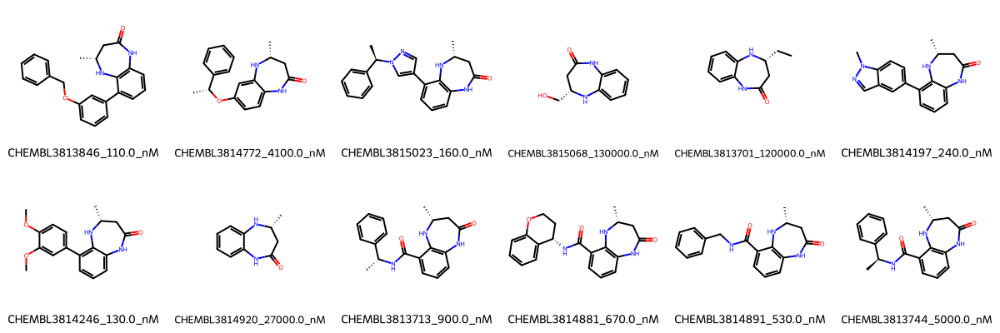

# CREBBP System FEP Calculation Results Analysis

> This README is generated by AI model using verified experimental data and Uni-FEP calculation results. Content may contain inaccuracies and is provided for reference only. No liability is assumed for outcomes related to its use.

## Introduction

CREBBP (CREB-binding protein), also known as CBP, is a crucial transcriptional coactivator that plays essential roles in various cellular processes, including transcription regulation, DNA damage response, and cell growth. It functions as a histone acetyltransferase (HAT) and helps regulate gene expression by modifying chromatin structure. CREBBP dysregulation has been implicated in various cancers and developmental disorders, making it an important therapeutic target.

## Molecules

The CREBBP system dataset in this study consists of 12 compounds, featuring a core structure with a dihydroquinoxaline scaffold. The compounds have diverse substitution patterns, including benzyl, methyl, and various other functional groups. These molecules demonstrate structural variation through different substituents while maintaining key pharmacophoric elements necessary for binding to the target.

The experimentally determined binding affinities range from 110 nM to 130 μM, spanning approximately three orders of magnitude, with binding free energies from -5.30 to -9.49 kcal/mol.

## Conclusions

The FEP calculation results for the CREBBP system demonstrate excellent agreement with experimental data, achieving an impressive R² of 0.91 and a low RMSE of 0.56 kcal/mol. Several compounds showed particularly accurate predictions, such as CHEMBL3813846 (experimental: -9.49 kcal/mol, predicted: -10.29 kcal/mol) and CHEMBL3814920 (experimental: -6.23 kcal/mol, predicted: -5.78 kcal/mol). The predicted binding free energies ranged from -4.55 to -10.29 kcal/mol, closely matching the experimental range.

## References

For more information about the CREBBP target and associated bioactivity data, please visit:
https://www.ebi.ac.uk/chembl/explore/assay/CHEMBL3817157 