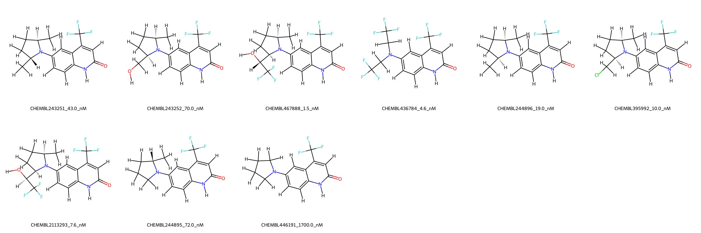
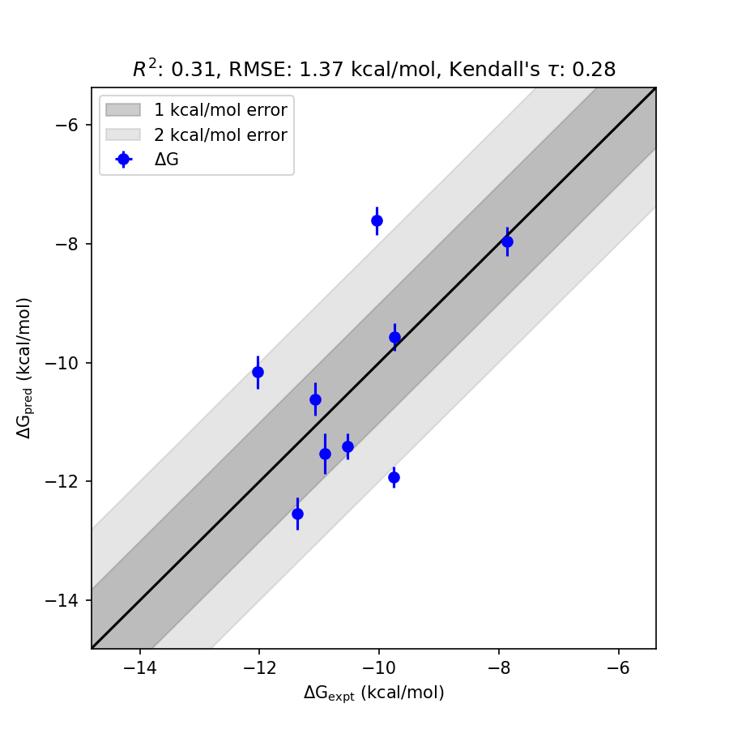

# AR System FEP Calculation Results Analysis

> This README is generated by AI model using verified experimental data and Uni-FEP calculation results. Content may contain inaccuracies and is provided for reference only. No liability is assumed for outcomes related to its use.

## Introduction  

Androgen Receptor (AR) is a ligand-activated transcription factor that belongs to the nuclear receptor superfamily. It plays a critical role in the regulation of genes involved in cellular proliferation and differentiation in target tissues. AR is essential for normal male development and reproductive function, and it also plays a role in certain cancers, particularly prostate cancer. Targeting AR with small molecule inhibitors is a key strategy in the treatment of hormone-driven malignancies, especially castration-resistant prostate cancer (CRPC).

## Molecules  

  

The AR system dataset analyzed in this study contains 9 ligands, representing a structurally diverse set of molecules specifically designed to inhibit AR's activity. These ligands include variations in trifluoromethyl substituents, stereochemical configurations, and other functional groups that enhance their ability to interact with the AR binding site.  

The experimentally determined binding free energies of these molecules range from -7.87 kcal/mol to -12.03 kcal/mol, highlighting the strong binding potential across the dataset.  

## Conclusions  

  

The FEP calculation results for the AR system demonstrate reasonable alignment with experimental data, achieving an RMSE of 1.37 kcal/mol and an R² of 0.31. Notable prediction accuracy was achieved for certain compounds, including CHEMBL467888, which exhibited an experimental binding free energy of -12.03 kcal/mol and a predicted value of -10.16 kcal/mol. Similarly, CHEMBL395992 exhibited strong agreement between experimental (-10.91 kcal/mol) and predicted (-11.53 kcal/mol) binding free energies.

The analysis highlights the utility of computational modeling in capturing the binding trends and assisting the development of AR inhibitors with strong binding affinities.  

## References  

For more information about the AR target and associated bioactivity data, please visit:  
https://www.ebi.ac.uk/chembl/explore/target/CHEMBL896869  