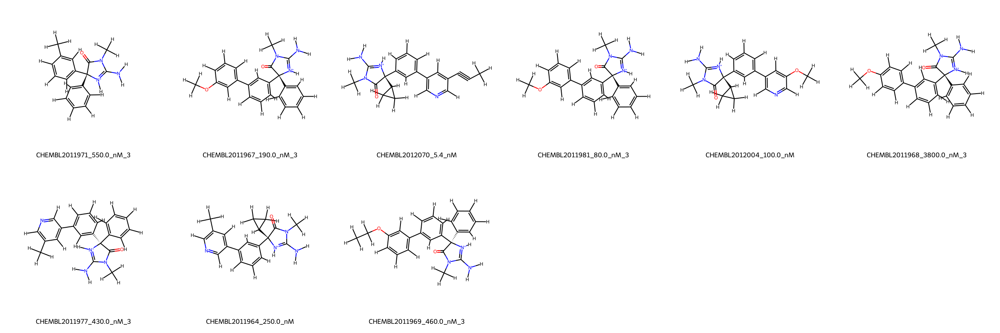
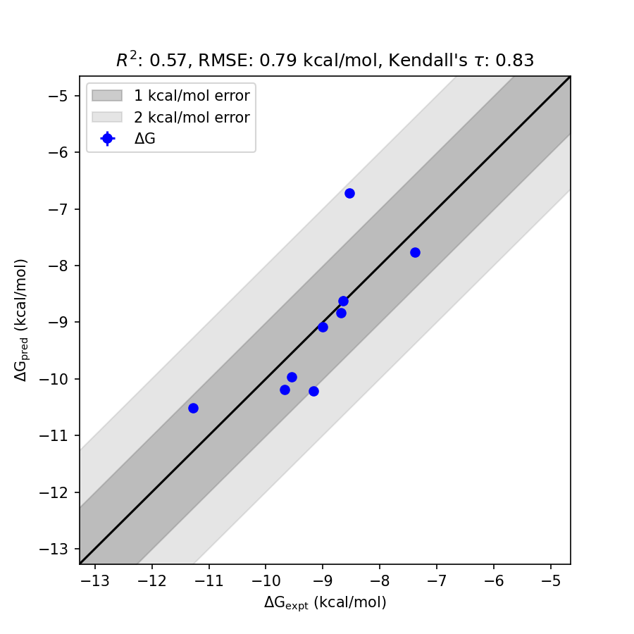

# BACE1 System FEP Calculation Results Analysis

> This README is generated by AI model using verified experimental data and Uni-FEP calculation results. Content may contain inaccuracies and is provided for reference only. No liability is assumed for outcomes related to its use.

## Introduction

BACE1 (Beta-site amyloid precursor protein cleaving enzyme 1), also known as β-secretase, is a key enzyme involved in the production of β-amyloid peptides, which aggregate to form plaques characteristic of Alzheimer’s disease pathology. As a member of the aspartic protease family, BACE1 cleaves amyloid precursor protein (APP) at specific sites, initiating the amyloidogenic pathway. Due to its central role in the formation of amyloid plaques, BACE1 has emerged as an important therapeutic target for Alzheimer's disease, and considerable efforts have been devoted to the development of BACE1 inhibitors to mitigate disease progression.

## Molecules

The BACE1 system dataset in this study consists of 10 compounds with diverse structural frameworks. These molecules exhibit varied substituents designed to interact with the enzyme's active site and demonstrate stereochemical diversity essential for modulating specific binding interactions. 

The experimentally determined binding affinities cover a broad range, from 5.4 nM to 3800 nM, corresponding to binding free energies from -11.27 to -7.39 kcal/mol. This dataset effectively captures both strong and moderate binders, enabling a comprehensive analysis of predictive performance across different affinity regimes.

## Conclusions

The FEP calculation results for the BACE1 system indicate good alignment with experimental data, achieving an R² of 0.57 and an RMSE of 0.79 kcal/mol. Notable prediction accuracy is observed for compounds such as CHEMBL2012070, which has an experimental binding free energy of -11.27 kcal/mol and a predicted value of -10.51 kcal/mol. Similarly, CHEMBL2011967 also demonstrates excellent predictive alignment, with an experimental binding free energy of -9.16 kcal/mol and a predicted value of -10.22 kcal/mol. 

For compounds tested, the predicted binding free energies effectively capture the relative ranking of binding affinities, reflecting the fundamental trends observed in experimental data across this inhibitor series.

## References

For more information about the BACE1 target and associated bioactivity data, please visit:
https://www.ebi.ac.uk/chembl/explore/assay/CHEMBL2015090 