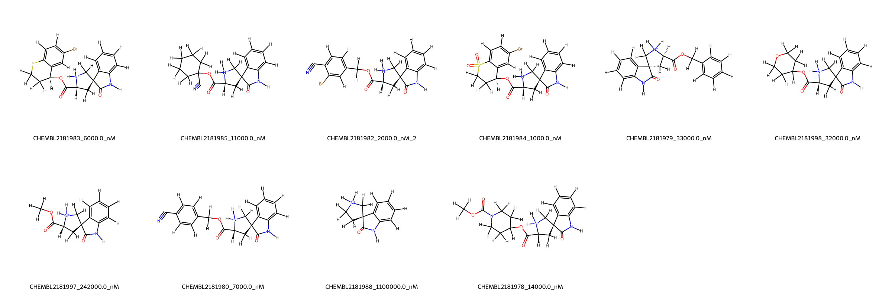
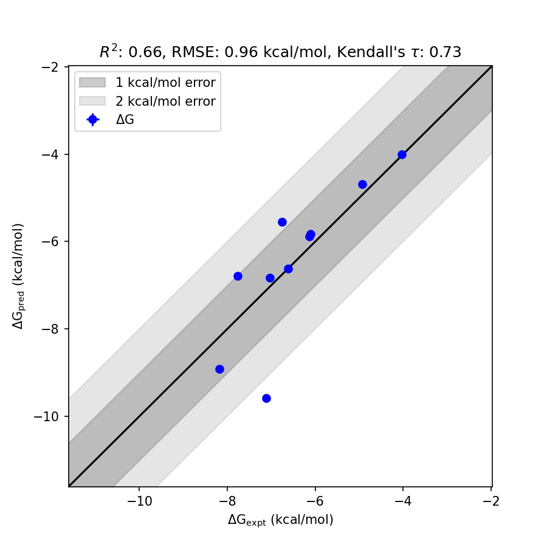

# BACE1 System FEP Calculation Results Analysis

> This README is generated by an AI model using verified experimental data and Uni-FEP calculation results. Content may contain inaccuracies and is provided for reference only. No liability is assumed for outcomes related to its use.

## Introduction

BACE1 (Beta-site amyloid precursor protein cleaving enzyme 1) is a transmembrane aspartic protease that plays a critical role in the production of amyloid-beta peptides, which are implicated in the pathology of Alzheimer's disease. By cleaving the amyloid precursor protein (APP) at specific sites, BACE1 initiates the process that leads to the accumulation of amyloid-beta plaques in the brain. Due to its pivotal role in amyloid-beta formation, BACE1 has been identified as a promising therapeutic target for preventing or slowing the progression of Alzheimer's disease.

## Molecules

The BACE1 system dataset in this study consists of 11 compounds with significant structural and substituent diversity. The molecules share a common amidic core structure and exhibit variations in functional groups such as cyano, bromo, and sulfoxide substituents on their rings. This dataset represents a wide spectrum of experimental binding affinities, ranging from 1000 nM to 1,100,000 nM, with corresponding experimental binding free energies spanning from -4.03 to -8.18 kcal/mol.

## Conclusions

The FEP calculation results for the BACE1 system show reasonable correlation with experimental data, achieving an R² of 0.66 and an RMSE of 0.96 kcal/mol. Several compounds displayed accurate predictions, such as CHEMBL2181984 (experimental: -8.18 kcal/mol, predicted: -8.92 kcal/mol) and CHEMBL2181982 (experimental: -7.77 kcal/mol, predicted: -6.78 kcal/mol), capturing key trends in experimental binding free energies effectively. The predicted results align well with the experimental values across various molecules, showcasing the reliability of the computational approach for estimating binding affinities in this system.

## References

For more information about the BACE1 target and associated bioactivity data, please visit:
https://www.ebi.ac.uk/chembl/explore/assay/CHEMBL2182237 