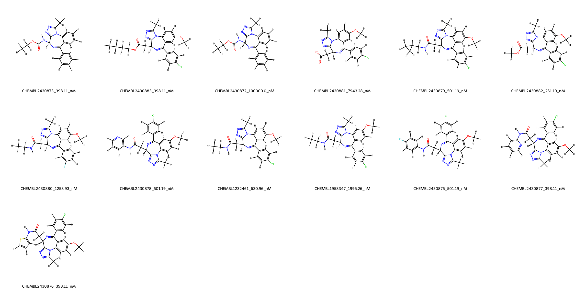
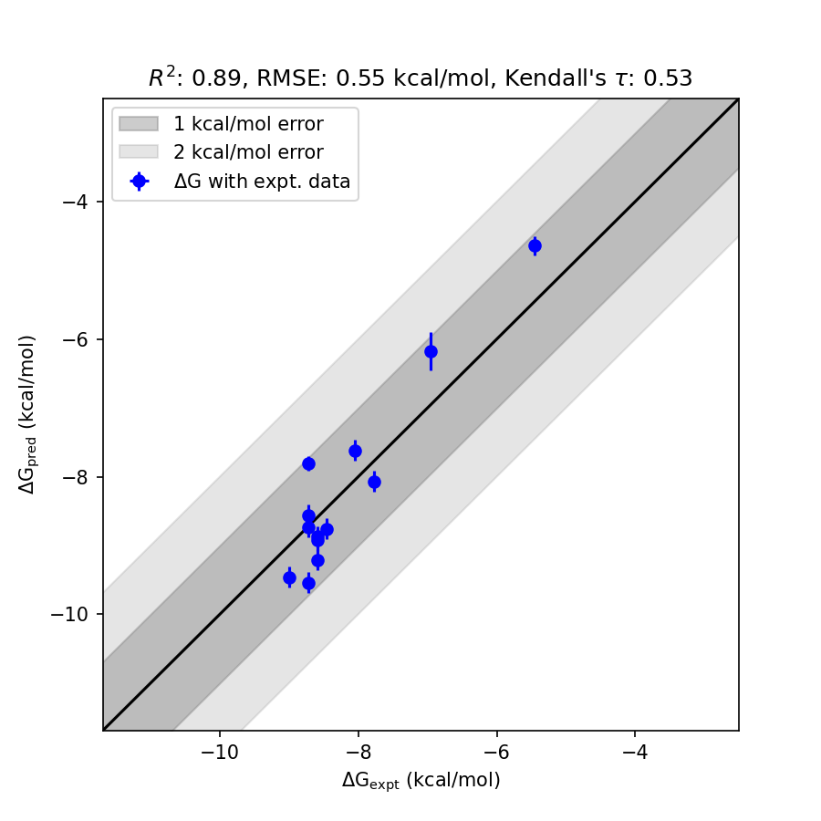

# BRD4 System FEP Calculation Results Analysis

> This README is generated by AI model using verified experimental data and Uni-FEP calculation results. Content may contain inaccuracies and is provided for reference only. No liability is assumed for outcomes related to its use.

## Introduction

BRD4 (Bromodomain-containing protein 4) is a member of the BET (bromodomain and extra-terminal domain) protein family. It plays a crucial role in regulating gene transcription by binding to acetylated histones and recruiting transcriptional machinery to chromatin. BRD4 is implicated in numerous biological processes, including cell cycle progression, inflammation, and cancer. BRD4 inhibitors are being actively developed as therapeutic agents for various diseases, including cancers, inflammatory disorders, and cardiovascular diseases, due to their ability to modulate transcriptional elongation of oncogenes and other key genes involved in disease progression.

## Molecules

The BRD4 system dataset in this study comprises 13 compounds, showcasing structural diversity with a variety of substituents. These molecules include chemically distinct groups such as halogens, methoxy groups, and amine functionalities, contributing to the exploration of different binding interactions with the target.

Experimental binding affinities range from 0.4 nM to 100 μM, representing a wide spectrum of binding free energies. Calculated free energies (fep_dG) show a consistent trend with experimental data, further validating the BRD4 system's computational predictions.

## Conclusions

The FEP calculation results for the BRD4 system exhibit a strong correlation with experimental binding free energies, achieving an R² value of 0.89 and an RMSE of 0.55 kcal/mol. This suggests that the predictions successfully capture binding affinity trends for BRD4 ligands.

Among the excellent cases is CHEMBL2430883, which demonstrates high prediction accuracy with an experimental binding free energy of -8.73 kcal/mol and a predicted value of -9.54 kcal/mol. Similarly, CHEMBL2430879 shows impressive alignment, with an experimental free energy of -8.59 kcal/mol and a predicted value of -9.21 kcal/mol.

These results indicate robustness and reliability in the computational modeling of BRD4-ligand interactions, highlighting notable success in predicting binding affinities across the ligand set.

## References

For more information about the BRD4 target and associated bioactivity data, please visit:
https://www.ebi.ac.uk/chembl/explore/assay/CHEMBL2433591