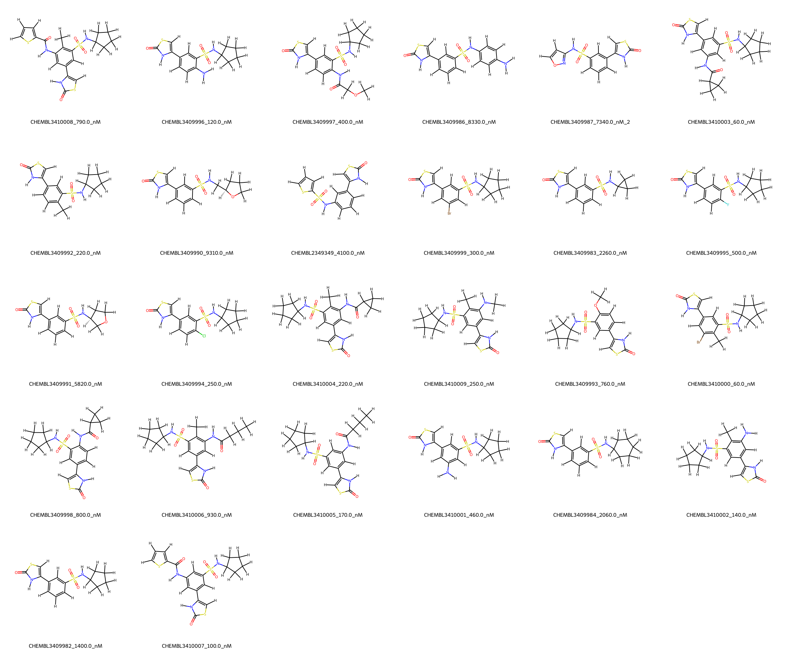
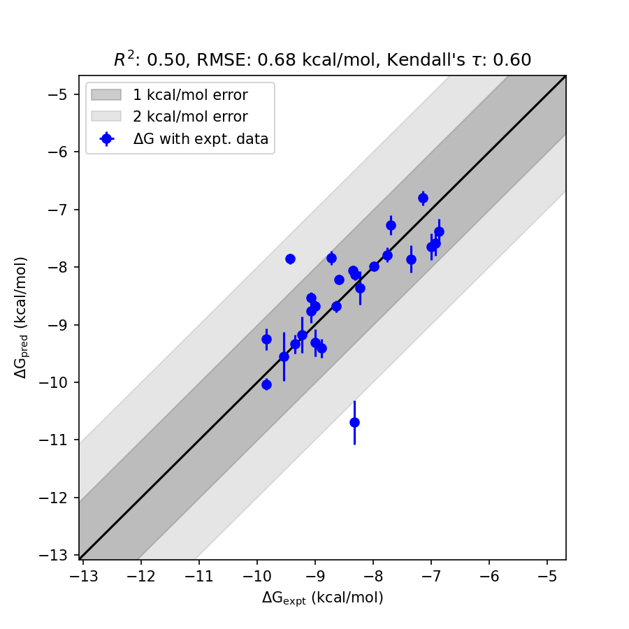

# BRD4 System FEP Calculation Results Analysis

> This README is generated by AI model using verified experimental data and Uni-FEP calculation results. Content may contain inaccuracies and is provided for reference only. No liability is assumed for outcomes related to its use.

## Introduction

BRD4 (Bromodomain-containing protein 4) is a member of the BET (bromodomain and extraterminal domain) family of proteins, which recognize acetylated lysine residues on histone tails and regulate gene transcription. BRD4 plays a crucial role in the regulation of transcriptional elongation and epigenetic memory, as well as in cell cycle progression and differentiation. It has been identified as a key therapeutic target in cancer and inflammatory diseases due to its involvement in transcriptional addiction in cancer cells and inflammatory signaling pathways.

## Molecules

The BRD4 system dataset includes 28 compounds, featuring diverse scaffolds and substituents that interact with the bromodomain region of BRD4. These molecules exhibit structural variation and stereochemical complexity, designed to explore their binding properties and enhance the selectivity for BRD4. 

The experimentally determined binding affinities range from 60 nM to 9310 nM, spanning nearly two orders of magnitude. The experimental binding free energies cover a range from -6.86 to -9.85 kcal/mol. The structural diversity ensures a comprehensive assessment of the predictive power of the FEP calculations for this system.

## Conclusions

The FEP calculation results for the BRD4 system demonstrate a reasonable correlation with experimental data, achieving an RMSE of 0.68 kcal/mol and an R² of 0.50. Notable examples of prediction accuracy include CHEMBL3410007, with an experimental binding free energy of -9.54 kcal/mol and a predicted value of -9.55 kcal/mol, as well as CHEMBL3409994, with an experimental binding free energy of -9.00 kcal/mol and a predicted value of -8.68 kcal/mol. These results highlight the reliability and robustness of FEP calculations in accurately predicting binding affinities for structurally diverse compounds.

## References

For more information about the BRD4 target and associated bioactivity data, please visit:  
https://www.ebi.ac.uk/chembl/target_report_card/CHEMBL3414207