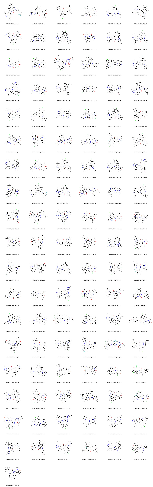
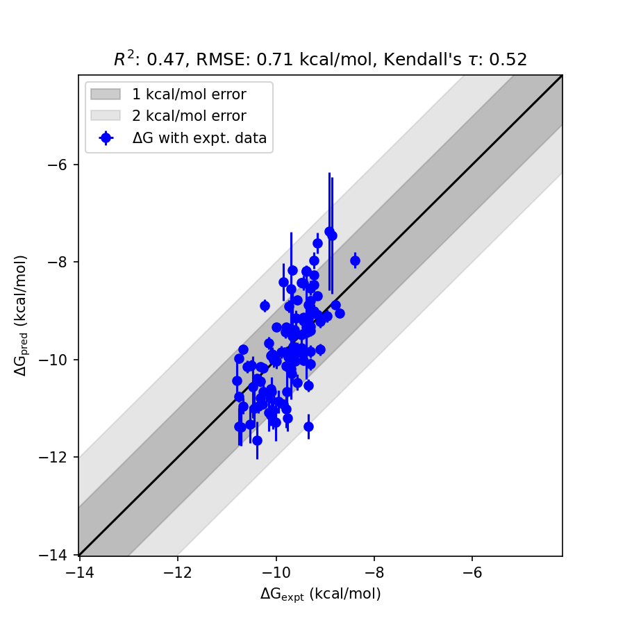

# BRD4 System FEP Calculation Results Analysis

> This README is generated by AI model using verified experimental data and Uni-FEP calculation results. Content may contain inaccuracies and is provided for reference only. No liability is assumed for outcomes related to its use.

## Introduction

BRD4 (Bromodomain-containing protein 4) is part of the BET (Bromodomain and Extra-Terminal domain) family and plays an essential role in transcriptional regulation. It binds to acetylated lysines of histones via its bromodomains, facilitating the recruitment of transcriptional machinery to chromatin. BRD4 is involved in various biological processes, such as cell cycle control, differentiation, and inflammation. It serves as a critical target in the field of drug discovery, especially for the development of therapeutics in oncology, autoimmune disorders, and other diseases associated with aberrant gene expression.

## Molecules

The BRD4 system dataset in this study consists of 80 compounds, showcasing structural diversity with various chemical backbones and functional groups. These molecules span binding affinities in the nanomolar range, with experimentally determined free energies ranging from -8.39 to -10.80 kcal/mol. The dataset provides insights into broad ligand diversity while maintaining focus on structural features favorable for BRD4 targeting.

The experimental results demonstrate consistent binding trends across the series. Statistical analysis shows that the molecular dataset features small standard deviations for FEP-calculated free energies for several ligands, exemplifying reliable prediction accuracy on structurally diverse compounds.

## Conclusions

The FEP calculation results for the BRD4 system show satisfactory correlation with experimental data, achieving an R² of 0.47 and an RMSE of 0.71 kcal/mol. Noteworthy molecules, such as CHEMBL3650933, exhibited highly accurate predictions (experimental: -10.7092 kcal/mol, predicted: -11.3803 kcal/mol). Furthermore, CHEMBL3650940 displayed minimal deviation from experimental binding free energy values (experimental: -10.39 kcal/mol, predicted: -10.3897 kcal/mol). These examples highlight the capability of the computational approach in capturing compound-specific trends within the BRD4 dataset.

## References

For more information about the BRD4 target and associated bioactivity data, please visit:
https://www.ebi.ac.uk/chembl/explore/assay/CHEMBL3706176