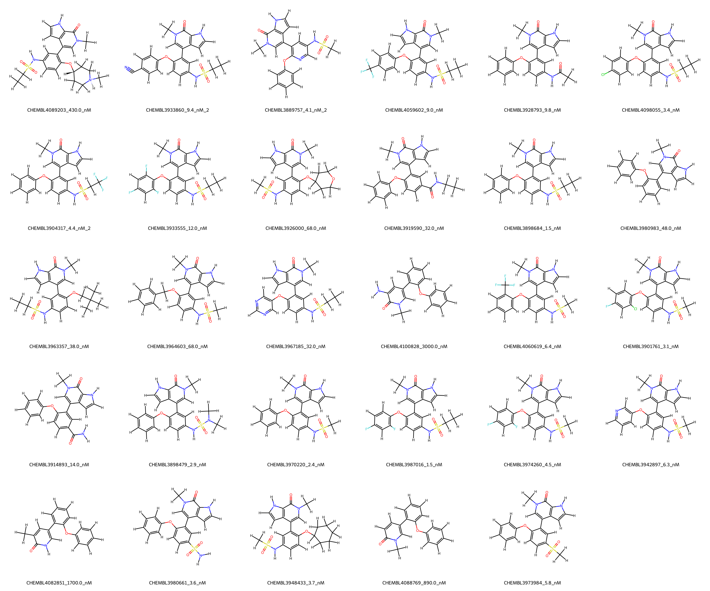
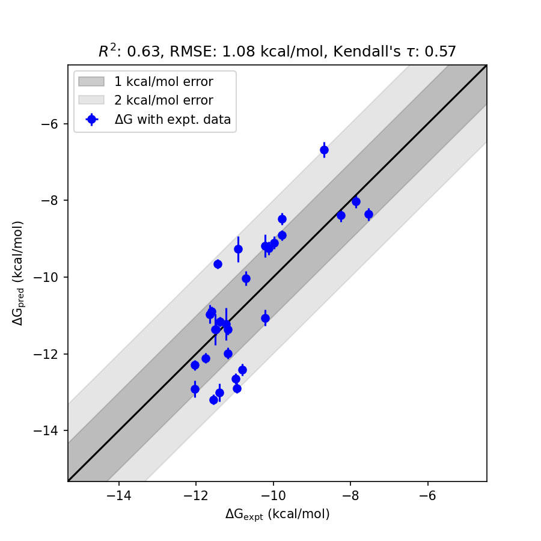

# BRD4 System FEP Calculation Results Analysis

> This README is generated by AI model using verified experimental data and Uni-FEP calculation results. Content may contain inaccuracies and is provided for reference only. No liability is assumed for outcomes related to its use.

## Introduction

BRD4 (Bromodomain-containing protein 4) is a member of the bromodomain and extra-terminal (BET) family of proteins that recognize acetylated lysine residues on histones through their bromodomains. BRD4 plays a critical role in regulating gene expression during cellular processes such as cell cycle progression and transcription. Due to its involvement in chromatin remodeling and transcriptional control, BRD4 has emerged as a key therapeutic target in cancer, inflammation, and neurodegenerative diseases. Small molecules targeting BRD4 are being actively developed to disrupt its interactions with chromatin and transcriptional machinery.

## Molecules

The BRD4 system dataset in this study comprises 30 compounds. The compounds exhibit structural diversity, with core scaffolds adopting different substitutions, including sulfonamides and carboxylic acids. The experimentally determined binding affinities range from 1.5 nM to 3000 nM, spanning approximately three orders of magnitude. The corresponding experimental binding free energies range from -7.53 kcal/mol to -12.03 kcal/mol. The predicted binding free energies obtained through FEP calculations span a similar range, reflecting the diversity in binding interactions within the molecular series.

## Conclusions

The FEP calculation results for the BRD4 system correlates well with experimental data, achieving an R² of 0.63 and an RMSE of 1.08 kcal/mol. Several compounds showed close alignment between predicted and experimental free energies, demonstrating the reliability of the calculations. Notably, CHEMBL3987016 exhibited excellent accuracy with experimental free energy of -12.03 kcal/mol and predicted free energy of -12.29 kcal/mol. Another noteworthy case is CHEMBL3933860, which displayed an experimental free energy of -10.94 kcal/mol and a predicted free energy of -12.89 kcal/mol, effectively capturing the strong binding affinity of the ligand. These results highlight the ability of FEP calculations to predict binding trends aligned with experimental outcomes.

## References

For more information about the BRD4 target and associated bioactivity data, please visit:
https://www.ebi.ac.uk/chembl/explore/assay/CHEMBL4020217