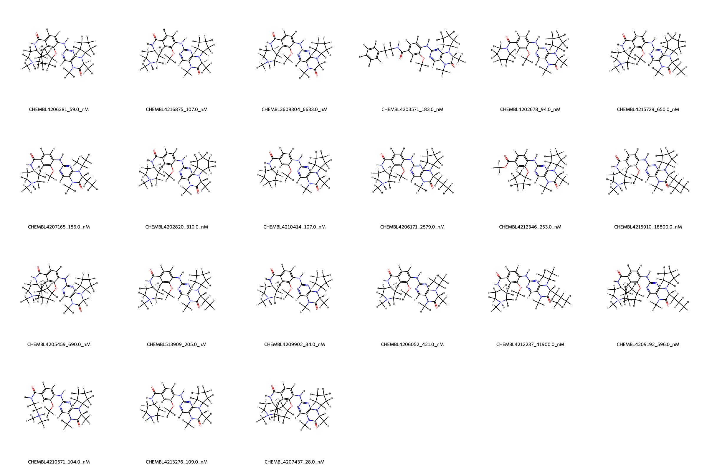
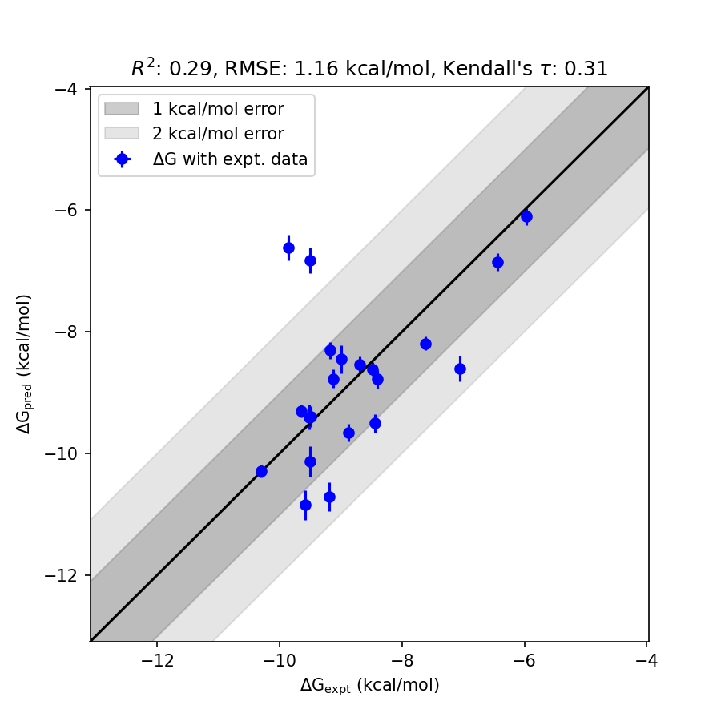

# BRD4 System FEP Calculation Results Analysis

> This README is generated by AI model using verified experimental data and Uni-FEP calculation results. Content may contain inaccuracies and is provided for reference only. No liability is assumed for outcomes related to its use.

## Introduction

BRD4 (Bromodomain-containing protein 4) is a member of the BET (bromodomain and extra-terminal) protein family. It plays a key role in transcriptional regulation and acts as a master regulator of chromatin interactions. BRD4 has been implicated in numerous human cancers and inflammatory diseases due to its ability to bind acetylated lysine residues on histone tails, thereby recruiting transcriptional machinery to active gene loci. As such, it has emerged as a promising therapeutic target for the development of novel cancer treatments, particularly in aggressive and therapy-resistant cancers.

## Molecules

The BRD4 system dataset in this study consists of 20 compounds featuring a wide range of binding affinities and structural diversity. The experimental binding affinities span from 28 nM to 41,900 nM, corresponding to binding free energies ranging from -10.30 to -5.97 kcal/mol. The molecular dataset includes several structurally diverse ligands with various functional groups contributing unique interactions with the binding pocket of BRD4.

## Conclusions

The FEP calculation results for the BRD4 system demonstrate moderate correlation with experimental data, achieving an R² of 0.29 and an RMSE of 1.16 kcal/mol. Notable examples of strong alignment between predicted and experimental values include the ligand CHEMBL4207437, with experimental binding free energy of -10.30 kcal/mol and predicted binding free energy of -10.29 kcal/mol, showcasing excellent predictive accuracy.

For further insights and exploration of BRD4-related bioactivity data, please visit:  
https://www.ebi.ac.uk/chembl/explore/assay/CHEMBL4200424