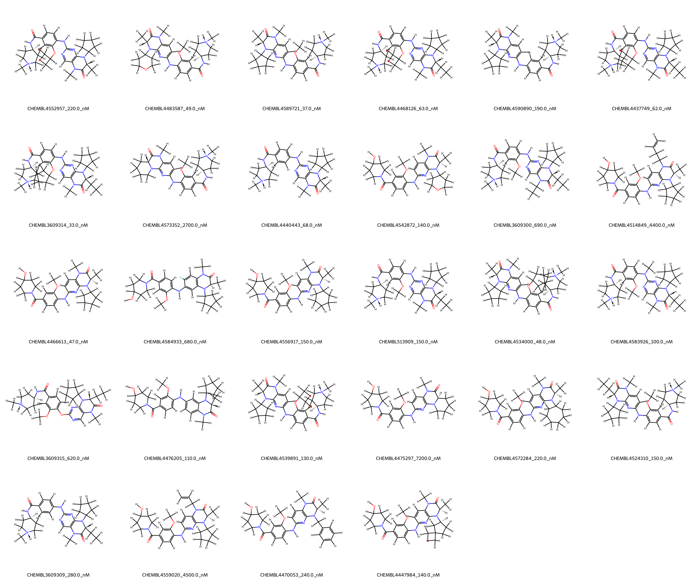
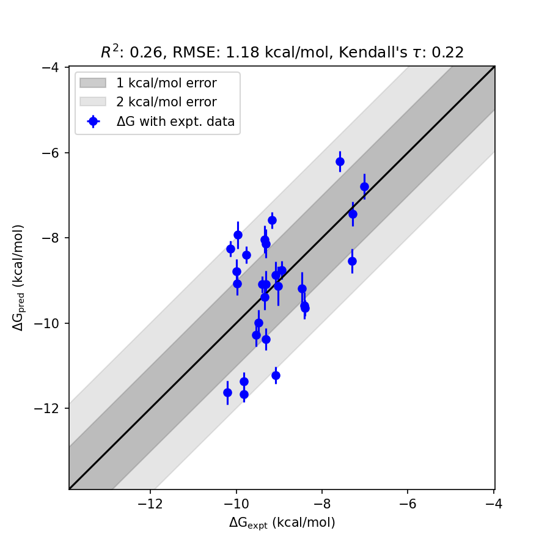

# BRD4 System FEP Calculation Results Analysis

> This README is generated by AI model using verified experimental data and Uni-FEP calculation results. Content may contain inaccuracies and is provided for reference only. No liability is assumed for outcomes related to its use.

## Introduction

BRD4 (Bromodomain-containing protein 4) is a member of the bromodomain and extraterminal (BET) family of proteins, which play critical roles in regulating gene transcription through recognition of acetylated lysine residues on histones and other proteins. BRD4 is a key epigenetic regulator involved in numerous cellular processes, and its inhibition has garnered significant attention for therapeutic strategies in cancer, inflammation, and cardiovascular diseases. Small molecule inhibitors targeting BRD4 have shown promise in preclinical and clinical studies as potential treatments for a variety of diseases.

## Molecules

The BRD4 system dataset in this study consists of 27 compounds, characterized by diverse chemical scaffolds with modifications designed to explore their binding affinities. The experimentally determined binding affinities range from 33 nM to 7200 nM, spanning nearly three orders of magnitude. The dataset also includes calculated binding free energies ranging from -7.0123 to -10.2015 kcal/mol. The results highlight a wide chemical and bioactivity diversity among these compounds, underscoring the complexity of interactions observed with the BRD4 target.

## Conclusions

The FEP calculation results for the BRD4 system demonstrate a reasonable agreement with experimental data, achieving an RMSE of 1.18 kcal/mol and an R² of 0.26. Among the compounds, several stand out for their impressive prediction accuracy. For instance, the ligand CHEMBL513909 showed experimental and predicted binding free energies of -9.3048 kcal/mol and -10.3749 kcal/mol, respectively, demonstrating strong correlation. Similarly, the ligand CHEMBL4583926 exhibited an excellent match between experimental (-9.5449 kcal/mol) and predicted (-10.2775 kcal/mol) values. These results affirm the ability of the computational model to capture key trends in binding free energy predictions.

## References

For more information about the BRD4 target and associated bioactivity data, please visit:  
https://www.ebi.ac.uk/chembl/explore/target/CHEMBL4308744  