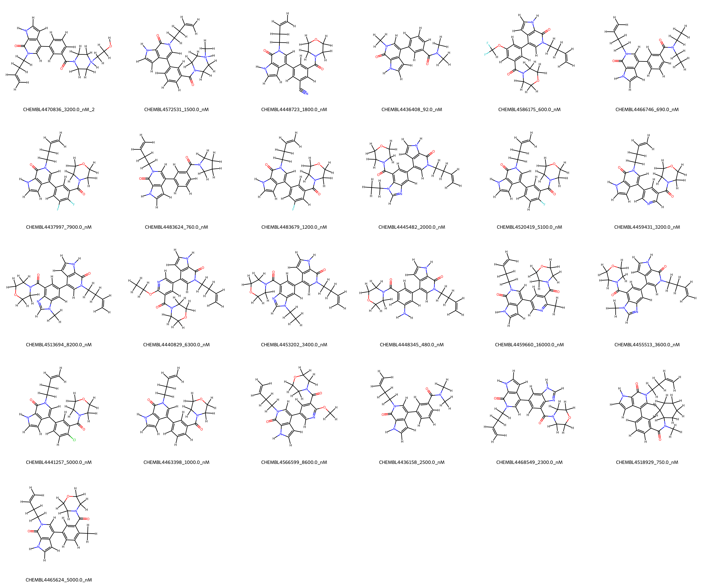
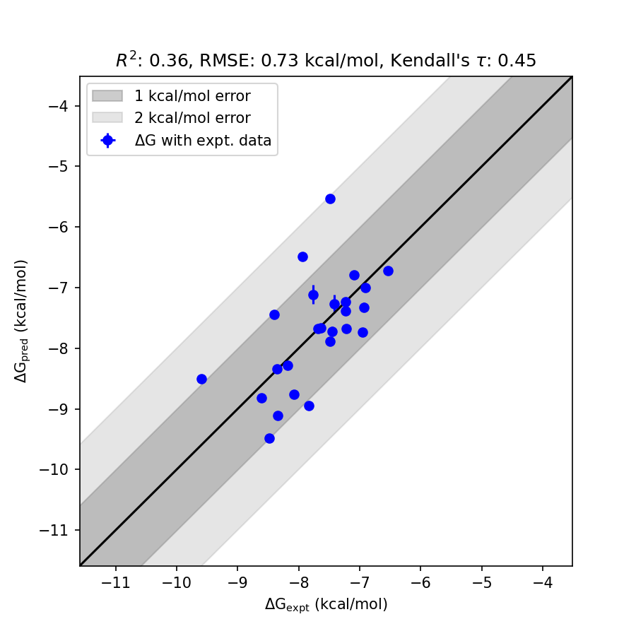

# BRD4 System FEP Calculation Results Analysis  

> This README is generated by AI model using verified experimental data and Uni-FEP calculation results. Content may contain inaccuracies and is provided for reference only. No liability is assumed for outcomes related to its use.  

## Introduction  

BRD4 (Bromodomain-containing protein 4) is a key member of the BET family of bromodomain proteins. It is a transcriptional regulator that interacts with acetylated lysines on histones, facilitating access to DNA for transcription machinery. BRD4 plays profound roles in cancer biology and immune regulation by controlling gene expression linked to cell growth and proliferation. It has emerged as a notable therapeutic target for various diseases, including cancers such as leukemia and breast cancer, inflammatory diseases, and viral infections. As a drug target, it has been extensively studied for its role in epigenetics and transcriptional regulation.  

## Molecules  

  

The BRD4 system dataset analyzed in this study consists of 25 compounds. These compounds exhibit significant structural diversity, with varying functionalities such as halogen substitutions, nitrile groups, and fluorinated methyl groups. Experimentally determined binding affinities for these molecules range from 92 nM to 16,000 nM, spanning over two orders of magnitude. Corresponding binding free energies range from -9.59 kcal/mol to -6.54 kcal/mol.  

## Conclusions  

  

The FEP calculation results for the BRD4 system demonstrated consistency with experimental data, achieving an RMSE of 0.73 kcal/mol and an R² of 0.36, indicating moderate predictive accuracy. Notably, certain ligands, such as CHEMBL4436408, exhibited excellent correlation between experimental and calculated binding free energies (experimental: -9.59 kcal/mol, predicted: -8.50 kcal/mol). These results underscore the capability of FEP calculations to capture the relative binding free energy trends while providing useful insights for ligand optimization targeting BRD4.  

## References  

For more information about the BRD4 target and associated bioactivity data, please visit:  
https://www.ebi.ac.uk/chembl/explore/assay/CHEMBL4310223  