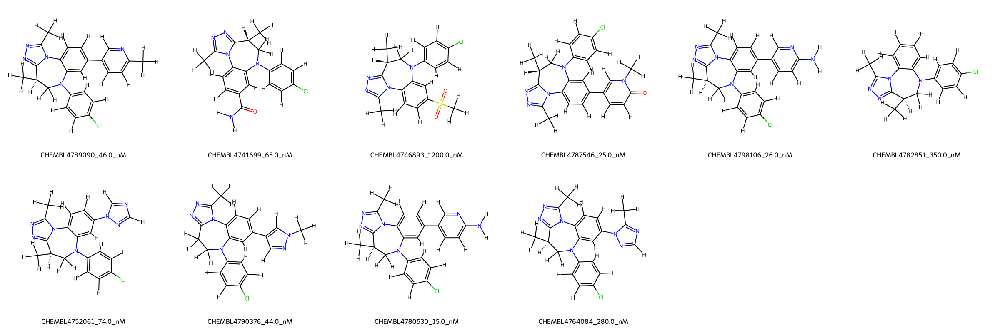
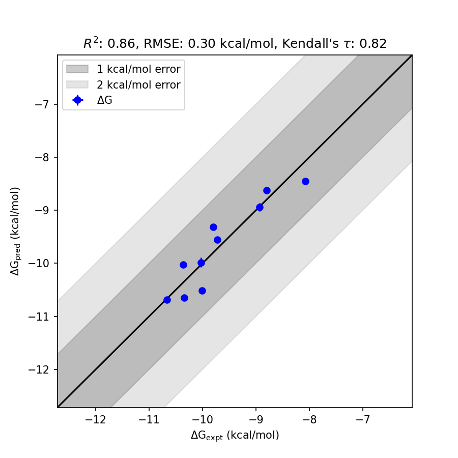

# BRD4 System FEP Calculation Results Analysis

> This README is generated by AI model using verified experimental data and Uni-FEP calculation results. Content may contain inaccuracies and is provided for reference only. No liability is assumed for outcomes related to its use.

## Introduction

BRD4, a member of the bromodomain and extraterminal (BET) protein family, acts as a crucial epigenetic regulator by recognizing acetylated lysine residues on histones. Through its interaction with chromatin and transcriptional machinery, BRD4 plays a pivotal role in the regulation of various genes, particularly those involved in cell growth and inflammation. BRD4 has emerged as a prominent therapeutic target in oncology and inflammatory diseases, with inhibitors being developed to disrupt its interaction with acetylated histones and modulate gene transcription critical for disease progression.

## Molecules

The BRD4 system dataset in this study consists of 11 compounds with diverse structural properties. These molecules exhibit varied scaffolds and functionalities, including halogen substitutions and heterocyclic cores. The experimental binding affinities of these compounds span from 15.0 nM to 1200.0 nM with corresponding experimental binding free energies ranging from -10.67 kcal/mol to -8.07 kcal/mol. The dataset thus covers a wide range of binding strengths, providing valuable insights into predictive modeling accuracy.

## Conclusions

The FEP calculation results for the BRD4 system achieved strong agreement with experimental data, showing an R² of 0.86 and an RMSE of 0.30 kcal/mol. Notable cases with excellent prediction accuracy include CHEMBL4780530 (experimental: -10.67 kcal/mol, predicted: -10.68 kcal/mol) and CHEMBL4764084 (experimental: -8.93 kcal/mol, predicted: -8.94 kcal/mol). These results demonstrate the robustness of the calculation method in capturing relative binding free energy trends and providing precise insights into molecular interactions within the BRD4 system.

## References

For more information about the BRD4 target and associated bioactivity data, please visit:
https://www.ebi.ac.uk/chembl/explore/assay/CHEMBL4716982