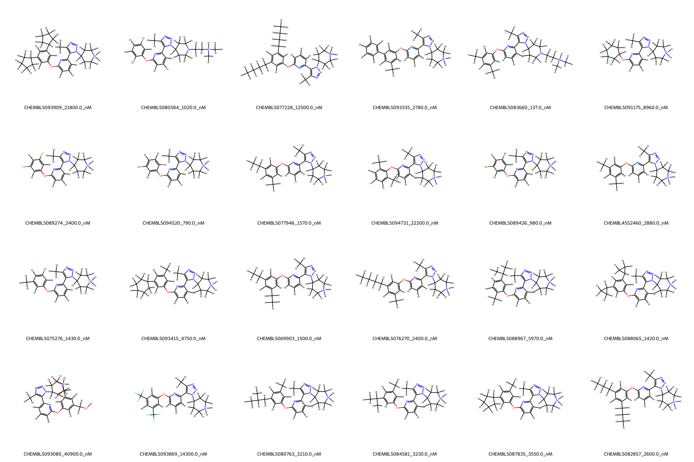

BRD4 System FEP Calculation Results Analysis  

> This README is generated by AI model using verified experimental data and Uni-FEP calculation results. Content may contain inaccuracies and is provided for reference only. No liability is assumed for outcomes related to its use.  

## Introduction  

BRD4 (Bromodomain-containing protein 4) is a member of the BET family of bromodomain proteins, which plays critical roles in regulating gene transcription by binding to acetylated lysine residues on histones. BRD4 is involved in controlling the expression of key genes associated with cell cycle progression, inflammation, and cancer. It has emerged as a prominent therapeutic target in oncology, particularly for the treatment of cancers such as leukemia and solid tumors, as well as inflammatory diseases due to its role in transcriptional regulation.  

## Molecules  

  

The BRD4 system dataset in this study includes 25 molecules with structural diversity, incorporating various substituents across distinct chemical scaffolds. The compounds span a range of affinities for BRD4, with experimental binding free energies from -5.98 to -9.36 kcal/mol.  

## Conclusions  

  

The FEP calculation results for the BRD4 system demonstrate moderate correlation with experimental data, achieving an R² of 0.40 and an RMSE of 0.66 kcal/mol. Several compounds exhibited excellent prediction accuracy, such as CHEMBL5088065 (experimental: -7.97 kcal/mol, predicted: -8.11 kcal/mol) and CHEMBL5089426 (experimental: -8.19 kcal/mol, predicted: -7.83 kcal/mol), illustrating the utility of FEP in capturing relative binding energy trends for BRD4 inhibitors.  

## References  

For more information about the BRD4 target and associated bioactivity data, please visit:  
https://www.ebi.ac.uk/chembl/explore/target/CHEMBL5037307  