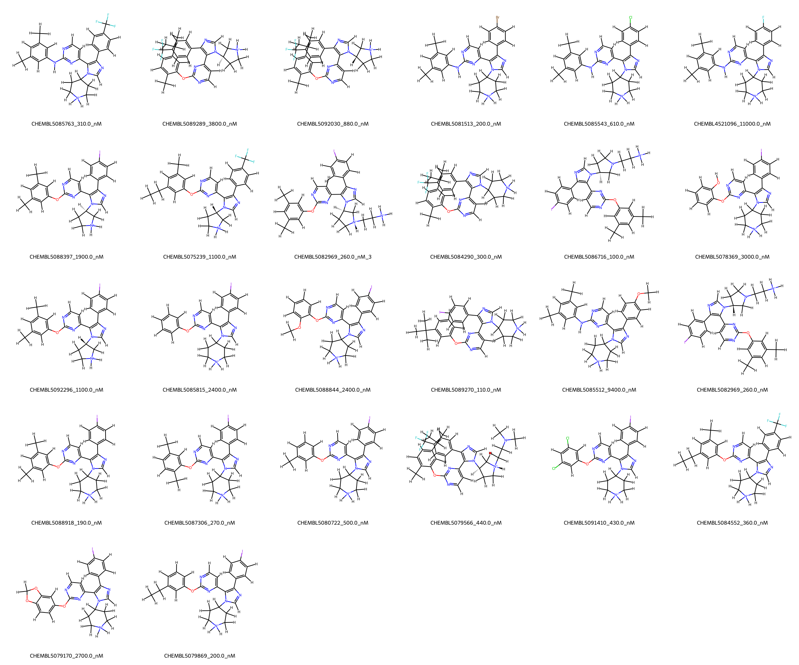
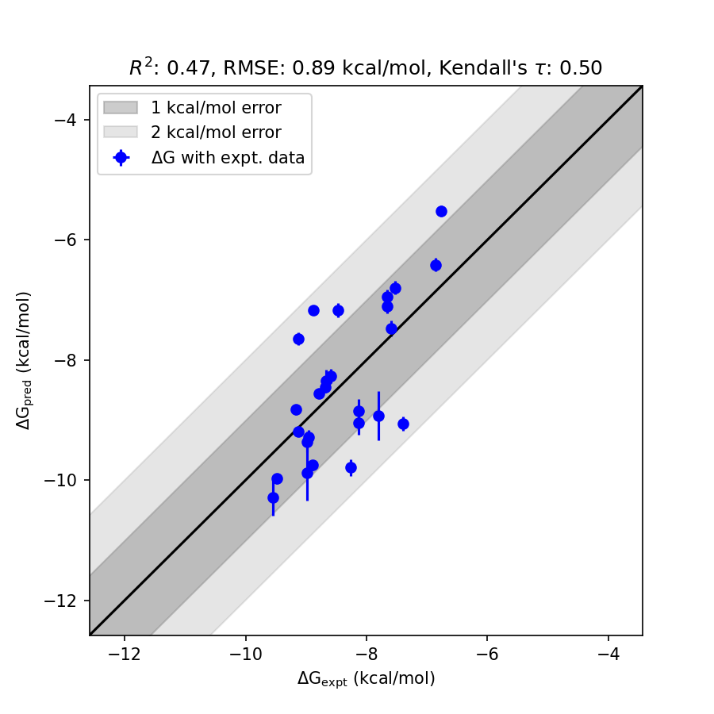

# BRD4 System Free Energy Perturbation (FEP) Calculation Results Analysis

> This README is generated by AI model using verified experimental data and Uni-FEP calculation results. Content may contain inaccuracies and is provided for reference only. No liability is assumed for outcomes related to its use.

## Introduction

BRD4 (Bromodomain-containing protein 4) is a member of the bromodomain and extraterminal (BET) family and is involved in the regulation of gene transcription. This protein plays a key role in recognizing acetylated lysine residues on histone tails, facilitating transcriptional activation. BRD4 has garnered significant attention as a therapeutic target, particularly in oncology, inflammation, and other diseases associated with aberrant transcription regulation. Inhibitors of BRD4 have been developed to disrupt its interaction with acetylated histones, thereby modulating transcription and affecting downstream biological pathways.

## Molecules

The BRD4 system dataset in this study contains 28 compounds with structural diversity and unique functional group variations to ensure broad coverage of binding free energy predictions. These molecules have experimentally determined binding affinities spanning wide ranges, with dissociation constants (Kd) from 100 nM to 11,000 nM. Corresponding experimental binding free energies vary from -6.76 kcal/mol to -9.54 kcal/mol.

The dataset features different substituents on the core scaffold, including halogens (e.g., Br, Cl, F) and other functional groups, resulting in structural diversity. Select compounds also contain stereochemical variations and substitutions designed to probe specific molecular interactions with the BRD4 binding pocket.

## Conclusions

The FEP calculation results for the BRD4 system demonstrated predictive accuracy with an RMSE of 0.89 kcal/mol and an R² of 0.47, reflecting a reasonable correlation between experimental and calculated binding free energies. Several compounds exhibited excellent agreement, showcasing the method's capability to capture key binding interactions. 

CHEMBL5088844, for instance, showed strong predictive performance with an experimental value of -7.6629 kcal/mol and a calculated value of -7.1103 kcal/mol. Another example includes CHEMBL5089270, where the experimental binding free energy of -9.4885 kcal/mol closely aligned with the calculated value of -9.9763 kcal/mol, demonstrating the consistency of the predictions for high-affinity ligands.

## References

For more information about the BRD4 target and associated bioactivity data, please visit:
https://www.ebi.ac.uk/chembl/explore/target/CHEMBL5044553