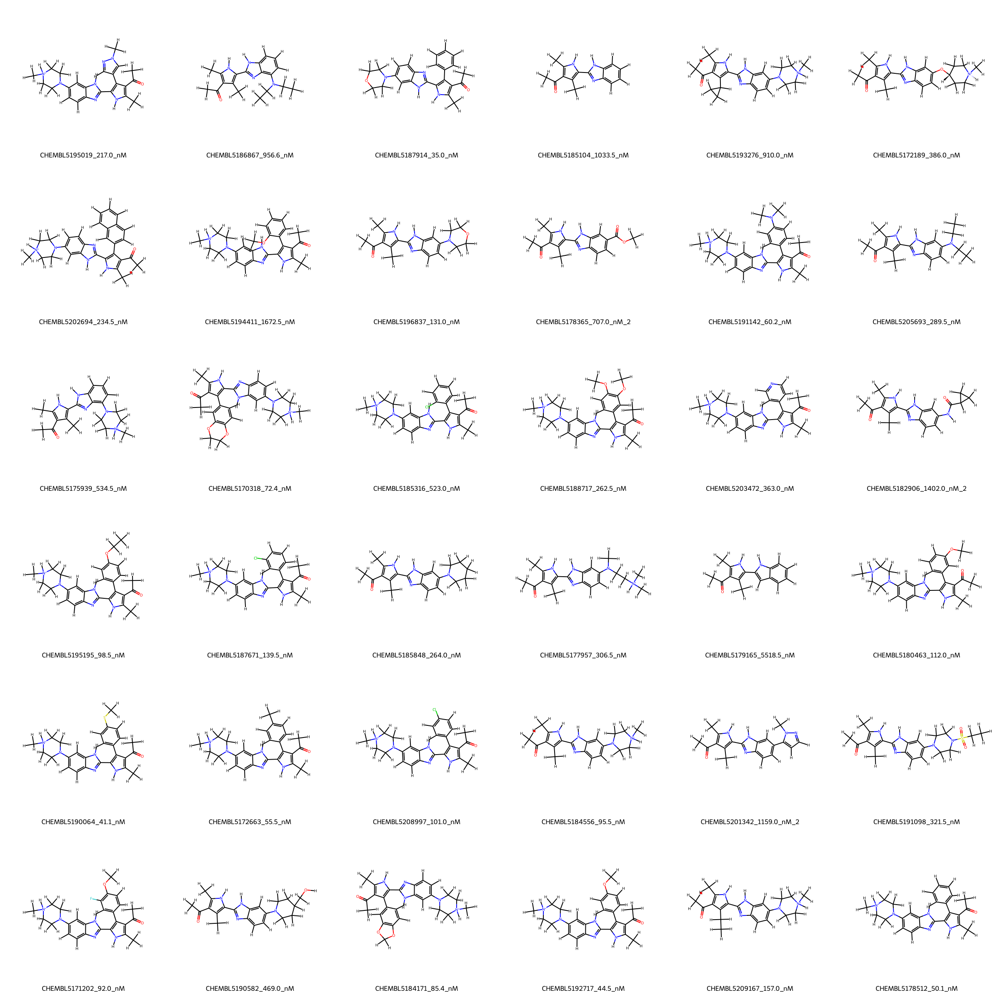
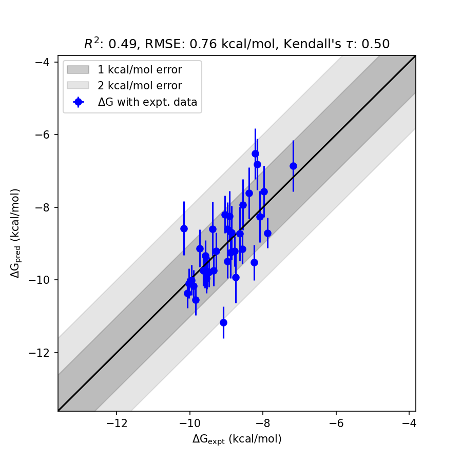

# BRD4 System FEP Calculation Results Analysis

> This README is generated by AI model using verified experimental data and Uni-FEP calculation results. Content may contain inaccuracies and is provided for reference only. No liability is assumed for outcomes related to its use.

## Introduction

BRD4 (Bromodomain-containing protein 4) is a member of the bromodomain and extraterminal (BET) protein family that plays an important role in regulating gene expression. BRD4 binds acetylated lysine residues on histone tails via its bromodomains, thereby influencing chromatin structure and transcriptional processes. It has been implicated in various diseases, including cancer, inflammatory disorders, and cardiovascular conditions, making it an attractive therapeutic target. The inhibition of BRD4 has been extensively studied for its potential in treating cancers such as leukemia, as well as for modulating inflammatory pathways in autoimmune diseases. 

## Molecules

The BRD4 dataset utilized in this study comprises 30 molecules with varying substituents and structural motifs. These molecules were analyzed for their experimental binding affinities ranging from approximately 35 nM to 5519 nM. The experimental binding free energy values spanned from approximately -7.17 kcal/mol to -10.17 kcal/mol, indicating a broad range of binding strength across the series. The dataset offers significant structural diversity, enabling robust analysis of BRD4-ligand interactions.

## Conclusions

The FEP calculation results for the BRD4 system displayed reasonable agreement with experimental data, achieving an R² of 0.49 and an RMSE of 0.76 kcal/mol. Several compounds exhibited high prediction accuracy. For instance, CHEMBL5195195, with an experimental binding free energy of -9.55 kcal/mol, was accurately predicted at -9.95 kcal/mol. Additionally, CHEMBL5190064 demonstrated excellent correlation, with an experimental value of -10.07 kcal/mol and a predicted free energy of -10.36 kcal/mol. These results exemplify the capability of computational methods in capturing relative binding trends among series compounds and provide valuable insights into BRD4 inhibitor design.

## References

For more information about the BRD4 target and associated bioactivity data, please visit:
https://www.ebi.ac.uk/chembl/target/CHEMBL5137805