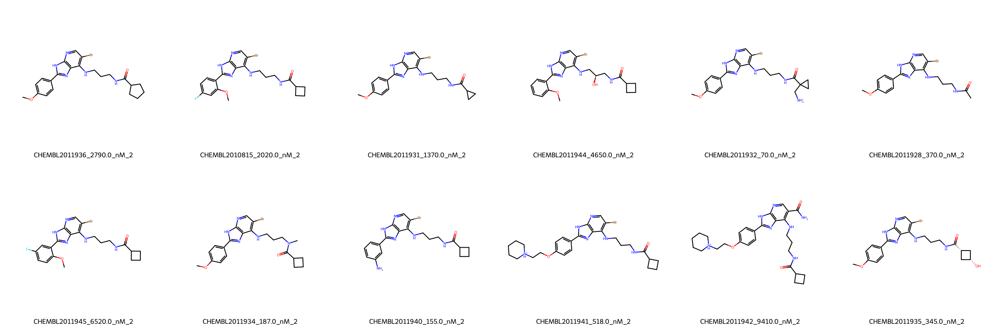
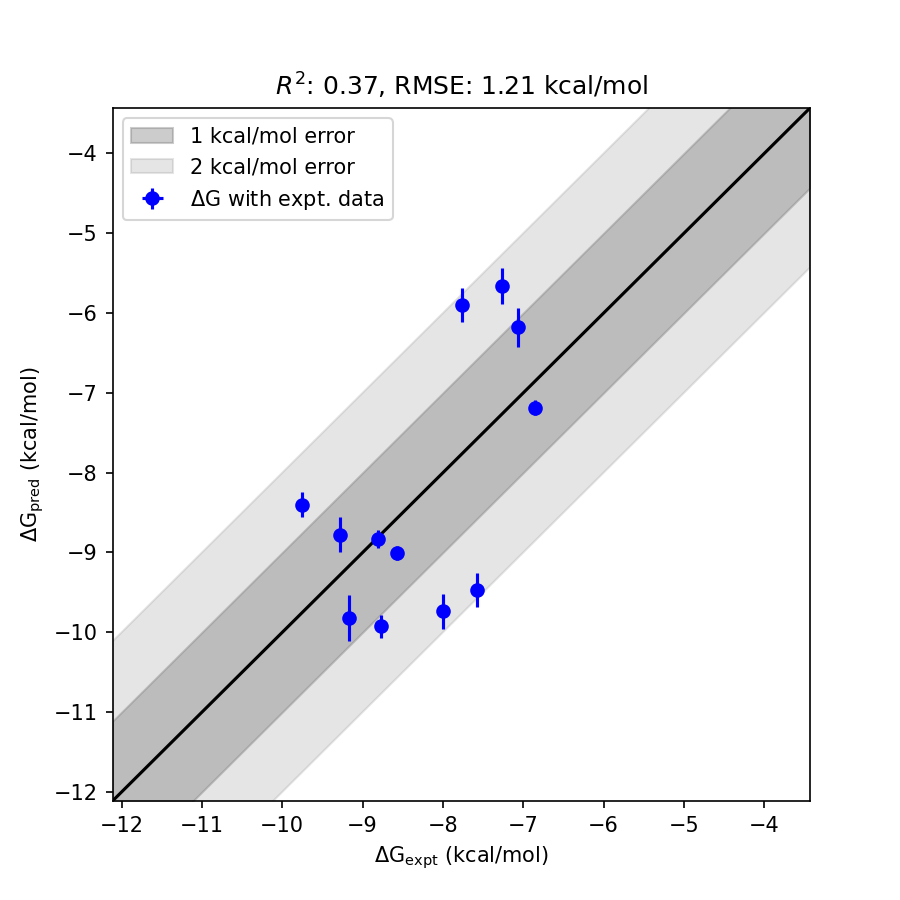

# CDK2 System FEP Calculation Results Analysis

> This README is generated by AI model using verified experimental data and Uni-FEP calculation results. Content may contain inaccuracies and is provided for reference only. No liability is assumed for outcomes related to its use.

## Introduction

CDK2 (Cyclin-Dependent Kinase 2) is a crucial member of the cell cycle regulatory network, belonging to the serine/threonine protein kinase family. It primarily regulates G1/S transition and S phase progression by forming complexes with cyclins E and A. CDK2 activity is tightly regulated, and its abnormal activation is closely associated with the development of various cancers, including breast cancer, ovarian cancer, and lung cancer. Recent research has revealed that CDK2 also plays important roles in DNA damage repair and apoptosis regulation, further highlighting its significance as an anti-cancer drug target.

## Molecules

The CDK2 system dataset in this study comprises 12 compounds, primarily ATP-competitive inhibitors, with molecular weights ranging from 400 to 600 Da. The compounds share a common pyrimidine-based core scaffold with a bromine substituent and demonstrate structural diversity through different substitution patterns. These compounds feature key structural characteristics complementary to the CDK2 ATP binding site, including heterocyclic systems forming hydrogen bonds with the hinge region, aromatic rings occupying the adenine binding region, and variable substituents extending into the solvent-exposed region.

The experimentally determined binding affinities range from 70 nM to 9.4 μM, spanning approximately three orders of magnitude, with binding free energies from -6.85 to -9.76 kcal/mol.

## Conclusions

The FEP calculation results for the CDK2 system show that the predicted values (-5.66 to -9.93 kcal/mol) generally align with the experimental range. The overall prediction accuracy achieved an R² of 0.37 and an RMSE of 1.21 kcal/mol. Several compounds demonstrated good prediction results, such as CHEMBL2011935 (experimental: -8.81 kcal/mol, predicted: -8.83 kcal/mol) and CHEMBL2011940 (experimental: -9.29 kcal/mol, predicted: -8.78 kcal/mol).

## References

For more information about the CDK2 target and associated bioactivity data, please visit:
https://www.ebi.ac.uk/chembl/explore/assay/CHEMBL2013356 