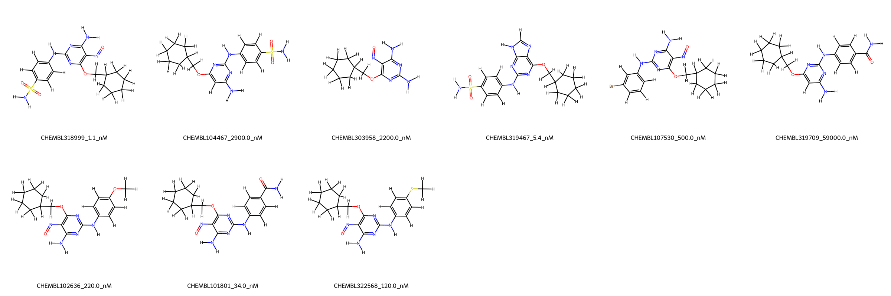
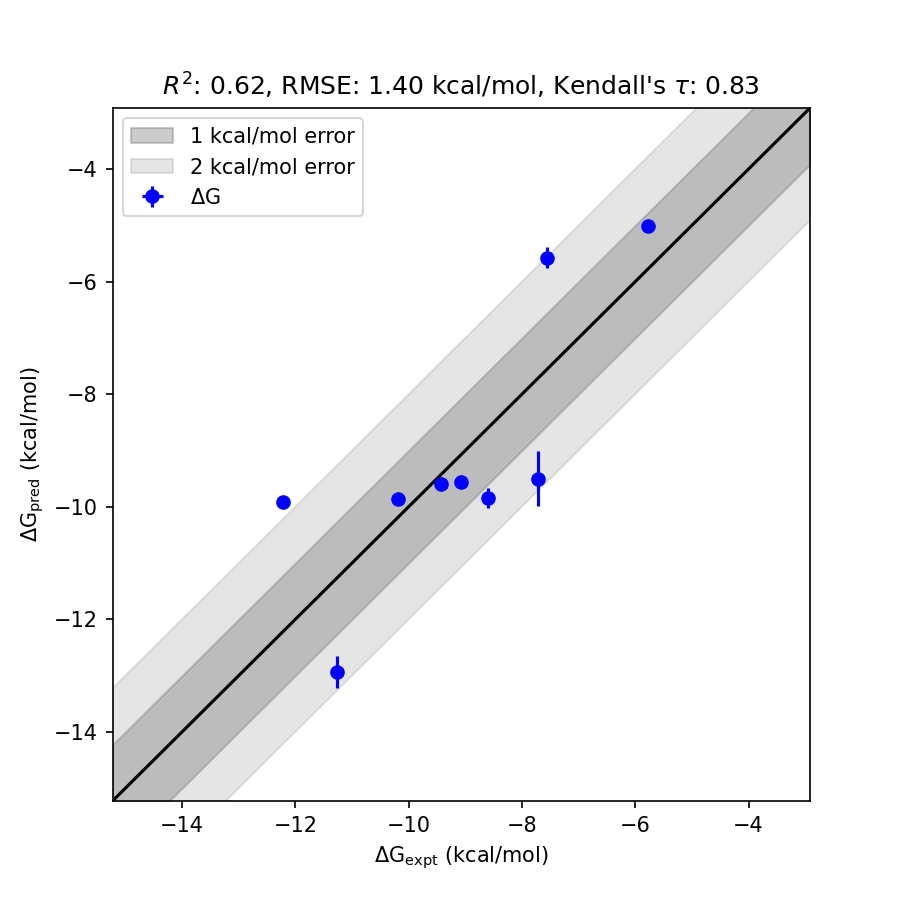

# CDK2 System FEP Calculation Results Analysis

> This README is generated by AI model using verified experimental data and Uni-FEP calculation results. Content may contain inaccuracies and is provided for reference only. No liability is assumed for outcomes related to its use.

## Introduction

Cyclin-dependent kinase 2 (CDK2) is a serine/threonine protein kinase that plays a pivotal role in cell cycle regulation, particularly in the transition from G1 to S phase. It partners with cyclins E and A to regulate DNA replication and repair. Dysregulation of CDK2 activity has been implicated in various cancers, making it a prominent therapeutic target for oncology drug development. CDK2 inhibitors have garnered significant interest for their potential to arrest tumor cell proliferation and overcome resistance to existing therapies.

## Molecules

The CDK2 system dataset in this study consists of 10 compounds. These compounds display a diverse range of functionalities, including nitro and sulfonamide groups, and share a consistent framework, each attached to a cyclopropane-1,1-dimethanol core structure. 

The experimentally determined binding affinities range from 1.1 nM to 59,000 nM, corresponding to calculated binding free energies (ΔG) from -5.77 to -12.22 kcal/mol. The dataset encompasses ligands with varying levels of potency, presenting valuable challenges for validating computational prediction methods.

## Conclusions

The FEP calculation results for the CDK2 system achieved a satisfactory correlation with experimental binding free energy values, with an R² of 0.62 and an RMSE of 1.40 kcal/mol. The predictions generally align well with experimental data, capturing key trends in the dataset.

Notably, outstanding performance was observed with ligands such as **CHEMBL319467**, which exhibited an experimental binding free energy of -11.27 kcal/mol and a predicted value of -12.94 kcal/mol, and **CHEMBL322568**, with an impressive alignment between the experimental value (-9.44 kcal/mol) and the predicted value (-9.60 kcal/mol). These results demonstrate the potential of FEP calculations to provide reliable insights into binding free energy trends for the CDK2 target.

## References

For more information about the CDK2 target and associated bioactivity data, please visit:
https://www.ebi.ac.uk/chembl/compound_report_card/CHEMBL661127