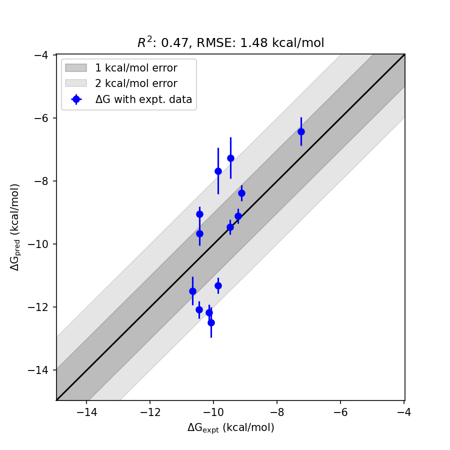

# CSNK1D System FEP Calculation Results Analysis

> This README is generated by AI model using verified experimental data and Uni-FEP calculation results. Content may contain inaccuracies and is provided for reference only. No liability is assumed for outcomes related to its use.

## Introduction

CSNK1D (Casein Kinase 1 Delta), also known as CK1δ, is a serine/threonine protein kinase that plays crucial roles in various cellular processes including circadian rhythm regulation, DNA repair, and cell division. It phosphorylates multiple substrates involved in these processes and has been implicated in the regulation of circadian rhythms through phosphorylation of clock proteins. CSNK1D has emerged as an important therapeutic target for circadian rhythm disorders and certain types of cancer.

## Molecules

The CSNK1D system dataset in this study consists of 13 compounds, featuring a core structure with a pyridine-pyrimidine scaffold linked to a 2,3-dihydro-1H-pyrrolo[2,3-b]pyridine system. The compounds share a common methoxy substituent and demonstrate structural diversity through various linkers and substituents connecting to fluorophenyl groups. These molecules show variation in both the nature of the linkage (ether, amine, alkyl) and the fluorination patterns on the terminal phenyl ring.

The experimentally determined binding affinities range from 15 nM to 4860 nM, spanning approximately three orders of magnitude, with binding free energies from -7.25 to -10.67 kcal/mol.

## Conclusions

The FEP calculation results for the CSNK1D system show moderate correlation with experimental data, achieving an R² of 0.47 and an RMSE of 1.48 kcal/mol. Several compounds demonstrated good prediction accuracy, such as CHEMBL2203554 (experimental: -9.48 kcal/mol, predicted: -9.46 kcal/mol) and CHEMBL2203557 (experimental: -9.24 kcal/mol, predicted: -9.11 kcal/mol). The predicted binding free energies ranged from -6.42 to -12.48 kcal/mol, showing some systematic overestimation for compounds with fluorinated phenoxy substituents.

## References

For more information about the CSNK1D target and associated bioactivity data, please visit:
https://www.ebi.ac.uk/chembl/explore/assay/CHEMBL2211470 