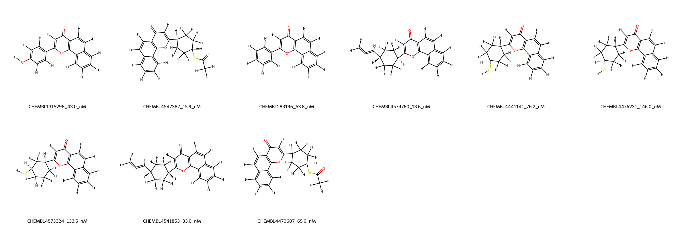
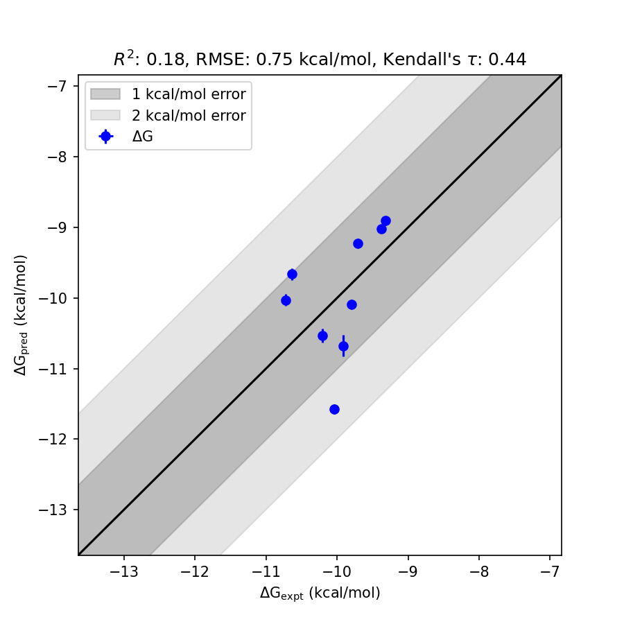

# CYP1A1 System FEP Calculation Results Analysis

> This README is generated by AI model using verified experimental data and Uni-FEP calculation results. Content may contain inaccuracies and is provided for reference only. No liability is assumed for outcomes related to its use.

## Introduction

CYP1A1 (Cytochrome P450 1A1) is a member of the cytochrome P450 superfamily of enzymes, which are involved in the metabolism of a variety of compounds including drugs and xenobiotics. CYP1A1 is specifically known for its role in the metabolic activation of polycyclic aromatic hydrocarbons (PAHs) which can lead to the formation of DNA adducts and carcinogenesis. Additionally, CYP1A1 has a significant role in the metabolism of endogenous substances, such as hormones and fatty acids. Due to its diverse functions and its involvement in toxicological processes, CYP1A1 has been extensively studied in pharmacology and toxicology, making it a relevant target for drug discovery and environmental health research.

## Molecules

The CYP1A1 system dataset in this study consists of 10 compounds, exhibiting structural diversity with various substituents and stereochemical configurations. Binding affinities for these molecules, expressed as experimental ΔG values, ranged from -9.32 kcal/mol to -10.72 kcal/mol. This indicates high binding potency across the set of ligands.

Prominent examples from the dataset include CHEMBL1315298, CHEMBL4547387, and CHEMBL4579760, demonstrating a range of binding energetics and structural diversity. The compounds in this study contribute robustly to the understanding of the binding landscape for CYP1A1.

## Conclusions

The FEP calculation results for the CYP1A1 system demonstrate alignment with the experimental data, achieving an RMSE of 0.75 kcal/mol and an R² of 0.18. Compounds such as CHEMBL4547387 (experimental: -10.63 kcal/mol, predicted: -9.66 kcal/mol) and CHEMBL4579760 (experimental: -10.73 kcal/mol, predicted: -10.03 kcal/mol) show excellent predictive accuracy, highlighting the utility of computational approaches for modeling molecule-target interactions. The calculated binding free energies successfully capture the relative binding trends across the set of ligands.

## References

For more information about the CYP1A1 target and associated bioactivity data, please visit:
https://www.ebi.ac.uk/chembl/explore/assay/CHEMBL4311586