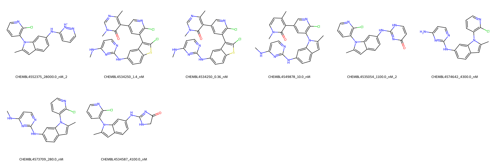

# DOT1L System FEP Calculation Results Analysis

> This README is generated by AI model using verified experimental data and Uni-FEP calculation results. Content may contain inaccuracies and is provided for reference only. No liability is assumed for outcomes related to its use.

## Introduction

DOT1L (DOT1-like histone lysine methyltransferase) is a unique histone methyltransferase that specifically methylates lysine 79 of histone H3. It plays crucial roles in transcriptional regulation, DNA damage response, and cell cycle regulation. DOT1L has emerged as an important therapeutic target, particularly in MLL-rearranged leukemias, where its inhibition has shown promising therapeutic potential.

## Molecules

The DOT1L system dataset in this study consists of 8 compounds, featuring diverse scaffolds with common structural elements including pyrimidine rings and chloro-substituted aromatic systems. The compounds demonstrate structural variation through different heterocyclic cores, including indole and thiophene rings, and various substituents such as methylpyridone and aminopyrimidine groups.

The experimentally determined binding affinities range from 0.36 nM to 28 μM, spanning approximately five orders of magnitude, with binding free energies from -6.21 to -12.88 kcal/mol.

## Conclusions

The FEP calculation results for the DOT1L system show strong correlation with experimental data, achieving a high R² of 0.90, though with a relatively large RMSE of 2.29 kcal/mol. Several compounds demonstrated reasonable prediction accuracy, such as CHEMBL4573709 (experimental: -8.94 kcal/mol, predicted: -8.76 kcal/mol) and CHEMBL4534587 (experimental: -7.35 kcal/mol, predicted: -7.31 kcal/mol). The predicted binding free energies ranged from -0.91 to -14.80 kcal/mol, showing a wider spread than the experimental values.

## References

For more information about the DOT1L target and associated bioactivity data, please visit:
https://www.ebi.ac.uk/chembl/explore/assay/CHEMBL4480297 