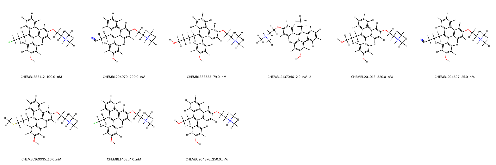
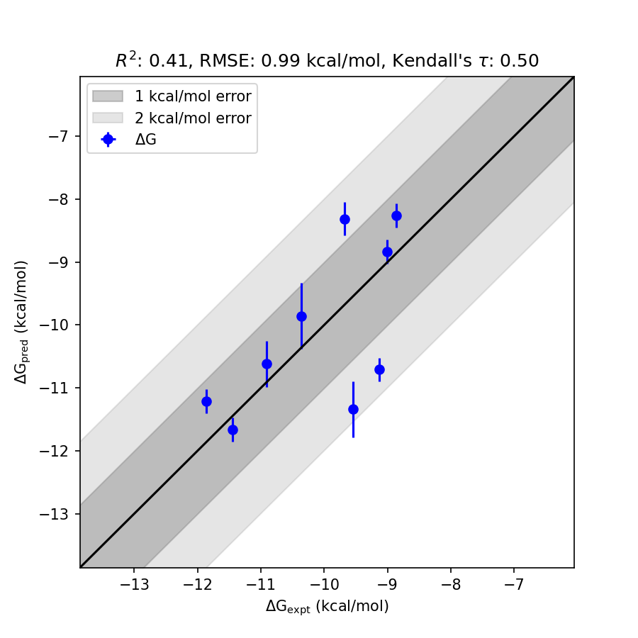

# ESR1 System FEP Calculation Results Analysis  

> This README is generated by AI model using verified experimental data and Uni-FEP calculation results. Content may contain inaccuracies and is provided for reference only. No liability is assumed for outcomes related to its use.  

## Introduction  

ESR1 (Estrogen Receptor Alpha) is a major mediator of the biological effects of estrogen in various tissues, including the reproductive system, mammary gland, bones, and cardiovascular system. It belongs to the nuclear receptor superfamily and functions as a transcription factor by regulating the expression of target genes. ESR1 is associated with the development and progression of estrogen-dependent diseases, most notably breast cancer, where it plays a critical role in tumor growth and metabolism. Its modulation is of considerable therapeutic interest, particularly in hormone-receptor-positive breast cancer.  

## Molecules  

  

The ESR1 system dataset used for this study consists of 10 molecules, showcasing distinct structural diversity. These compounds exhibit a core scaffold and varying substitutions such as cyano, hydroxyl, chloro, and sulfur-containing groups. The binding free energies of the experimentally determined ligands range from -8.86 kcal/mol to -11.86 kcal/mol, spanning a broad scale of bioactivity in terms of binding affinity.  

The structural diversity of the molecules reveals purposeful design modifications targeting optimized activity against ESR1. This dataset provides valuable insights for effective prediction and evaluation of binding affinities for these structurally diverse ligands.  

## Conclusions  

  

The FEP calculation results for the ESR1 system demonstrated a reasonable alignment with experimental data, achieving an RMSE of 0.99 kcal/mol and an R² of 0.41. Notably, the ligand CHEMBL1402 showed remarkable agreement between the predicted and experimental binding free energy (-11.66 kcal/mol predicted vs. -11.45 kcal/mol experimental), exemplifying the capability of the computational approach for achieving high accuracy in selective cases. Alongside this, CHEMBL369935 also showcased strong prediction consistency (-10.62 kcal/mol predicted vs. -10.90 kcal/mol experimental), further highlighting the robustness of the prediction model for key compounds in the dataset.  

The predicted binding free energies generally captured the relative binding trends and displayed promise in their coherence with the experimentally obtained values for ESR1 ligands.  

## References  

For more information about the ESR1 target and associated bioactivity data, please visit:  
https://www.ebi.ac.uk/chembl/explore/assay/CHEMBL867062  