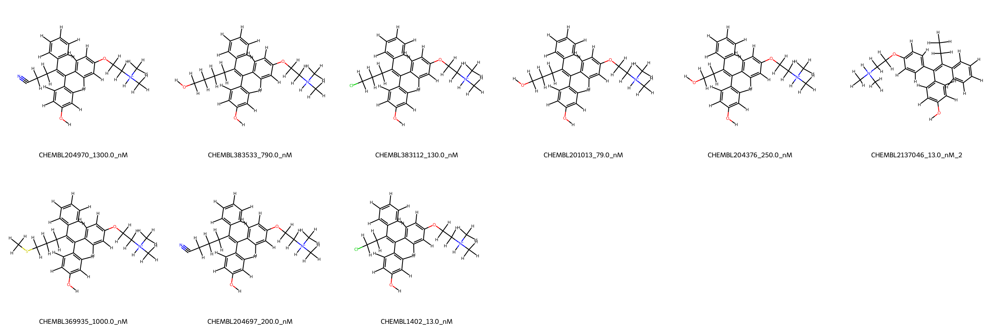
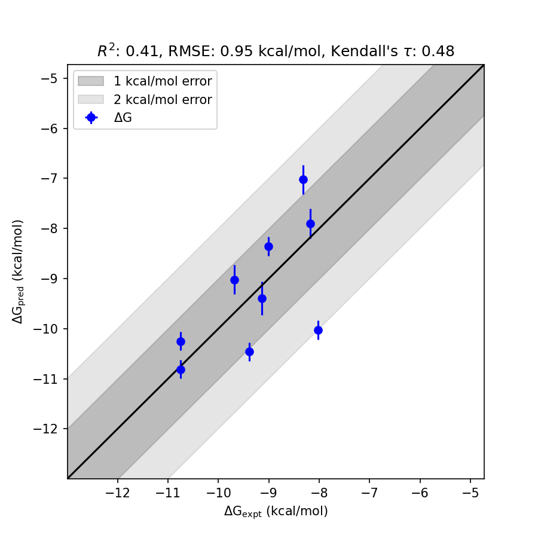

# ESRRG System FEP Calculation Results Analysis

> This README is generated by AI model using verified experimental data and Uni-FEP calculation results. Content may contain inaccuracies and is provided for reference only. No liability is assumed for outcomes related to its use.

## Introduction

ESRRG (Estrogen-Related Receptor Gamma) is an orphan nuclear receptor that belongs to the estrogen receptor-related group of the nuclear hormone receptor superfamily. Unlike classical estrogen receptors, ESRRG does not bind estrogens but is instead activated through co-activators and other signaling pathways. It plays a critical role in regulating energy homeostasis, mitochondrial function, and metabolic gene expression. ESRRG also has emerging significance in various pathophysiological conditions, such as metabolism disorders and certain cancers, making it a vital target for drug discovery efforts.

## Molecules

  

The ESRRG system dataset in this study consists of 9 compounds with diverse chemical scaffolds. The included molecules span a wide range of experimentally determined binding free energies (ΔG), from -8.026 kcal/mol to -10.7531 kcal/mol. The experimental binding affinities correspond to nanomolar concentration ranges between 13.0 nM and 1300.0 nM. 

The dataset demonstrates significant chemical diversity, with various substituents contributing to structural heterogeneity. Selected molecules showed distinct functional groups such as nitriles, hydroxyls, and halogens, offering insights into the structure-activity relationship for ESRRG. Additionally, standard deviations for the predicted binding free energies remained relatively low, highlighting good consistency across the dataset.

## Conclusions

The FEP calculation results for the ESRRG system provide insightful predictions with moderate correlation to experimental results. The analysis achieved an RMSE of 0.95 kcal/mol and an R² value of 0.41, overall capturing the general binding trends of the series. Compounds such as CHEMBL1402 and CHEMBL383112 demonstrate excellent agreement between experimental and predicted values. For example, CHEMBL1402 exhibits an experimental binding free energy of -10.7531 kcal/mol and a predicted value of -10.8106 kcal/mol, indicating high prediction accuracy.

Additionally, the compound CHEMBL383112 stands out with an experimental ΔG of -9.3896 kcal/mol and a predicted ΔG of -10.4591 kcal/mol, showcasing the capability of the method to closely approximate experimental findings. These results highlight the robust potential of the FEP approach in supporting drug discovery efforts for ESRRG targets.

## References

For more information about the ESRRG target and associated bioactivity data, please visit:
https://www.ebi.ac.uk/chembl/explore/target/CHEMBL867061