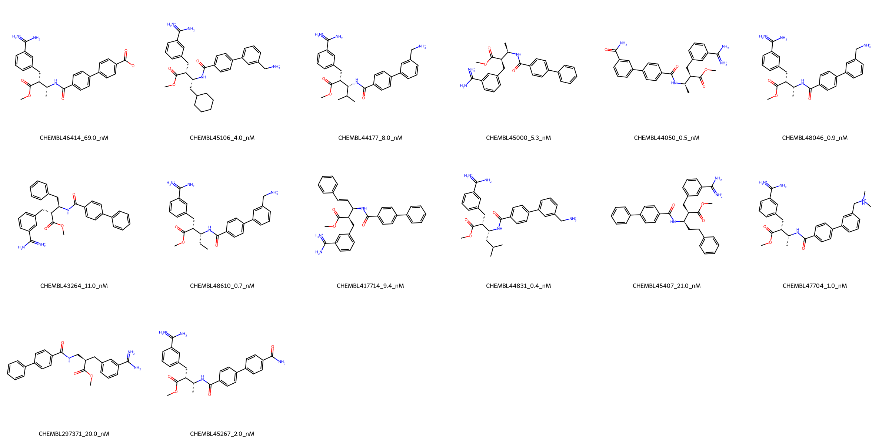

# F10 System FEP Calculation Results Analysis

> This README is generated by AI model using verified experimental data and Uni-FEP calculation results. Content may contain inaccuracies and is provided for reference only. No liability is assumed for outcomes related to its use.

## Introduction

F10 (Coagulation Factor X), also known as Stuart factor or thrombokinase, is a key serine protease in the blood coagulation cascade. It plays a crucial role in both the intrinsic and extrinsic pathways of coagulation by activating prothrombin to thrombin. F10 has emerged as an important therapeutic target for anticoagulation therapy, particularly in the prevention and treatment of thrombotic disorders. The development of selective F10 inhibitors represents a significant approach in the management of various cardiovascular conditions.

## Molecules

The F10 system dataset in this study comprises 14 compounds, featuring a complex scaffold with an amidine-substituted phenyl ring and a methyl ester group. These compounds demonstrate structural diversity through various substituents, including aminomethyl groups, carboxamides, and different alkyl chains. A notable feature is the presence of basic amidine groups that appear to be essential for binding affinity.

The experimentally determined binding affinities range from 0.4 nM to 69.0 nM, spanning approximately two orders of magnitude, with binding free energies from -9.76 to -12.81 kcal/mol.

## Conclusions

The FEP calculation results for the F10 system show moderate predictive performance with an R² of 0.63 and an RMSE of 1.13 kcal/mol. The predicted binding free energies (-7.16 to -13.38 kcal/mol) generally correlate with experimental values, though with some notable variations. Several compounds showed good prediction accuracy, such as CHEMBL44050 (experimental: -12.68 kcal/mol, predicted: -11.68 kcal/mol) and CHEMBL45267 (experimental: -11.86 kcal/mol, predicted: -11.66 kcal/mol). The most potent compound, CHEMBL44831, with an experimental binding free energy of -12.81 kcal/mol, was predicted at -13.31 kcal/mol.

## References

For more information about the F10 target and associated bioactivity data, please visit:
https://www.ebi.ac.uk/chembl/explore/assay/CHEMBL661585 