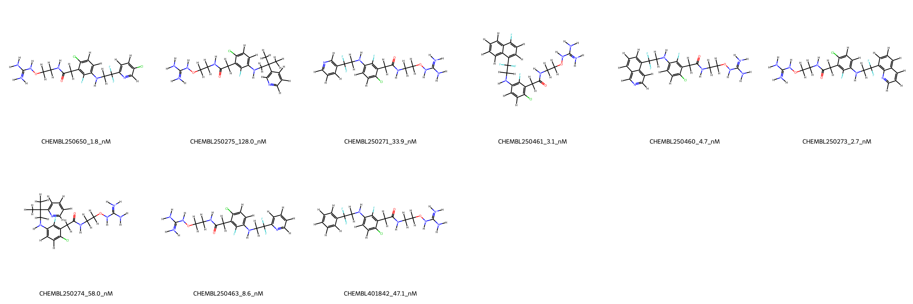
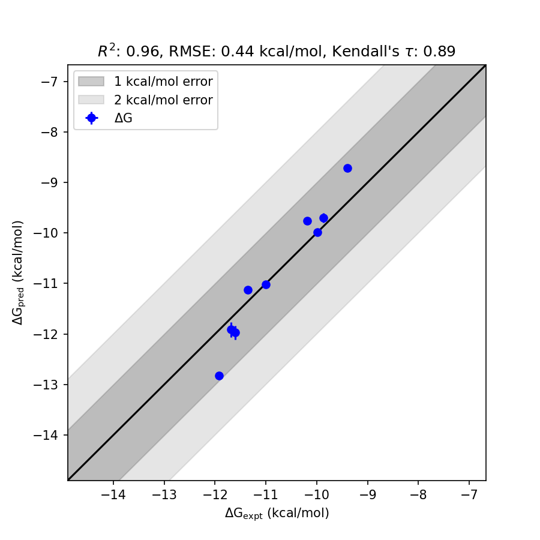

# F2 System FEP Calculation Results Analysis

> This README is generated by an AI model using verified experimental data and Uni-FEP calculation results. Content may contain inaccuracies and is provided for reference only. No liability is assumed for outcomes related to its use.

## Introduction

F2, also known as coagulation factor II or thrombin, is a serine protease enzyme that plays a central role in the coagulation cascade. It is crucial for converting fibrinogen into fibrin during blood clot formation and is involved in the regulation of hemostasis, thrombosis, and inflammation. Due to its significant role in thrombosis-related disorders, F2 has been widely investigated as a therapeutic target for anticoagulants. The inhibition of F2 reduces clot formation and serves as a strategy for the prevention and treatment of thrombotic diseases such as deep vein thrombosis, pulmonary embolism, and stroke.

## Molecules

The F2 system dataset in this study contains 10 molecules, exhibiting structural diversity and varying levels of binding affinities. The experimentally determined binding free energies span from -9.9908 kcal/mol to -11.924 kcal/mol, covering strong to moderate binding interactions. The dataset reveals variations in ligand structures, with distinct functional groups that modulate the binding characteristics of these compounds to F2.

## Conclusions

The FEP calculation results for the F2 system show excellent correlation with experimental data, achieving an R² of 0.96 and a remarkably low RMSE of 0.44 kcal/mol. Several compounds demonstrated highly accurate prediction performance. Notably, CHEMBL250463 exhibited exceptional agreement between experimental (-10.9978 kcal/mol) and predicted (-11.0185 kcal/mol) binding free energies, with an extremely low standard deviation of 0.0207 kcal/mol. Similarly, CHEMBL401842 achieved consistent accuracy, where the experimental (-9.9908 kcal/mol) and predicted (-9.9811 kcal/mol) values closely align with an impressive standard deviation of 0.0097 kcal/mol. These results highlight the reliability of the FEP calculation approach in capturing the binding trends of F2 ligands.

## References

For more information about the F2 target and associated bioactivity data, please visit:
[https://www.ebi.ac.uk/chembl/explore/assay/CHEMBL924350](https://www.ebi.ac.uk/chembl/explore/assay/CHEMBL924350)