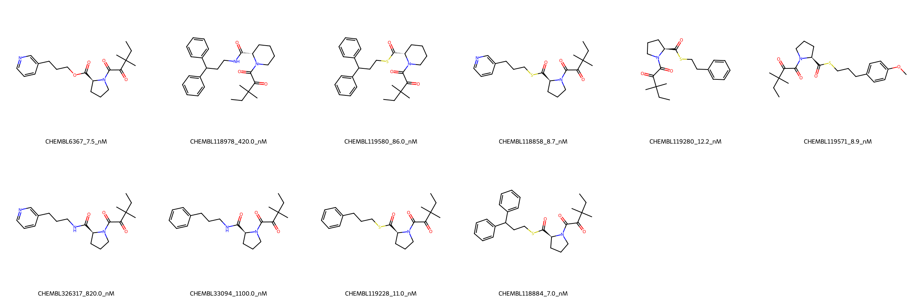

# FKBP1A System FEP Calculation Results Analysis

> This README is generated by AI model using verified experimental data and Uni-FEP calculation results. Content may contain inaccuracies and is provided for reference only. No liability is assumed for outcomes related to its use.

## Introduction

FKBP1A (FK506-binding protein 1A), also known as FKBP12, is a peptidyl-prolyl cis-trans isomerase that plays important roles in protein folding and cellular signaling. It is a key immunophilin that mediates the immunosuppressive effects of drugs such as FK506 (tacrolimus) and rapamycin. FKBP1A has emerged as an important therapeutic target for immunosuppression and various diseases due to its involvement in multiple cellular processes including T-cell activation and signal transduction.

## Molecules

The FKBP1A system dataset in this study consists of 10 compounds, featuring a core structure with a piperidine-based scaffold. The compounds share a common dimethylpentanoyl ketone group and demonstrate structural diversity through various linkers (including sulfur, oxygen, and nitrogen) connecting to different aromatic systems such as phenyl, pyridine, and biphenyl groups. These molecules show variation in both their linking groups and terminal aromatic substituents.

The experimentally determined binding affinities range from 7.0 nM to 1100 nM, spanning approximately three orders of magnitude, with binding free energies from -8.12 to -11.12 kcal/mol.

## Conclusions

The FEP calculation results for the FKBP1A system show good correlation with experimental data, achieving an R² of 0.66 and an RMSE of 0.70 kcal/mol. Several compounds demonstrated excellent prediction accuracy, such as CHEMBL118884 (experimental: -11.12 kcal/mol, predicted: -11.11 kcal/mol) and CHEMBL119228 (experimental: -10.85 kcal/mol, predicted: -10.82 kcal/mol). The predicted binding free energies ranged from -8.05 to -11.21 kcal/mol, showing excellent agreement with the experimental range.

## References

For more information about the FKBP1A target and associated bioactivity data, please visit:
https://www.ebi.ac.uk/chembl/explore/assay/CHEMBL678145 