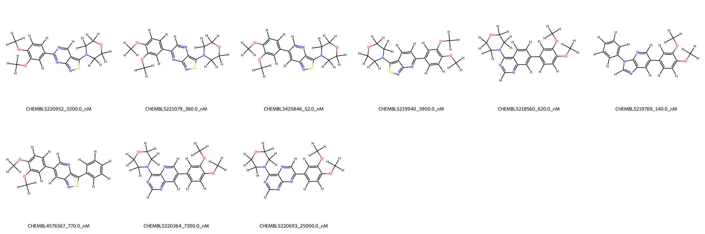
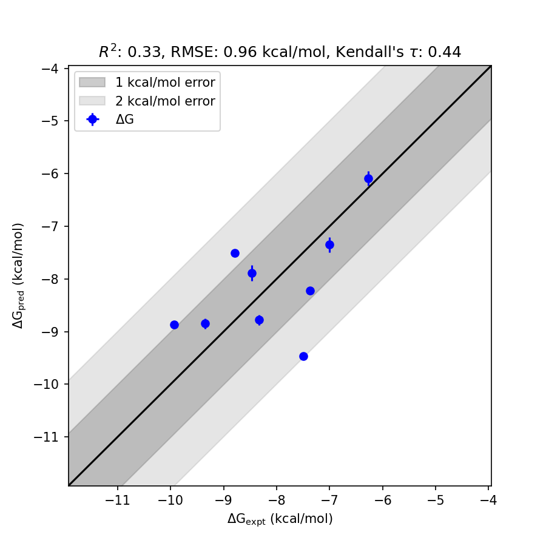

# GAK System FEP Calculation Results Analysis

> This README is generated by AI model using verified experimental data and Uni-FEP calculation results. Content may contain inaccuracies and is provided for reference only. No liability is assumed for outcomes related to its use.

## Introduction

GAK (Cyclin-G-associated kinase) is a member of the serine/threonine kinase family and plays an essential role in various cellular processes, including endocytosis and intracellular trafficking. As a regulator of the clathrin-mediated endocytic machinery, GAK is critical in cellular homeostasis and receptor-mediated signal transduction. Its dysregulation has been associated with neurodegenerative diseases such as Parkinson's disease, as well as various cancers. These insights have made GAK an emerging therapeutic target for drug discovery, particularly in neuroscience and oncology.

## Molecules

The GAK dataset in this study consists of 10 compounds with structurally diverse scaffolds. These ligands exhibit a range of potencies spanning nanomolar concentrations (140 nM to 25,000 nM) based on experimentally determined binding affinities, representing nearly three orders of magnitude in range. The corresponding binding free energies vary from -6.28 kcal/mol to -9.93 kcal/mol.

## Conclusions

The FEP calculation results for the GAK system show an RMSE of 0.96 kcal/mol and an R² of 0.33, indicative of moderate predictive reliability of the binding free energies. Several ligands exemplify successful predictions, such as CHEMBL3425846, which showed an experimental binding free energy of -9.93 kcal/mol and a predicted value of -8.87 kcal/mol with a standard deviation of 1.06 kcal/mol. Another high-accuracy case is CHEMBL5219769, whose experimental value of -9.35 kcal/mol closely matches its predicted value of -8.85 kcal/mol with a standard deviation of 0.50 kcal/mol.

Both of these cases highlight the potential of FEP calculations to accurately capture binding free energy trends within the GAK ligand series.

## References

For more information about the GAK target and associated bioactivity data, please visit:
https://www.ebi.ac.uk/chembl/explore/assay/CHEMBL5217398 