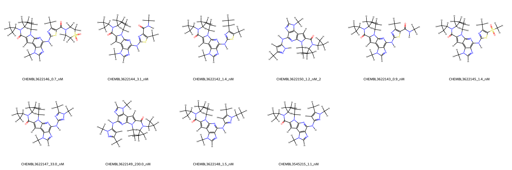
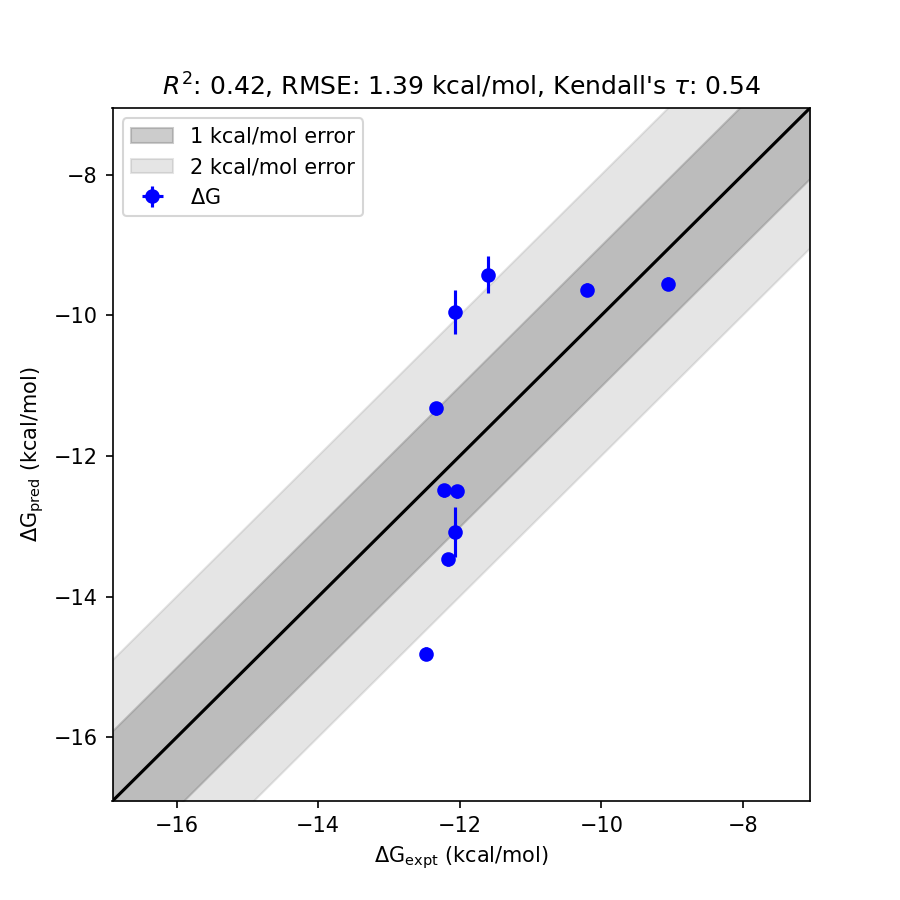

# JAK2 System FEP Calculation Results Analysis

> This README is generated by AI model using verified experimental data and Uni-FEP calculation results. Content may contain inaccuracies and is provided for reference only. No liability is assumed for outcomes related to its use.

## Introduction

JAK2 (Janus kinase 2) is a non-receptor tyrosine kinase that plays a key role in the signaling pathways of various cytokines and growth factors. It is involved in the regulation of cellular processes such as proliferation, differentiation, and apoptosis. JAK2 is part of the JAK-STAT signaling pathway, which is essential for mediating responses to extracellular signals via cytokine receptors. Abnormal activation of JAK2 has been implicated in several diseases, including myeloproliferative neoplasms, making it a critical therapeutic target for drug design.

## Molecules

The JAK2 system dataset in this study consists of 11 compounds. These molecules exhibit structural diversity through substitutions around their parent scaffolds, providing varied binding profiles. The experimentally determined binding free energies range from -9.05 to -12.48 kcal/mol, showcasing a competitive range of affinities toward the JAK2 target across the dataset. The core structures are designed with functional groups to improve stability and target interactivity.

## Conclusions

The FEP calculation results for the JAK2 system demonstrate a reasonable predictive performance, achieving an RMSE of 1.39 and an R² of 0.42, indicating moderate correlation with experimental data. Several compounds showed commendable prediction accuracy. For example, CHEMBL3622150 exhibited an experimental binding free energy of -12.16 kcal/mol with a predicted value of -13.47 kcal/mol, highlighting robust modeling outcomes. Similarly, CHEMBL3545215 demonstrated excellent agreement between experimental (-12.22 kcal/mol) and predicted (-12.49 kcal/mol) binding free energies. The predictions effectively capture the relative trends of compound binding observed experimentally.

## References

For more information about the JAK2 target and associated bioactivity data, please visit:
https://www.ebi.ac.uk/chembl/explore/assay/CHEMBL3625512