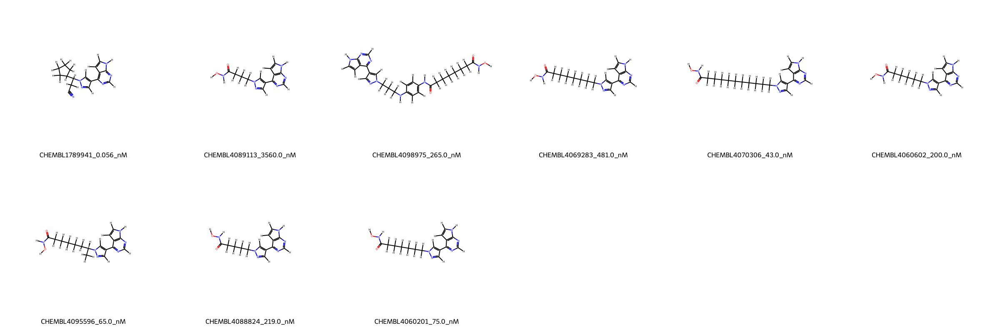
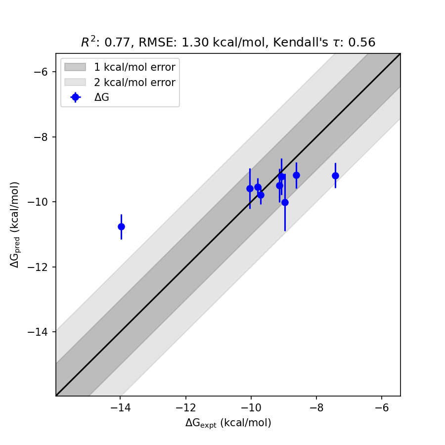

# JAK2 System FEP Calculation Results Analysis

> This README is generated by AI model using verified experimental data and Uni-FEP calculation results. Content may contain inaccuracies and is provided for reference only. No liability is assumed for outcomes related to its use.

## Introduction

Janus kinase 2 (JAK2) is a member of the Janus kinase family of non-receptor tyrosine kinases and plays a central role in cytokine receptor signaling pathways. It is critical for the regulation of hematopoiesis and the immune system functions. Mutations in JAK2, such as V617F, are well-known drivers of myeloproliferative disorders, including polycythemia vera, essential thrombocythemia, and myelofibrosis. As a consequence, JAK2 has emerged as an essential therapeutic target, with inhibitors being actively developed to treat a wide range of hematologic and inflammatory diseases.

## Molecules

The JAK2 system dataset used in this study consists of 10 compounds, exhibiting diversity in their chemical structures. These compounds demonstrate experimental binding affinities spanning a wide range, from low nanomolar (43.0 nM) to several micromolar (3560.0 nM). The binding free energies were experimentally determined to range from -7.43 to -13.98 kcal/mol.

## Conclusions

The FEP calculation results for the JAK2 system achieved robust performance, with an RMSE of 1.30 kcal/mol and an R² of 0.77, indicating a strong correlation between predicted and experimental binding free energies. Several compounds showed particularly accurate predictions, such as CHEMBL4060201 (experimental: -9.72 kcal/mol, predicted: -9.79 kcal/mol) and CHEMBL4095596 (experimental: -9.80 kcal/mol, predicted: -9.54 kcal/mol). These results highlight the reliability of the predictions for compounds with significant binding affinities.

## References

For more information about the JAK2 target and associated bioactivity data, please visit:
[https://www.ebi.ac.uk/chembl/explore/target/CHEMBL4031305](https://www.ebi.ac.uk/chembl/explore/target/CHEMBL4031305)