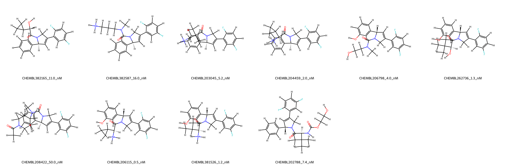
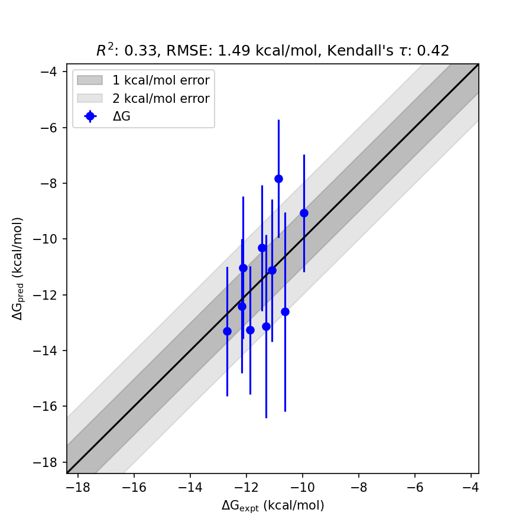

# KIF11 System FEP Calculation Results Analysis

> This README is generated by AI model using verified experimental data and Uni-FEP calculation results. Content may contain inaccuracies and is provided for reference only. No liability is assumed for outcomes related to its use.

## Introduction

KIF11 (also known as Eg5 or kinesin-like protein 1) is a crucial kinesin motor protein that plays an essential role in the process of mitosis through its involvement in spindle assembly and separation of sister chromatids. This ATP-dependent motor is essential for microtubule dynamics and is considered a validated target for cancer therapeutics. Inhibitors targeting KIF11 have shown promise in disrupting spindle formation in rapidly dividing cancer cells, making it a potential target for antimitotic agents.

## Molecules

The dataset for the KIF11 system includes 11 molecules designed to inhibit its ATPase activity effectively. The compounds exhibit diverse chemical architectures and binding affinities, with experimental free energies (∆G) spanning from -9.9554 kcal/mol to -12.6825 kcal/mol. This dataset represents a range of potent molecules as evidenced by their nanomolar binding affinities, with experimental values ranging from 50 nM to as low as 0.5 nM.

## Conclusions

The FEP calculation results for the KIF11 system show a reasonable correlation with experimental data, with an RMSE of 1.49 kcal/mol and an R² of 0.33. Notably, the inhibitor CHEMBL206115 showed excellent agreement between experimental and predicted values, with ∆G values of -12.6825 kcal/mol and -13.3081 kcal/mol, respectively. The strong affinity and accurate computational prediction for CHEMBL206115 demonstrate the robustness of the approach and the potential utility of FEP for virtual screening and lead optimization in the KIF11 inhibitor series.

## References

For more information about the KIF11 target and associated bioactivity data, please visit:
https://www.ebi.ac.uk/chembl/explore/target/CHEMBL942113 