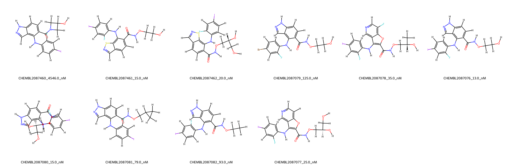
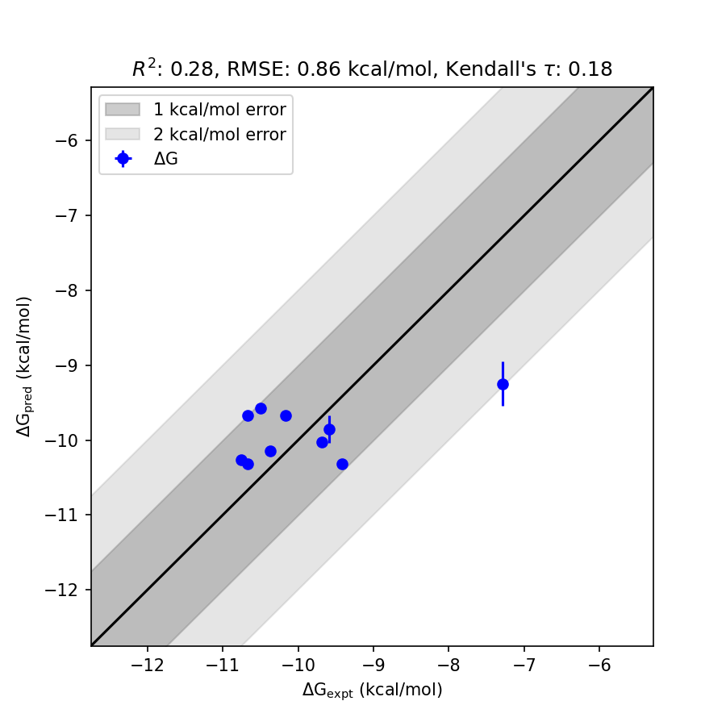

# MAP2K1 System FEP Calculation Results Analysis

> This document is generated by AI model using verified experimental data and Uni-FEP calculation results. Content may contain inaccuracies and is provided for reference only. No liability is assumed for outcomes related to its use.

## Introduction

MAP2K1, also known as MEK1, is a dual-specificity kinase that plays a pivotal role in the mitogen-activated protein kinase (MAPK) signaling pathway. This pathway is critical for regulating various cellular processes, including growth, survival, and differentiation. MAP2K1 acts as a key upstream activator of ERK1/2, phosphorylating these kinases in response to extracellular signals. Dysregulation of the MAPK signaling pathway, often due to mutations or overexpression of MAP2K1, has been implicated in several cancers and inflammatory diseases, making it an important therapeutic target.

## Molecules

The MAP2K1 system dataset in this study consists of 11 compounds, spanning a diverse range of chemical structures. These molecules feature various functional groups, including halogens, hydroxyl groups, and amines, contributing to their unique binding characteristics with MAP2K1. 

The experimentally determined binding affinities for these ligands range from 13 nM to 4546 nM, with corresponding binding free energies from -10.75 to -7.28 kcal/mol. This demonstrates a wide experimental dynamic range for binding strength, enabling robust assessment of computational predictability. The structural diversity of the dataset also makes it highly representative of MAP2K1 ligand space.

## Conclusions

The FEP calculation results for the MAP2K1 system show a reasonable agreement with experimental data, achieving an RMSE of 0.86 kcal/mol and an R² of 0.28. Some ligands demonstrated strong prediction accuracy that aligns closely with experimental results. For instance, CHEMBL2087076, which has an experimental binding free energy of -10.75 kcal/mol, was predicted with high accuracy at -10.26 kcal/mol, demonstrating the capability of the computational approach to capture key binding trends. Another good example is CHEMBL2087080, with an experimental binding free energy of -10.67 kcal/mol and a predicted value of -10.32 kcal/mol.

These results highlight the utility of computational methods in providing useful insights into ligand binding behaviors with MAP2K1, supporting future ligand optimization efforts for this important therapeutic target.

## References

For more information about the MAP2K1 target and associated bioactivity data, please visit:  
https://www.ebi.ac.uk/chembl/explore/target/CHEMBL2092007 