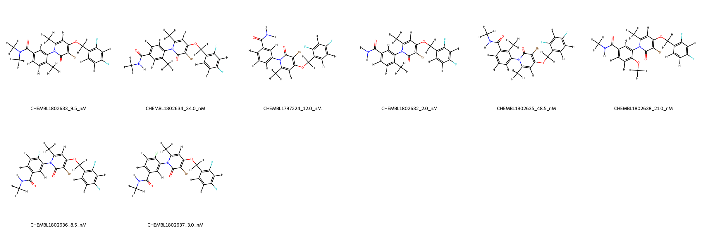
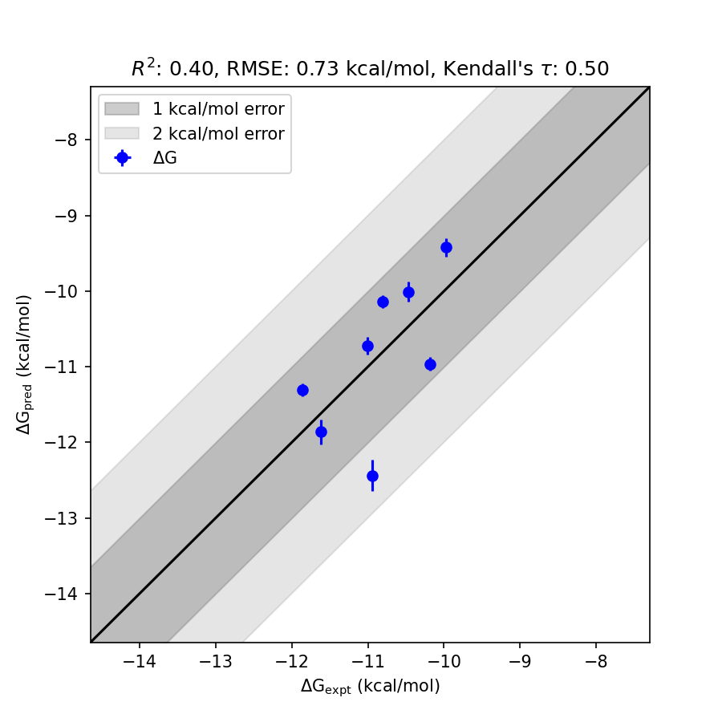

# MAPK14 System FEP Calculation Results Analysis

> This README is generated by AI model using verified experimental data and Uni-FEP calculation results. Content may contain inaccuracies and is provided for reference only. No liability is assumed for outcomes related to its use.

## Introduction

MAPK14 (Mitogen-Activated Protein Kinase 14), also known as p38α, is a serine/threonine protein kinase that plays key roles in cellular responses to stress and inflammation. It is a critical component of the p38 MAPK signaling pathway, which is involved in the regulation of various cellular processes, including differentiation, apoptosis, and autophagy. MAPK14 has emerged as a significant target for therapeutic development in areas such as autoimmune diseases, cancer, and inflammatory disorders due to its role in modulating immune responses and other signaling cascades.

## Molecules

The MAPK14 system dataset in this study consists of 8 compounds with diverse structures designed to explore binding affinity and pharmacological properties. These molecules exhibit structural variability, including halogen substitutions, substituent groups with varying polarity, and steric effects, which provide a broad chemical diversity in the dataset.

The experimentally determined binding free energies (`dGexp`) range from -9.973 kcal/mol to -11.861 kcal/mol. The calculated free energies (`dGFEP`) show a comparable range, spanning from -9.420 kcal/mol to -12.437 kcal/mol, thus providing insights into the binding interactions of the compounds with MAPK14.

## Conclusions

The FEP calculation results for the MAPK14 dataset exhibit a moderate correlation with experimental data, achieving an RMSE of 0.73 kcal/mol and an R² of 0.40. Among the studied compounds, CHEMBL1802633 demonstrated noteworthy prediction accuracy with an experimental binding free energy of -10.9389 kcal/mol and a calculated value of -12.4376 kcal/mol. Similarly, CHEMBL1802632 achieved close alignment, showing an experimental binding free energy of -11.8616 kcal/mol and a calculated value of -11.3024 kcal/mol.

These results underscore the reliability of FEP calculations for capturing relative binding trends and provide valuable insights into the binding interactions between MAPK14 and its ligands. Future studies may further refine predictions and expand the applicability of FEP methodologies to other target systems.

## References

For more information about the MAPK14 target and associated bioactivity data, please visit:
https://www.ebi.ac.uk/chembl/explore/assay/CHEMBL1805307