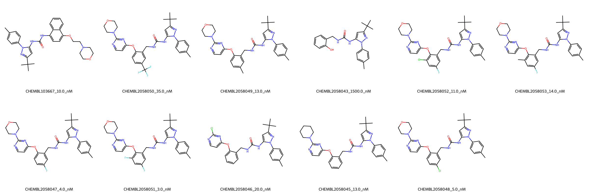
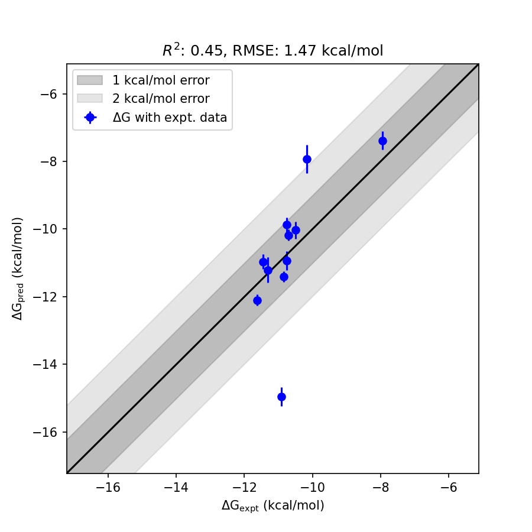

# MAPK14 System FEP Calculation Results Analysis

> This README is generated by AI model using verified experimental data and Uni-FEP calculation results. Content may contain inaccuracies and is provided for reference only. No liability is assumed for outcomes related to its use.

## Introduction

MAPK14 (Mitogen-Activated Protein Kinase 14), also known as p38α, is a serine/threonine protein kinase that plays a crucial role in cellular responses to stress, inflammation, and other environmental signals. It is a key mediator of inflammatory cytokine production and cellular responses to stress stimuli. MAPK14 has emerged as an important therapeutic target for inflammatory diseases, autoimmune disorders, and certain types of cancer.

## Molecules

The MAPK14 system dataset in this study consists of 11 compounds, featuring a core structure with a pyrazole-urea scaffold. The compounds share a common p-tolylpyrazole group and demonstrate structural diversity through various substituents on the phenyl ring, including halogens (F, Cl), methyl, and trifluoromethyl groups. These molecules also show variation in their pyrimidine substituents, with different cyclic amine patterns including morpholine and piperidine.

The experimentally determined binding affinities range from 3.0 nM to 1500 nM, spanning approximately three orders of magnitude, with binding free energies from -7.94 to -11.62 kcal/mol.

## Conclusions

The FEP calculation results for the MAPK14 system show moderate correlation with experimental data, achieving an R² of 0.45 and an RMSE of 1.47 kcal/mol. Several compounds demonstrated good prediction accuracy, such as CHEMBL2058048 (experimental: -11.32 kcal/mol, predicted: -11.21 kcal/mol) and CHEMBL2058051 (experimental: -11.62 kcal/mol, predicted: -12.10 kcal/mol). The predicted binding free energies ranged from -7.39 to -14.95 kcal/mol, showing some systematic overestimation for certain compounds, particularly those with complex substituent patterns.

## References

For more information about the MAPK14 target and associated bioactivity data, please visit:
https://www.ebi.ac.uk/chembl/explore/assay/CHEMBL2061259 