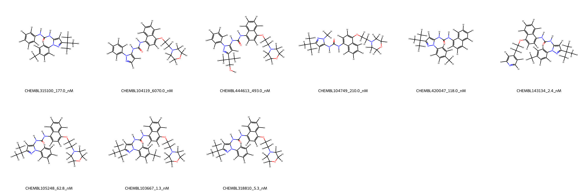
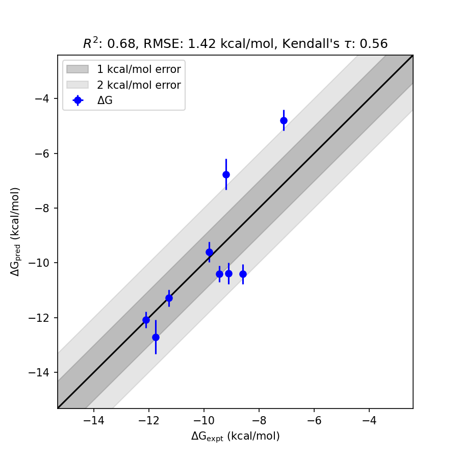

# MAPK14 System FEP Calculation Results Analysis

> This README is generated by AI model using verified experimental data and Uni-FEP calculation results. Content may contain inaccuracies and is provided for reference only. No liability is assumed for outcomes related to its use.

## Introduction

MAPK14, also known as p38α, is a mitogen-activated protein kinase that plays a major role in the regulation of inflammatory responses, cell differentiation, apoptosis, and autophagy. As part of the p38 MAP kinase pathway, MAPK14 is activated by environmental stresses, pro-inflammatory cytokines, and growth factors, integrating signaling events that are fundamental to normal cell function and pathological conditions. MAPK14 has been extensively studied as a therapeutic target for inflammatory diseases, neurodegenerative disorders, and cancer due to its central role in immune response and inflammation.

## Molecules

The MAPK14 system dataset in this study consists of 9 compounds. These molecules vary in structural complexity and include substitutions such as hydrocarbon chains, aromatic substituents, and functional groups like amides and ethers. The experimental binding affinities for MAPK14 span a wide range, from 1.3 nM to 6070 nM, covering over three orders of magnitude. Corresponding experimental binding free energies range from -11.75 kcal/mol to -7.11 kcal/mol.

## Conclusions

The FEP calculation results for the MAPK14 system showed strong predictive performance, with an R² of 0.68 and an RMSE of 1.42 kcal/mol. Several ligands demonstrated outstanding predictive accuracy between experimental and FEP-calculated binding free energies. For instance, CHEMBL103667 exhibited excellent agreement, with an experimental binding free energy of -12.12 kcal/mol and a predicted value of -12.08 kcal/mol. Similarly, CHEMBL318810 showed close alignment, with an experimental binding free energy of -11.28 kcal/mol and predicted free energy of -11.29 kcal/mol. 

The predicted binding free energy values generally aligned with the relative binding trends observed experimentally, showcasing the capability of FEP calculation methods to support MAPK14-targeted drug discovery efforts.

## References

For more information about the MAPK14 target and associated bioactivity data, please visit:
https://www.ebi.ac.uk/chembl/explore/target/CHEMBL734085