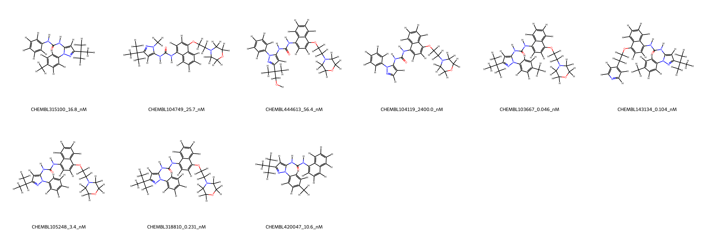
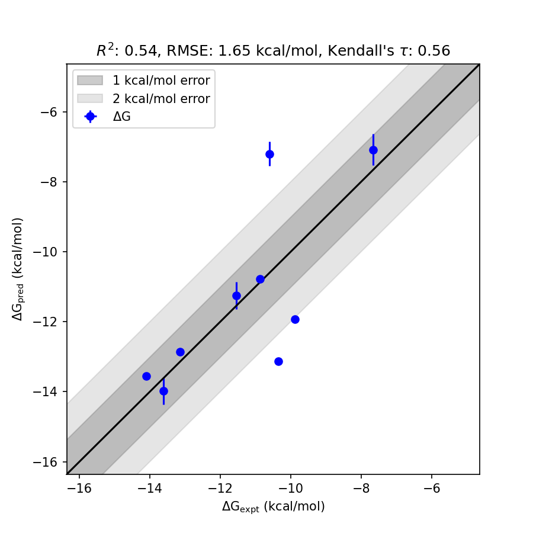

# MAPK14 System FEP Calculation Results Analysis

> This README is generated by AI model using verified experimental data and Uni-FEP calculation results. Content may contain inaccuracies and is provided for reference only. No liability is assumed for outcomes related to its use.

## Introduction

MAPK14, also known as p38 alpha, is a member of the mitogen-activated protein kinase (MAPK) family, which plays a crucial role in cellular responses to external stress. This kinase is involved in multiple cellular processes, including inflammation, cell differentiation, apoptosis, and autophagy. MAPK14 is activated in response to stress stimuli such as proinflammatory cytokines and environmental stressors, making it an essential target for various therapeutic interventions, particularly inflammatory diseases, cancer, and autoimmune disorders.

## Molecules

The MAPK14 system dataset analyzed in this study includes 10 molecules, showcasing diverse substituents with complex aromatic and heterocyclic scaffolds. These molecules were designed to interact with the ATP-binding pocket of MAPK14, representing a range of affinities and structural variability. 

The experimentally determined binding affinities for these compounds range from 0.046 nM to 2400 nM, covering over five orders of magnitude. Corresponding binding free energies span from -7.66 to -14.10 kcal/mol, emphasizing the structural diversity and binding potential of these molecules.

## Conclusions

The FEP calculation results for the MAPK14 system exhibit reasonable performance, achieving an RMSE of 1.65 kcal/mol and an R² value of 0.54. Compounds such as CHEMBL103667 and CHEMBL143134 demonstrated accurate prediction of binding free energies, with experimental values of -14.10 kcal/mol and -13.61 kcal/mol, respectively, closely aligned with predicted values (-13.56 kcal/mol and -13.97 kcal/mol).

Additionally, CHEMBL105248 performed well with both experimental and predicted binding affinities in excellent agreement, showcasing the effectiveness of the model in capturing relative binding trends in certain cases.

## References

For more information about the MAPK14 target and associated bioactivity data, please visit:
https://www.ebi.ac.uk/chembl/explore/assay/CHEMBL734088 