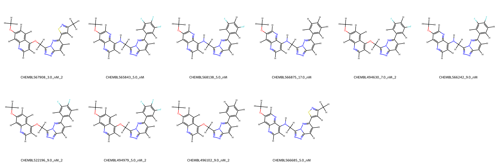
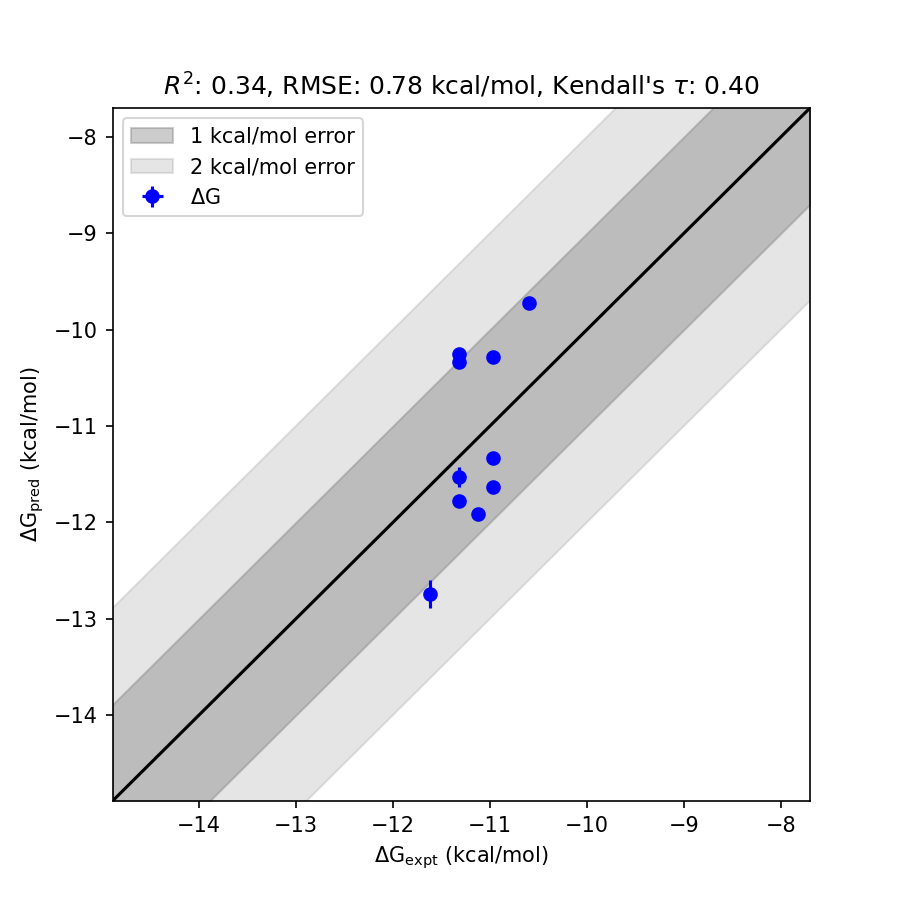

# MET System FEP Calculation Results Analysis

> This README is generated by AI model using verified experimental data and Uni-FEP calculation results. Content may contain inaccuracies and is provided for reference only. No liability is assumed for outcomes related to its use.

## Introduction

MET (Mesenchymal-epithelial transition factor), also known as hepatocyte growth factor receptor (HGFR), is a receptor tyrosine kinase that plays an essential role in embryonic development, tissue regeneration, and wound healing. Dysregulation of MET signaling has been implicated in numerous human cancers, including lung, liver, and gastric cancers, as well as in tumor metastasis and resistance to targeted therapies. MET is considered a validated therapeutic target for the treatment of MET-amplified and MET-mutated cancers.

## Molecules

The MET dataset analyzed in this study consists of 11 ligands, showcasing structural diversity centered around various functional groups. The binding free energies for these ligands, determined experimentally, range from approximately -10.59 kcal/mol to -11.62 kcal/mol. The predicted binding free energies using FEP span a similar range, capturing the variation among the ligand binding affinities.

## Conclusions

The FEP calculation results for the MET system exhibit reliable performance, achieving an RMSE of 0.78 kcal/mol and an R² of 0.34 with respect to experimental data. Notably, CHEMBL567908_3.0_nM_2 demonstrated accurate prediction, with experimental binding free energy of -11.62 kcal/mol and predicted FEP free energy of -12.74 kcal/mol. Additionally, CHEMBL494979_5.0_nM_2 showed consistency between experimental value (-11.32 kcal/mol) and predicted FEP value (-11.77 kcal/mol). These results highlight the capacity of FEP simulations to provide valuable insights into binding affinity trends.

## References

For more information about the MET target and associated bioactivity data, please visit:  
https://www.ebi.ac.uk/chembl/target_report_card/CHEMBL1038130