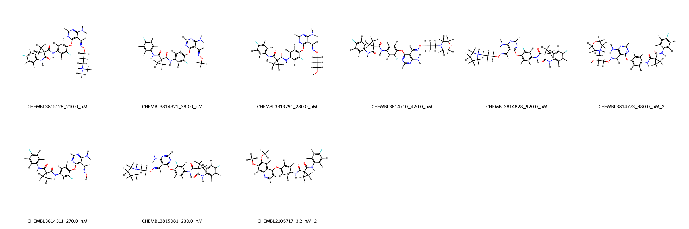
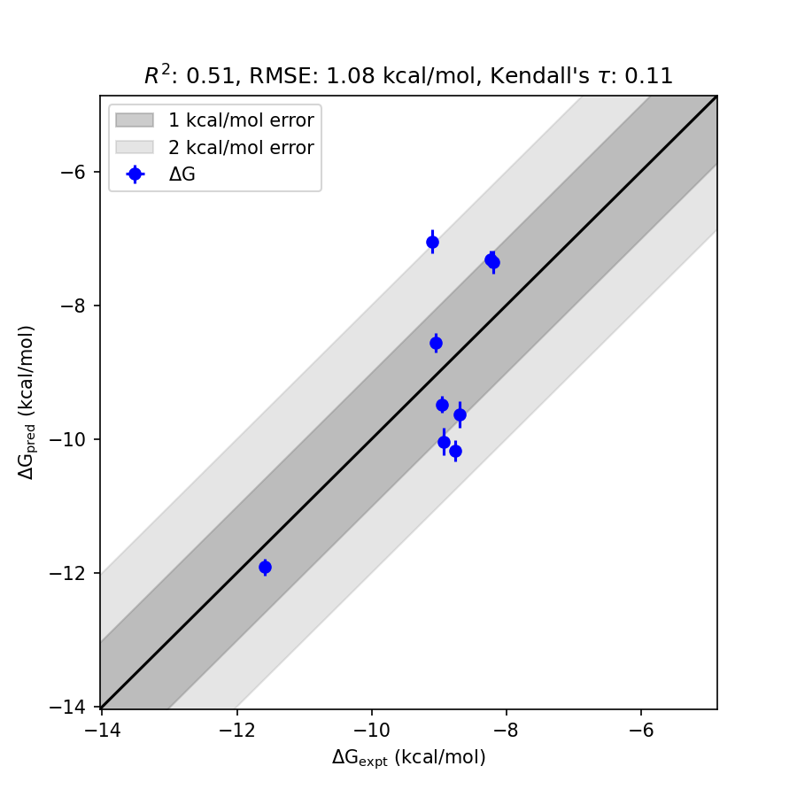

# MET System FEP Calculation Results Analysis

> This README is generated by AI model using verified experimental data and Uni-FEP calculation results. Content may contain inaccuracies and is provided for reference only. No liability is assumed for outcomes related to its use.

## Introduction

MET, also known as hepatocyte growth factor receptor (HGFR), is a receptor tyrosine kinase that plays a pivotal role in various cellular processes, including cell growth, survival, and epithelial-mesenchymal transition. MET is activated by the binding of hepatocyte growth factor (HGF), leading to downstream signal transduction that regulates development, repair, and regeneration. Dysregulation of MET signaling is implicated in several cancers and has been identified as a critical target in the treatment of malignancies such as non-small cell lung cancer (NSCLC) and gastric cancer. The therapeutic targeting of MET has emerged as an area of focus in cancer drug discovery, making it a compelling target for inhibitor development.

## Molecules

The dataset for the MET system comprises 10 ligands, showcasing structural diversity and a range of binding affinities. These molecules demonstrate unique variations in their functional groups, enabling the exploration of their inhibitory potential against MET. The experimentally determined binding affinities of these molecules range from 3.2 nM to 980.0 nM, translating to experimental binding free energies spanning approximately from -11.58 kcal/mol to -8.19 kcal/mol.

## Conclusions

The FEP calculation results for the MET system exhibit reasonable alignment with the experimental data, characterized by an RMSE of 1.08 kcal/mol and an R² of 0.51. Among the analyzed compounds, several stand out for their predictive accuracy and binding potential. For instance, CHEMBL2105717 demonstrates remarkable agreement between experimental and predicted binding free energies, showing an experimental ΔG of -11.58 kcal/mol and a predicted ΔG of -11.91 kcal/mol with a low standard deviation of 0.328 kcal/mol. Similarly, CHEMBL3814311 achieves close alignment with an experimental ΔG of -8.96 kcal/mol and a predicted ΔG of -9.48 kcal/mol, supported by a standard deviation of only 0.525 kcal/mol.

## References

For more information about the MET target and associated bioactivity data, please visit:
https://www.ebi.ac.uk/chembl/explore/assay/CHEMBL3816036