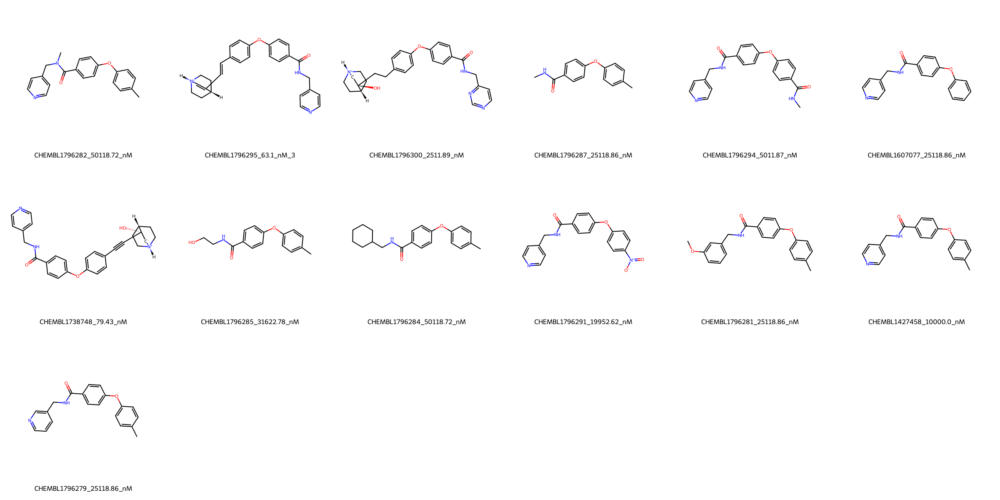
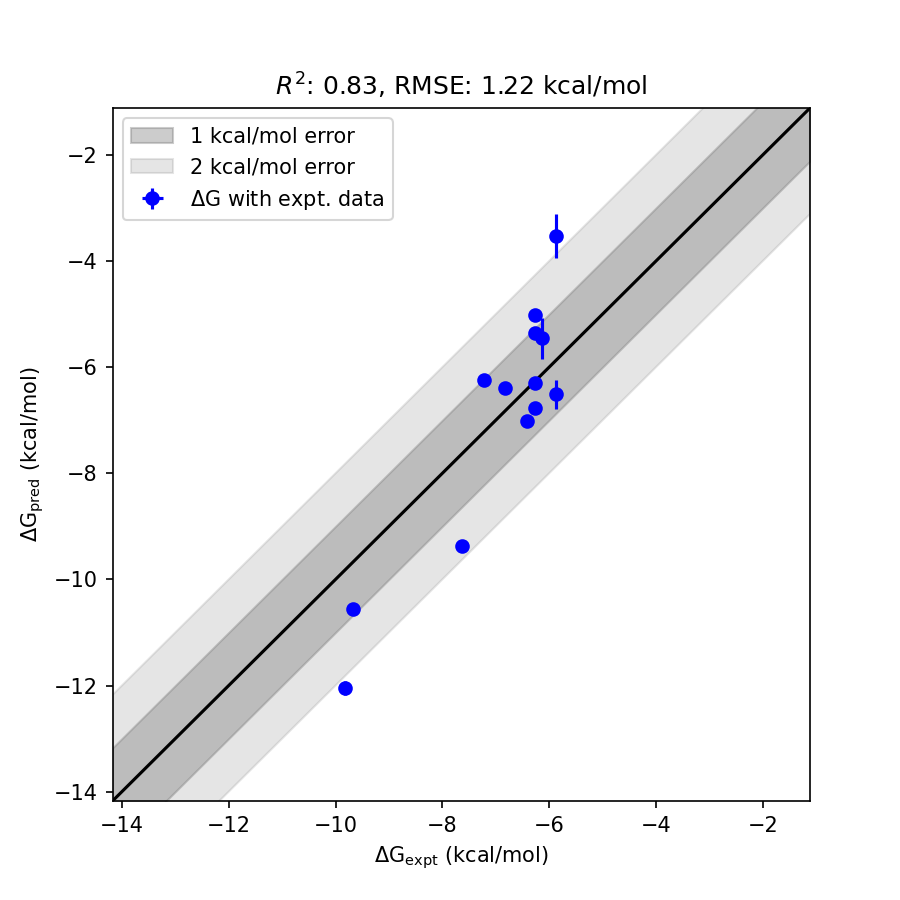

# MMP13 System FEP Calculation Results Analysis

> This README is generated by AI model using verified experimental data and Uni-FEP calculation results. Content may contain inaccuracies and is provided for reference only. No liability is assumed for outcomes related to its use.

## Introduction

MMP13 (Matrix Metalloproteinase 13), also known as Collagenase-3, is a zinc-dependent endopeptidase that plays a crucial role in the degradation of extracellular matrix components, particularly type II collagen. It is involved in various physiological processes including tissue remodeling and wound healing. MMP13 has emerged as an important therapeutic target, particularly in osteoarthritis and various types of cancer, where its overexpression contributes to disease progression. The development of selective MMP13 inhibitors represents a significant approach in treating these conditions.

## Molecules

The MMP13 system dataset in this study comprises 13 compounds, featuring a diphenyl ether scaffold with various substituents. These compounds demonstrate structural diversity through different modifications, including pyridine rings, amide linkages, and various cyclic systems. A notable feature is the presence of basic nitrogen-containing groups that appear to be important for binding affinity.

The experimentally determined binding affinities range from 63.1 nM to 50118.72 nM, spanning approximately three orders of magnitude, with binding free energies from -5.86 to -9.82 kcal/mol.

## Conclusions

The FEP calculation results for the MMP13 system demonstrate excellent predictive performance with an R² of 0.83 and an RMSE of 1.22 kcal/mol. The predicted binding free energies (-3.53 to -12.05 kcal/mol) generally correlate well with experimental values, though with some notable variations in the absolute values. Several compounds showed good prediction accuracy, such as CHEMBL1796279 (experimental: -6.27 kcal/mol, predicted: -6.29 kcal/mol) and CHEMBL1738748 (experimental: -9.68 kcal/mol, predicted: -10.55 kcal/mol). The most potent compound, CHEMBL1796295, with an experimental binding free energy of -9.82 kcal/mol, was predicted at -12.05 kcal/mol.

## References

For more information about the MMP13 target and associated bioactivity data, please visit:
https://www.ebi.ac.uk/chembl/explore/assay/CHEMBL1798873 