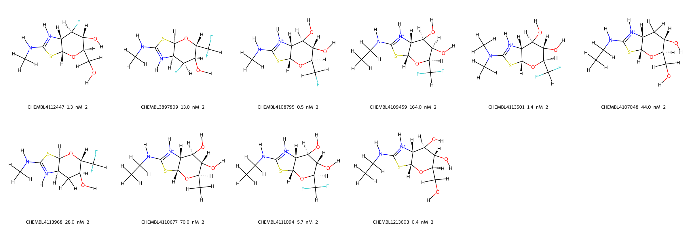
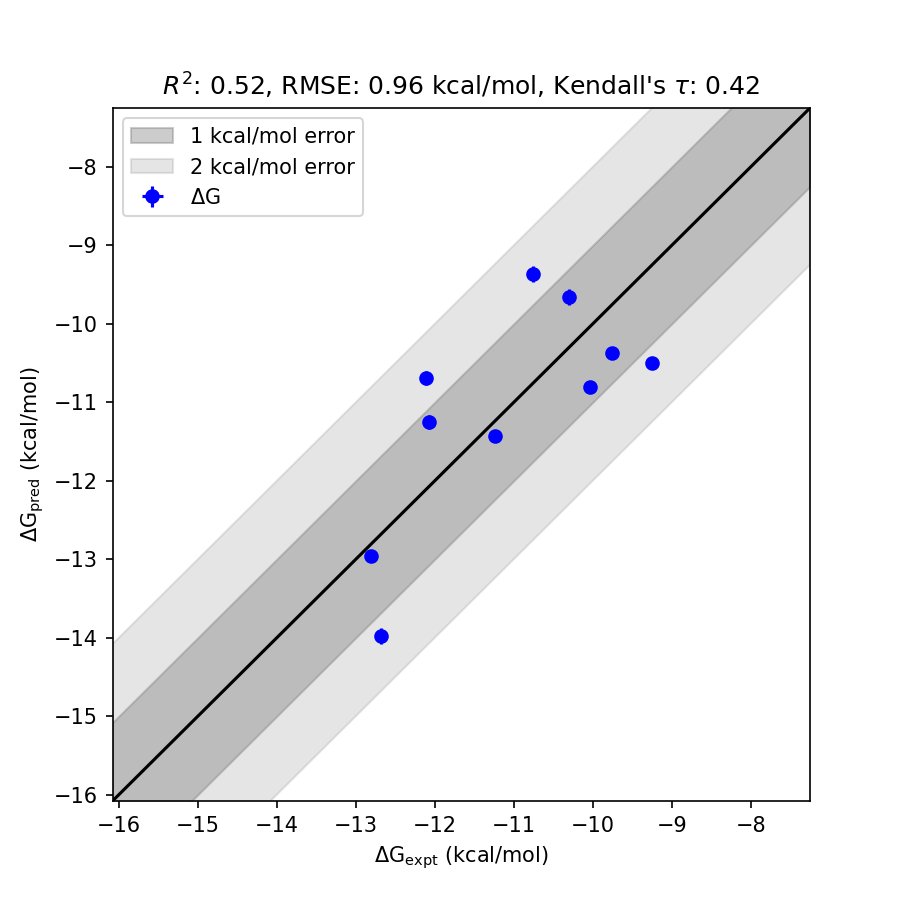

# OGA System FEP Calculation Results Analysis

> This README is generated by AI model using verified experimental data and Uni-FEP calculation results. Content may contain inaccuracies and is provided for reference only. No liability is assumed for outcomes related to its use.

## Introduction

OGA (O-GlcNAcase), also known as N-acetylglucosaminidase, is an enzyme responsible for removing O-linked N-acetylglucosamine (O-GlcNAc) modifications from serine and threonine residues of nucleocytoplasmic proteins. OGA plays a key role in the regulation of cellular signaling, transcription, and metabolic processes. Due to its involvement in neurodegenerative diseases, cancer, and diabetes, OGA has emerged as a potentially important therapeutic target. Inhibition of OGA is being explored as an avenue to modulate O-GlcNAcylation and its associated pathways in various diseases.

## Molecules

The OGA system dataset in this study consists of 11 compounds, demonstrating structural diversity with different substitutions resulting in variations in binding affinities and stereochemistry. These compounds include fluorine-substituted derivatives and hydroxyl-containing functional groups crucial for binding interactions. 

The experimentally determined binding free energies (ΔG) range from -12.81 kcal/mol to -9.25 kcal/mol, showcasing an approximate span of 3.56 kcal/mol. The molecular statistics reveal a rich dataset featuring varied stereochemical configurations and functional group substituents, which contribute to the diversity in binding behavior.

## Conclusions

The FEP calculation results for the OGA system achieved an RMSE of 0.96 kcal/mol and an R² of 0.52, demonstrating moderate alignment with experimental data. Notable examples of prediction accuracy include CHEMBL4108795 (experimental: -12.68 kcal/mol, predicted: -13.98 kcal/mol), which showed an excellent correlation between experimental and computed free energy values. Similarly, CHEMBL1213603 had experimental and predicted free energy values of -12.81 kcal/mol and -12.96 kcal/mol respectively, showcasing its reliable predictability within the dataset. Overall, the system successfully captured relative binding trends across the compound set.

## References

For more information about the OGA target and associated bioactivity data, please visit:
https://www.ebi.ac.uk/chembl/explore/assay/CHEMBL3887929