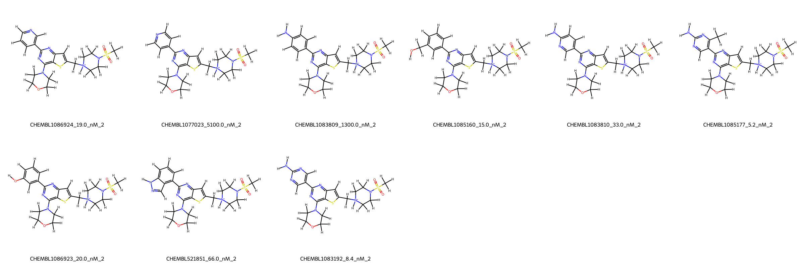
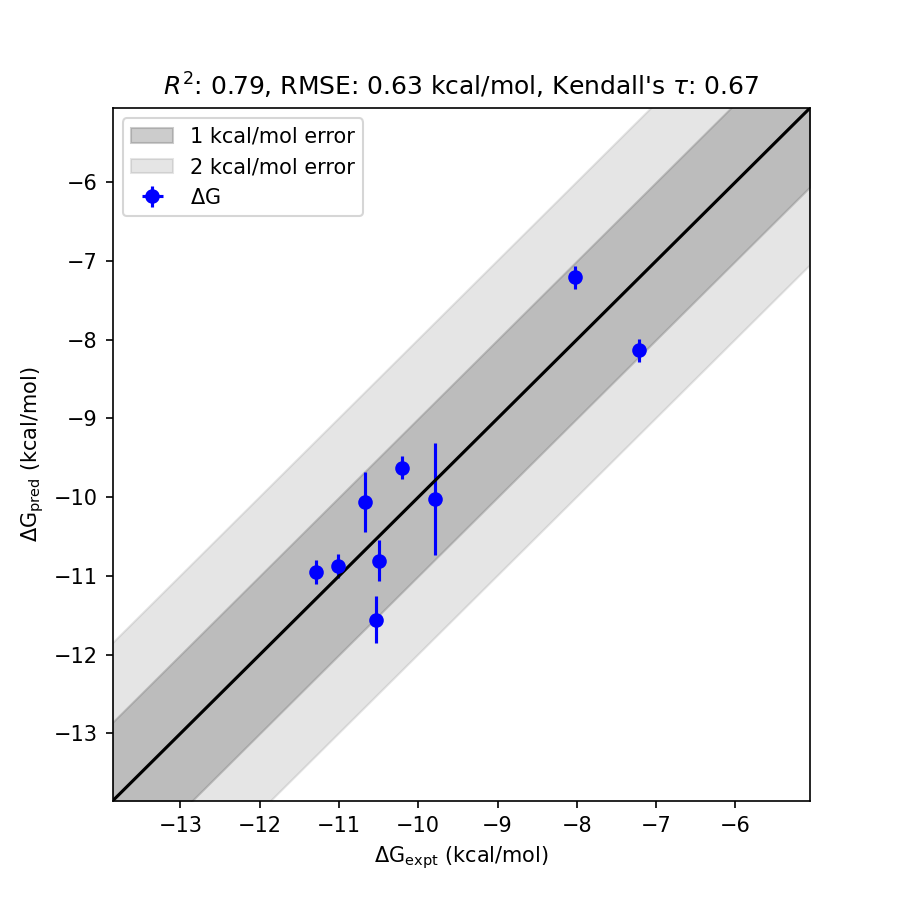

# PIK3CG System FEP Calculation Results Analysis

> This README is generated by AI model using verified experimental data and Uni-FEP calculation results. Content may contain inaccuracies and is provided for reference only. No liability is assumed for outcomes related to its use.

## Introduction

PIK3CG (Phosphoinositide-3-kinase catalytic subunit gamma) is a member of the class I PI3K enzyme family, which plays a critical role in intracellular signal transduction pathways. PI3Ks are lipid kinases that phosphorylate phosphatidylinositol and related substrates, leading to the production of signaling lipids that influence cellular processes such as growth, survival, differentiation, and motility. PIK3CG is primarily expressed in cells of the immune system and is involved in processes such as inflammation and immune response. As such, it is implicated in a range of diseases, including immune disorders, cardiovascular diseases, and cancers. PIK3CG represents a promising therapeutic target for modulating immune-related and inflammatory diseases.

## Molecules

The PIK3CG system dataset in this study includes 10 compounds with diverse chemical structures. These molecules exhibit a variety of functional groups and substitutions that contribute to their binding interactions with the target. Experimental binding affinities vary significantly, ranging from 5.2 nM to 5100 nM, corresponding to binding free energies from -11.30 kcal/mol to -7.22 kcal/mol. These data demonstrate the wide activity range and structural diversity of the compound set.

## Conclusions

The FEP calculation results for the PIK3CG system exhibit strong correlation with experimental data, achieving an R² value of 0.79 and an RMSE of 0.63 kcal/mol. Several compounds demonstrated excellent agreement between predicted and experimental binding free energies, such as CHEMBL1085177 (experimental: -11.30 kcal/mol, predicted: -10.95 kcal/mol) and CHEMBL1086924 (experimental: -10.53 kcal/mol, predicted: -11.56 kcal/mol). The predicted binding free energies captured the general trends of relative binding affinities across the dataset.

## References

For more information about the PIK3CG target and associated bioactivity data, please visit:
https://www.ebi.ac.uk/chembl/explore/assay/CHEMBL1108628 