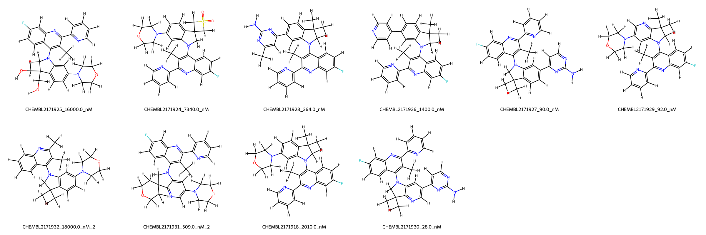
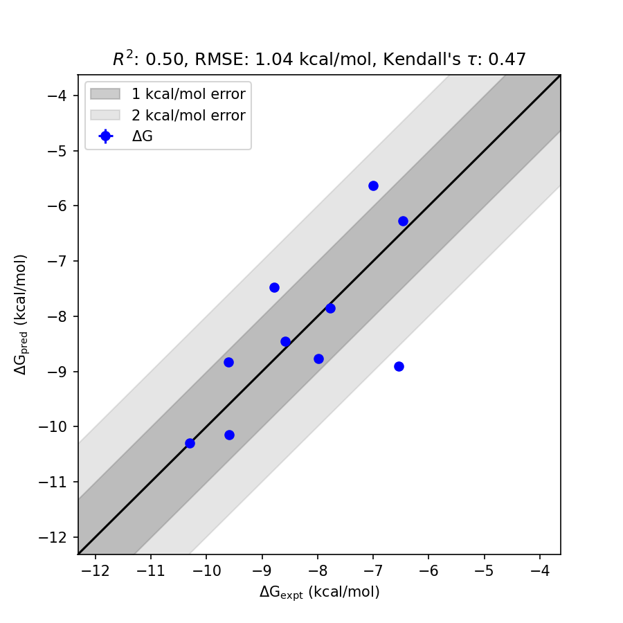

# PIK3CG System FEP Calculation Results Analysis  

> This README is generated by AI model using verified experimental data and Uni-FEP calculation results. Content may contain inaccuracies and is provided for reference only. No liability is assumed for outcomes related to its use.  

## Introduction  

PIK3CG (Phosphoinositide 3-kinase catalytic subunit gamma) is a critical component of the phosphoinositide 3-kinase (PI3K) signaling pathway involved in cellular processes such as growth, proliferation, differentiation, motility, and survival. PIK3CG plays a notable role in immune cell function and inflammation, which has made it a promising target for therapeutic interventions in inflammatory disorders, cardiovascular diseases, and cancer. The selective targeting of PIK3CG is an active area of drug discovery, aiming to modulate its activity while minimizing off-target effects.  

## Molecules

The PIK3CG system dataset in this study consists of 10 compounds. These compounds exhibit a structural variety that includes a combination of substituent variations across different functional groups. Some notable features include aromatic scaffolds with fluorine substituents, sulfonamide groups, and secondary amines incorporated within diverse heterocyclic frameworks.  

The experimentally measured binding affinities (as IC50) span from 28 nM to 18,000 nM, corresponding to binding free energies from -10.30 kcal/mol to -6.46 kcal/mol. The predictive FEP models achieved calculated binding free energies ranging from -10.14 kcal/mol to -6.27 kcal/mol, with variability indicated by standard deviations ranging from 0.0015 kcal/mol to 2.3686 kcal/mol.  

## Conclusions  

The FEP calculation results for the PIK3CG system exhibit moderate correlation with experimental binding affinities, achieving an R² value of 0.50 and an RMSE of 1.04 kcal/mol. This level of accuracy reflects reliable prediction trends across structurally diverse compounds.  

Certain compounds demonstrated excellent alignment between experimental and predicted binding free energies, such as CHEMBL2171930, which exhibited an experimental binding free energy of -10.30 kcal/mol and a predicted value of -10.30 kcal/mol with a minimal deviation of 0.0015 kcal/mol. Similarly, CHEMBL2171929 showed consistent results, with an experimental value of -9.59 kcal/mol and a predicted free energy of -10.14 kcal/mol, reinforcing the robustness of the predictions.  

## References  

For more information about the PIK3CG target and associated bioactivity data, please visit:  
https://www.ebi.ac.uk/chembl/explore/assay/CHEMBL2174949  