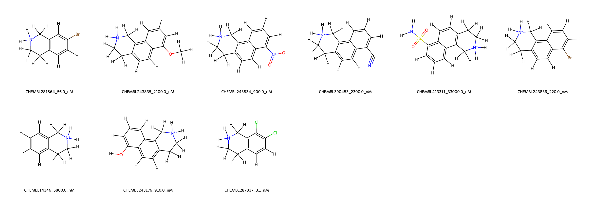
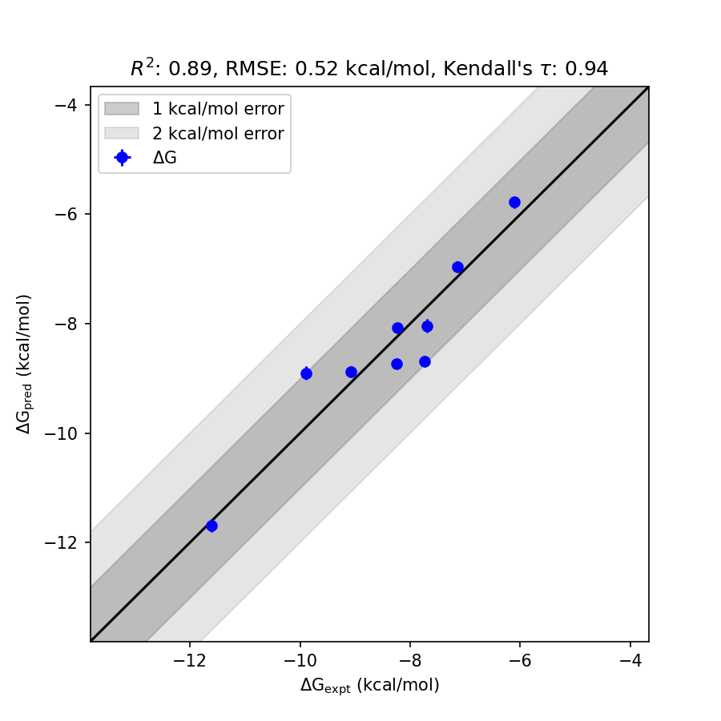

# PNMT System FEP Calculation Results Analysis

> This README is generated by AI model using verified experimental data and Uni-FEP calculation results. Content may contain inaccuracies and is provided for reference only. No liability is assumed for outcomes related to its use.

## Introduction

Phenylethanolamine N-methyltransferase (PNMT) is an enzyme that catalyzes the methylation of norepinephrine to produce epinephrine, a critical neurotransmitter and hormone involved in the fight-or-flight response. PNMT is primarily expressed in the adrenal medulla and plays a pivotal role in the biosynthesis of catecholamines. Due to its physiological and pathological significance, PNMT has garnered attention as a target for therapeutic intervention in conditions such as hypertension and certain stress-related disorders.

## Molecules

The PNMT system dataset in this study consists of 9 compounds with diverse substituents and core structures. These molecules exhibit significant variation in their experimentally determined binding affinities, ranging from 3.1 nM to 33,000 nM. The corresponding experimental binding free energies span a wide range from -11.602 kcal/mol to -6.1108 kcal/mol, providing a robust dataset for binding free energy prediction and analysis. The structural diversity of the molecules ensures the examination of both highly potent and weaker binding ligands.

## Conclusions

The FEP calculation results for the PNMT system achieve an R² of 0.89 and an RMSE of 0.52 kcal/mol, indicating excellent agreement with experimental data. Among the evaluated compounds, CHEMBL287837 demonstrated standout predictive accuracy, with its predicted binding free energy (-11.6903 kcal/mol) closely matching the experimental value (-11.602 kcal/mol). Other ligands, such as CHEMBL243836, also exhibited consistent predictions, making it a reliable compound within the dataset. These results highlight the effectiveness of the binding affinity prediction methodology applied to the PNMT system.

## References

For more information about the PNMT target and associated bioactivity data, please visit:
https://www.ebi.ac.uk/chembl/explore/target/CHEMBL890212